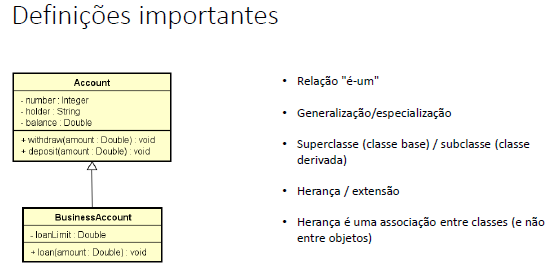
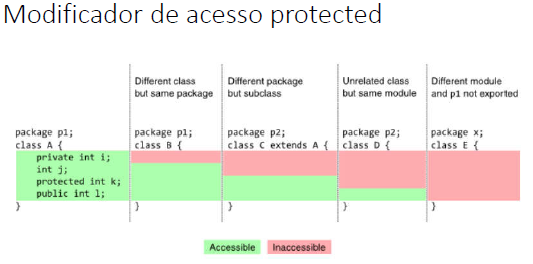
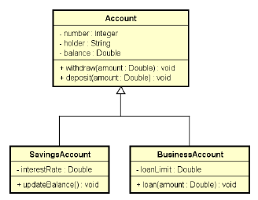
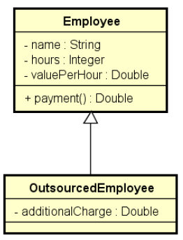
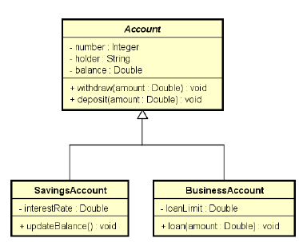
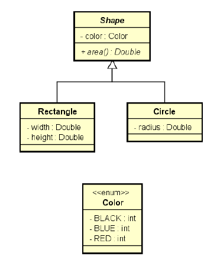
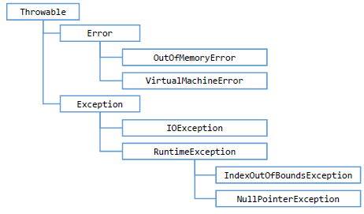
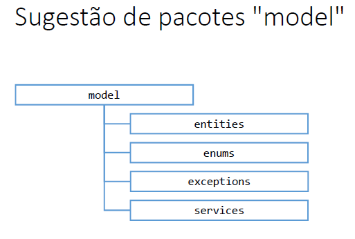
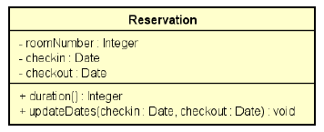
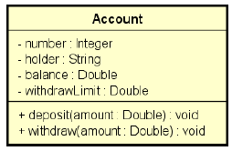

# Java COMPLETO 2018 Programação Orientada a Objetos +Projetos

Curso mais didático e completo de Java e Orientação a Objetos. Projetos reais com UML, Spring Boot, MongoDB e muito mais

https://www.udemy.com/java-curso-completo/

---

## <a name="indice">Índice</a>

- [Introdução](#parte1)   
- [Apresentação da linguagem Java e tópicos básicos](#parte2)   
- [Introdução à Programação Orientada a Objetos](#parte3)   
- [Construtores, palavra this, sobrecarga, encapsulamento](#parte4)   
- [Comportamento de memória, arrays, listas](#parte5)   
- [Tópicos especiais em Java](#parte6)   
- [Bônus - nivelamento sobre Git e Github](#parte7)   
- [Enumerações, composição](#parte8)   
- [Herança e polimorfismo](#parte9)   
- [Tratamento de exceções](#parte10)   
- [Projeto: Sistema jogo de xadrez](#parte11)   
- [Trabalhando com arquivos](#parte12)   
- [Interfaces](#parte13)   
- [Generics, Set, Map](#parte14)   
- [Programação funcional e expressões lambda](#parte15)   
- [Acesso a banco de dados com JDBC](#parte16)   
- [Interface gráfica com JavaFX](#parte17)   
- [Projeto Aplicação desktop com JavaFX e banco de dados MySQL com JDBC](#parte18)   
- [Projeto API Restful web com Spring Boot e banco de dados MongoDB](#parte19)   
- [Seção bônus](#parte20)   


---

## <a name="parte1">Introdução</a>


[Voltar ao Índice](#indice)

---

## <a name="parte2">Apresentação da linguagem Java e tópicos básicos</a>

- \material_curso\cap2\02-java-topicos-basicos.pdf

#### 8. Primeiro programa em Java no Eclipse  
Checklist  
Window -> Perspective -> Open Perspective -> Java
- File -> New -> Java Project
- Package Explorer
    - JRE System Library
    - Pasta "src"
- Criar classe
    - Botão direito no projeto -> New -> Class
    - Escolher um nome para a classe (iniciar com letra Maiúscula)
    - Escolher um nome para o pacote (iniciar com letra Minúscula)
    - Selecionar public static void main
- Classe
    - package
    - Cláusula import: referências a outros pacotes
    - Classe
    - Método
    - public static void main(String[] args)
- Executar o programa: Botão direito no arquivo -> Run As -> Java Application
- Como fechar e reabrir o projeto? E o workspace?
- Dica: indentação automática: CTRL + SHIFT -> F

#### 9. Trabalhando sem IDE
Crie a estrutura do projeto  
- javac course/*.java
- java course/Program
Nota: para projetos grandes, usar uma ferramenta para automatização (Maven, Ant, Gradle). 

#### 10. Tipos primitivos em Java

https://docs.oracle.com/javase/tutorial/java/nutsandbolts/datatypes.html  

- Java é uma linguagem estaticamente tipada
- Tipos primitivos em Java
- Tipos referência String e Object
- Variável não iniciada
- Valores padrão
- Overflow
- Padrão para float: sufixo "f"
- Padrão para char: aspas simples
- Padrão para string: aspas duplas
- Padrão para boolean: true, false
- Opção: inferência de tipos com palavra "var" (dentro de métodos)

```java
package course;

public class Program {

	public static void main(String[] args) {
		System.out.println("Olá Mundo!");
		boolean completed = false;
		char gender = 'F';
		char letter = '\u0041';
		byte n1 = 126;
		int n2 = 1000;
		int n3 = 2147483647;
		long n4 = 2147483648L;
		float n5 = 4.5f;
		double n6 = 4.5;

		String name = "Maria Green";
		Object obj1 = "Alex Brown";
		Object obj2 = 4.5f;

		System.out.println(completed);
		System.out.println(gender);
		System.out.println(letter);
		System.out.println(n1);
		System.out.println(n2);
		System.out.println(n3);
		System.out.println(n4);
		System.out.println(n5);
		System.out.println(n6);

		System.out.println(name);
		System.out.println(obj1);
		System.out.println(obj2);
	}
}

```

#### 11. Restrições e convenções para nomes

- Não pode começar com dígito: use uma letra ou _
- Não usar acentos ou til
- Não pode ter espaço em branco
- Sugestão: use nomes que tenham um significado

Convenções
- Camel Case: lastName
    - pacotes
    - atributos
    - métodos
    - variáveis e parâmetros
- Pascal Case: ProductService
    - classes

Exemplo:
```java
package entities;
public class Account {
private String holder;
private Double balance;
    public Account(String holder, Double balance) {
        this.holder = holder;
        this.balance = balance;
    }
    public String getHolder() {
        return holder;
    }
    public void deposit(double amount) {
        balance += amount;
    }
    public void withdraw(double amount) {
        balance -= amount;
    }
}
```

#### 12. Conversão implícita e casting

```java
package course;
public class Program {
	public static void main(String[] args) {
		double a;
		float b;
		a = 5.0;
		b = (float)a;
		System.out.println(b);
	}
}
 // 5.0
```

```java
package course;

public class Program {
	public static void main(String[] args) {
		double a;
		int b;
		a = 5.0;
		b = (int)a;
		System.out.println(b);
	}
}
// 5

```

```java
package course;

public class Program {
	public static void main(String[] args) {
		int a, b;
		double result;
		a = 5;
		b = 2;
		result = (double) a / b;
		System.out.println(result);
	}
}
// 2.5
```

#### 13. Saída de dados em Java

```java
package course;

import java.util.Locale;

public class Program {
	public static void main(String[] args) {
		char gender = 'F';
		int age = 32;
		double balance = 10.35784;
		String name = "Maria";
		System.out.print("Good morning!");
		System.out.println("Good afternoon!");
		System.out.println("Good night!");
		System.out.println("---------------------------");
		System.out.println(balance);
		System.out.printf("%.2f%n", balance);
		System.out.printf("%.4f%n", balance);
		Locale.setDefault(Locale.US);
		System.out.printf("%.4f%n", balance);
		System.out.println("---------------------------");
		System.out.printf("%s is %d years old, gender %c, and got balance = %.2f bitcoins%n", name, age,
		gender, balance);
	}
}

/*
Good morning!Good afternoon!
Good night!
---------------------------
10.35784
10,36
10,3578
10.3578
---------------------------
Maria is 32 years old, gender F, and got balance = 10.36 bitcoins
*/


```

Exercício de fixação

Em um novo programa, inicie as seguintes variáveis:
```java
String product1 = "Computer";
String product2 = "Office desk";
int age = 30;
int code = 5290;
char gender = 'F';
double price1 = 2100.0;
double price2 = 650.50;
double measure = 53.234567;
```

Em seguida, usando os valores das variáveis, produza a seguinte saída na tela do console:

```
Products:
Computer, which price is $ 2100,00
Office desk, which price is $ 650,50
Record: 30 years old, code 5290 and gender: F
Measue with eight decimal places: 53,23456700
Rouded (three decimal places): 53,235
US decimal point: 53.235

```

Resolução

```java
package course;

import java.util.Locale;

public class Program {
	public static void main(String[] args) {
		String product1 = "Computer";
		String product2 = "Office desk";
		byte age = 30;
		int code = 5290;
		char gender = 'F';
		double price1 = 2100.0;
		double price2 = 650.50;
		double measure = 53.234567;
		System.out.println("Products:");
		System.out.printf("%s, which price is $ %.2f%n", product1, price1);
		System.out.printf("%s, which price is $ %.2f%n", product2, price2);
		System.out.println();
		System.out.printf("Record: %d years old, code %d and gender: %c%n", age, code, gender);
		System.out.println();
		System.out.printf("Measue with eight decimal places: %.8f%n", measure);
		System.out.printf("Rouded (three decimal places): %.3f%n", measure);
		Locale.setDefault(Locale.US);
		System.out.printf("US decimal point: %.3f%n", measure);
	}
}

```

#### 14. Operadores aritméticos

```java
package course;

public class Program {
	public static void main(String[] args) {
		int n1 = 3 + 4 * 2;
		int n2 = (3 + 4) * 2;
		int n3 = 17 % 3;
		double n4 = 10.0 / 8.0;
		double a = 1.0, b = -3.0, c = -4.0;
		double x1 = (-b + Math.sqrt(b * b - 4 * a * c)) / (2 * a);
		System.out.println(n1);
		System.out.println(n2);
		System.out.println(n3);
		System.out.println(n4);
		System.out.println(x1);
	}
}

```

#### 15. Operadores de atribuição

```java
package course;

public class Program {
	public static void main(String[] args) {
		double n1 = 10;
		double n2 = 30;
		String s = "ABC";
		System.out.println(n1);
		System.out.println(n2);
		System.out.println(s);
		System.out.println("-------------");
		n1 *= 2;
		n2 += n1;
		s += "DEF";
		System.out.println(n1);
		System.out.println(n2);
		System.out.println(s);
        /*
        10.0
        30.0
        ABC
        -------------
        20.0
        50.0
        ABCDEF
        */
		
		int a = 10;
		int b = a++;
		System.out.println(a); // 11
		System.out.println(b); // 10
		int c = 10;
		int d = ++c;
		System.out.println(c); // 11
		System.out.println(d); // 11
	}
}

```

#### 16. Operadores comparativos

```java
package course;

public class Program {
	public static void main(String[] args) {
		int a = 10;
		boolean c1 = a < 10;
		boolean c2 = a < 20;
		boolean c3 = a > 10;
		boolean c4 = a > 5;
		System.out.println(c1);
		System.out.println(c2);
		System.out.println(c3);
		System.out.println(c4);
		System.out.println("------------");
		boolean c5 = a <= 10;
		boolean c6 = a >= 10;
		boolean c7 = a == 10;
		boolean c8 = a != 10;
		System.out.println(c5);
		System.out.println(c6);
		System.out.println(c7);
		System.out.println(c8);
        /*
        false
        true
        false
        true
        ------------
        true
        true
        true
        false
        */
	}
}

```

#### 17. Operadores lógicos

```java
package course;

public class Program {
	public static void main(String[] args) {
		boolean c1 = 2 > 3 || 4 != 5; // true
		boolean c2 = !(2>3) && 4 != 5; // true
		System.out.println(c1);
		System.out.println(c2);
		System.out.println("--------------");
		boolean c3 = 10 < 5; // false
		boolean c4 = c1 || c2 && c3; // true
		System.out.println(c4);
        /*
        true
        true
        --------------
        true
        */
	}
}

```

#### 18. Operadores bitwise

```java
package course;

public class Program {
	public static void main(String[] args) {

		int n1 = 89;
		int n2 = 60;
		System.out.println(n1 & n2);
		System.out.println(n1 | n2);
		System.out.println(n1 ^ n2);
		
	}
}

```

```java
package course;

import java.util.Scanner;

public class Program {
	public static void main(String[] args) {
		Scanner sc = new Scanner(System.in);
		int mask = 0b100000;
		int n = sc.nextInt();
		if ((n & mask) != 0) {
			System.out.println("6th bit is true!");
		}
		else {
			System.out.println("6th bit is false");
		}
		sc.close();
		//89
		//6th bit is false
		
		//186
		//6th bit is true!
	}
}

```

#### 19. Entrada de dados em Java - Parte 1
```java
package course;

import java.util.Scanner;

public class Program {
	public static void main(String[] args) {
		Scanner sc = new Scanner(System.in);
		
		String sentence = sc.nextLine();
		String x, y, z;
		x = sc.next();
		y = sc.next();
		z = sc.next();
		
		System.out.println(sentence);
		System.out.println(x);
		System.out.println(y);
		System.out.println(x);
		
		x = sc.next();
		y = sc.next();
		z = sc.next();
		
		System.out.println(x);
		System.out.println(y);
		System.out.println(x);
		
		sc.close();

        /*
        AZUL
        AMARELO
        VERDE
        VERMELHO
        AZUL
        AMARELO
        VERDE
        AMARELO
        
        AZUL AMARELO VERDE VERMELHO
        AZUL
        AMARELO
        AZUL
        */
	}
}

```

#### 19. Entrada de dados em Java - Parte 2

Limpeza de stream de entrada (flush)  
DETALHE IMPORTANTE:  
Antes de fazer um nextLine()  
- Se antes foi dada uma quebra de linha na stream de entrada sem o nextLine()  
- Então é preciso fazer um nextLine() extra para "limpar" a quebra de linha que fica pendente na stream  

```java
package course;

import java.util.Locale;
import java.util.Scanner;

public class Program {
	public static void main(String[] args) {
		Locale.setDefault(Locale.US);
		Scanner sc = new Scanner(System.in);
		// 35
		int n1 = sc.nextInt();
		// Bob Brown
		sc.nextLine();
		String name = sc.nextLine();
		// F
		char gender = sc.next().charAt(0);
		// b5
		String s = sc.next();
		char letter = s.charAt(0);
		int digit = Integer.parseInt(s.substring(1));
		// 4.32
		double n2 = sc.nextDouble();
		// Maria F 23 1.68
		String name2 = sc.next();
		char ch = sc.next().charAt(0);
		int age = sc.nextInt();
		double height = sc.nextDouble();
		System.out.println(n1);
		System.out.println(name);
		System.out.println(gender);
		System.out.println(letter);
		System.out.println(digit);
		System.out.println(n2);
		System.out.println(name2);
		System.out.println(ch);
		System.out.println(age);
		System.out.println(height);
		sc.close();
		/*
		 	35
			Bob
			F
			b5
			4.32
			Maria F 23 1.68
			
			35
			Bob
			F
			b
			5
			4.32
			Maria
			F
			23
			1.68 
		 */
	}
}

```

Exercício:

Fazer um programa para executar o seguinte procedimento de entrada de dados, e depois mostrar os dados na tela:  
Enter your full name:  
Alex Green  
How many bedrooms are there in your house?  
3  
Enter product price:  
500.50  
Enter your last name, age and height (same line):  
Green 21 1.73  

SAÍDA ESPERADA (NÚMEROS REAIS COM DUAS CASAS DECIMAIS):  
Alex Green  
3  
500.50  
Green  
21  
1.73  

```java
package course;

import java.util.Locale;
import java.util.Scanner;

public class Program {
	public static void main(String[] args) {
		Locale.setDefault(Locale.US);
		Scanner sc = new Scanner(System.in);
		System.out.println("Enter your full name:");
		String fullName = sc.nextLine();
		System.out.println("How many bedrooms are there in your house?");
		int bedrooms = sc.nextInt();
		System.out.println("Enter product price:");
		double price = sc.nextDouble();
		System.out.println("Enter your last name, age and height (same line):");
		sc.nextLine();
		String[] vect = sc.nextLine().split(" ");
		String lastName = vect[0];
		int age = Integer.parseInt(vect[1]);
		double height = Double.parseDouble(vect[2]);
		System.out.println(fullName);
		System.out.println(bedrooms);
		System.out.printf("%.2f%n", price);
		System.out.println(lastName);
		System.out.println(age);
		System.out.printf("%.2f%n", height);
		sc.close();
	}
}

/*
Enter your full name:
Alex green
How many bedrooms are there in your house?
3
Enter product price:
500.50
Enter your last name, age and height (same line):
Green 21 1.73
Alex green
3
500.50
Green
21
1.73

*/

```


#### 21. Funções interessantes para String

- Formatar: toLowerCase(), toUpperCase(), trim()
- Recortar: substring(inicio), substring(inicio, fim)
- Substituir: Replace(char, char), Replace(string, string)
- Buscar: IndexOf, LastIndexOf
- str.Split(" ")

```java
package course;

public class Program {
	public static void main(String[] args) {
		String original = "abcde FGHIJ ABC abc DEFG ";
		String s01 = original.toLowerCase();
		String s02 = original.toUpperCase();
		String s03 = original.trim();
		String s04 = original.substring(2);
		String s05 = original.substring(2, 9);
		String s06 = original.replace('a', 'x');
		String s07 = original.replace("abc", "xy");
		int i = original.indexOf("bc");
		int j = original.lastIndexOf("bc");
		System.out.println("Original: -" + original + "-");
		System.out.println("toLowerCase: -" + s01 + "-");
		System.out.println("toUpperCase: -" + s02 + "-");
		System.out.println("trim: -" + s03 + "-");
		System.out.println("substring(2): -" + s04 + "-");
		System.out.println("substring(2, 9): -" + s05 + "-");
		System.out.println("replace('a', 'x'): -" + s06 + "-");
		System.out.println("replace('abc', 'xy'): -" + s07 + "-");
		System.out.println("Index of 'bc': " + i);
		System.out.println("Last index of 'bc': " + j);
		System.out.println("---------------------------------");
		
		String s = "potato apple lemon";
		System.out.println(s);
		String[] vect = s.split(" ");
		String word1 = vect[0];
		String word2 = vect[1];
		String word3 = vect[2];
		System.out.println(vect[0]);
		System.out.println(vect[1]);
		System.out.println(vect[2]);
		
        /*
        Original: -abcde FGHIJ ABC abc DEFG -
        toLowerCase: -abcde fghij abc abc defg -
        toUpperCase: -ABCDE FGHIJ ABC ABC DEFG -
        trim: -abcde FGHIJ ABC abc DEFG-
        substring(2): -cde FGHIJ ABC abc DEFG -
        substring(2, 9): -cde FGH-
        replace('a', 'x'): -xbcde FGHIJ ABC xbc DEFG -
        replace('abc', 'xy'): -xyde FGHIJ ABC xy DEFG -
        Index of 'bc': 1
        Last index of 'bc': 17
        ---------------------------------
        potato apple lemon
        potato
        apple
        lemon
        */
	}
}

```

#### 22. Estruturas condicionais

Exercício de fixação  
Fazer um programa para ler três números inteiros na mesma linha, separados por espaço em branco.  
Em seguida, mostrar na tela qual é o maior dos números lidos. Se houver empate, mostrar apenas um.  

```java
package course;

import java.util.Locale;
import java.util.Scanner;

public class Program {
	public static void main(String[] args) {
		Locale.setDefault(Locale.US);
		Scanner sc = new Scanner(System.in);
		int a = sc.nextInt();
		int b = sc.nextInt();
		int c = sc.nextInt();
		if (a > b && a > c) {
			System.out.println("Higher = " + a);
		} else if (b > c) {
			System.out.println("Higher = " + b);
		} else {
			System.out.println("Higher = " + c);
		}
		sc.close();
	}
}

```

#### 23. Sintaxe alternativa - switch-case

```java
package course;

import java.util.Scanner;

public class Program {
	public static void main(String[] args) {
		Scanner sc = new Scanner(System.in);
		int x = sc.nextInt();
		String day;
		switch (x) {
		case 1:
		day = "Sunday";
		break;
		case 2:
		day = "Monday";
		break;
		case 3:
		day = "Tuesday";
		break;
		case 4:
		day = "Wednesday";
		break;
		case 5:
		day = "Thursday";
		break;
		case 6:
		day = "Friday";
		break;
		case 7:
		day = "Saturday";
		break;
		default:
		day = "Invalid value";
		}
		System.out.println("Day: " + day);
	}
}

```

#### 24. Expressão condicional ternária

```java
package course;

public class Program {
	public static void main(String[] args) {
		/*
		double preco = 34.5;
		double desconto;
		if (preco < 20.0) {
			desconto = preco * 0.1;
		}
		else {
			desconto = preco * 0.05;
		}
		*/
		double preco = 34.5;
		double desconto = (preco < 20.0) ? preco * 0.1 : preco * 0.05;
		
		
	}
}

```

#### 25. Escopo e inicialização

- Escopo de uma variável: é a região do programa onde a variável é válida, ou seja, onde ela pode ser referenciada.
- Uma variável não pode ser usada se não for iniciada.
- Falaremos de escopo de métodos no Capítulo 5

```java
package course;

public class Program {
	public static void main(String[] args) {
		//double price = sc.nextDouble();
		double price = 0;
		double discount = 0;
		if (price > 100.0) {
		 discount = price * 0.1;
		}
		System.out.println(discount); 
    }
}

```

#### 26. Comentários em Java (básico)

```java
package course;

import java.util.Locale;
import java.util.Scanner;

/*
Este programa calcula as raízes de uma equação do segundo grau
Os valores dos coeficientes devem ser digitados um por linha
*/
public class Program {
	public static void main(String[] args) {
		Locale.setDefault(Locale.US);
		Scanner sc = new Scanner(System.in);
		double a, b, c, delta;
		System.out.println("Digite os valores dos coeficientes:");
		a = sc.nextDouble();
		b = sc.nextDouble();
		c = sc.nextDouble();
		delta = b * b - 4 * a * c; // cálculo do valor de delta
	}
}
```

#### 27. Funções (sintaxe)

Representam um processamento que possui um significado
    - Math.sqrt(double)
    - System.out.println(string)
- Principais vantagens: modularização, delegação e reaproveitamento
- Dados de entrada e saída
    - Funções podem receber dados de entrada (parâmetros ou argumentos)
    - Funções podem ou não retornar uma saída
- Em orientação a objetos, funções em classes recebem o nome de "métodos"

EX:  
Fazer um programa para ler três números inteiros e mostrar na tela o maior deles.

```java
package course;

import java.util.Scanner;

public class Program {
	/*
	 * public static void main(String[] args) { Scanner sc = new Scanner(System.in);
	 * System.out.println("Enter three numbers:"); int a = sc.nextInt(); int b =
	 * sc.nextInt(); int c = sc.nextInt(); if (a > b && a > c) {
	 * System.out.println("Higher = " + a); } else if (b > c) {
	 * System.out.println("Higher = " + b); } else { System.out.println("Higher = "
	 * + c); } sc.close();
	 * 
	 * }
	 */
	public static void main(String[] args) {
		Scanner sc = new Scanner(System.in);
		System.out.println("Enter three numbers:");
		int a = sc.nextInt();
		int b = sc.nextInt();
		int c = sc.nextInt();
		int higher = max(a, b, c);
		showResult(higher);
		sc.close();
	}

	public static int max(int x, int y, int z) {
		int aux;
		if (x > y && x > z) {
			aux = x;
		} else if (y > z) {
			aux = y;
		} else {
			aux = z;
		}
		return aux;
	}

	public static void showResult(int value) {
		System.out.println("Higher = " + value);
	}
}
```


#### 28. Debugging com Eclipse

- Teclas  
    - CTRL+SHIFT+B - marcar/desmarcar breakpoint
    - (bug) iniciar/continuar o debug
    - F6 - executar um passo (pula função)
    - F5 - executar um passo (entra na função)
    - F7 - sair do método em execução
    - (stop) parar debug

- Perspectiva Debug
- Aba importante: Variables

#### 29. Estrutura repetitiva while

```
while ( condição ) {
    comando 1
    comando 2
}
```

EX:  
Digitar um número e mostrar sua raiz quadrada com três casas decimais, depois repetir o procedimento.  
Quando o usuário digitar um número negativo (podendo inclusive ser na primeira vez), mostrar uma mensagem "Negative number" e terminar o programa.

```java
package course;

import java.util.Scanner;

public class Program {
	public static void main(String[] args) {
		Scanner sc = new Scanner(System.in);
		
		System.out.println("Enter a number");
		double n  = sc.nextDouble();
		
		while(n >= 0.0) {
			double sr = Math.sqrt(n);
			System.out.printf("%.3f%n", sr);
			System.out.println("Enter another number");
			n = sc.nextDouble();
		}
		System.out.println("Negative number");
		sc.close();
	}
}
```

#### 30. Estrutura repetitiva for

Digitar um número N e depois N valores inteiros. Mostrar a soma dos N valores digitados.

```java
package course;

import java.util.Scanner;

public class Program {
	public static void main(String[] args) {
		Scanner sc = new Scanner(System.in);
		System.out.print("How many integer numbers are you going to enter: ");
		int n = sc.nextInt();
		int sum = 0;
		for (int i = 1; i <= n; i++) {
			System.out.print("Value #" + i + ": ");
			int x = sc.nextInt();
			sum += x;
		}
		System.out.println("Sum = " + sum);
		sc.close();
	}

}
```

#### 31. Exercício de fixação - estruturas repetitivas while e for

Fazer um programa para ler um número N (se for digitado um valor não positivo, mostrar uma mensagem e ler novamente). 
Em seguida, N valores inteiros. Mostrar o maior dentre os N números digitados. Veja exemplo:

```
Enter N: 0
N must be positive! Try again: -2
N must be positive! Try again: 4
Value #1: 5
Value #2: 4
Value #3: 10
Value #4: 2
Higher = 10
```

```java
package course;

import java.util.Scanner;

public class Program {
	public static void main(String[] args) {
		Scanner sc = new Scanner(System.in);
		System.out.print("Enter N: ");
		int n = sc.nextInt();
		while (n <= 0) {
			System.out.print("N must be positive! Try again: ");
			n = sc.nextInt();
		}
		int higher = Integer.MIN_VALUE;
		for (int i = 1; i <= n; i++) {
			System.out.print("Value #" + i + ": ");
			int x = sc.nextInt();
			if (x > higher) {
				higher = x;
			}
		}
		System.out.println("Higher = " + higher);
		sc.close();
	}
}
```

#### 32. Estrutura repetitiva do-while

```
do {
    comando 1
    comando 2
} while ( condição );
```

Digitar um número e mostrar sua raiz quadrada, depois perguntar ao usuário se ele deseja repetir o procedimento (y/n). 
Caso ele responda 'y', repetir o procedimento.

```java
package course;

import java.util.Locale;
import java.util.Scanner;

public class Program {
	public static void main(String[] args) {
		Locale.setDefault(Locale.US);
		Scanner sc = new Scanner(System.in);
		char resp;
		do {
			System.out.print("Enter a number: ");
			double n = sc.nextDouble();
			double sq = Math.sqrt(n);
			System.out.printf("Square root = %.3f%n", sq);
			System.out.print("Repeat (y/n)? ");
			resp = sc.next().charAt(0);
		} while (resp != 'n');
		sc.close();
		
		
		/*
		    Enter a number: 10
			Square root = 3.162
			Repeat (y/n)? y
			Enter a number: 144
			Square root = 12.000
			Repeat (y/n)? n
		 */
	}

}
```

#### 33. Exercícios de reforço

1) Deseja-se fazer um programa para calcular a nota final de um estudante, considerando as
três notas que ele tirou nos três trimestres de seu curso. Caso a nota final do estudante seja
menor que 60.00, deve-se mostrar uma mensagem "FAILED" também.

```
Enter three student scores:
22.00 30.10 25.50
Final score = 77.60
```
```
Enter three student scores:
15.00 20.00 20.00
Final score = 55.00
FAILED
```

```java
package course;

import java.util.Locale;
import java.util.Scanner;

public class Program {
	public static void main(String[] args) {
		Locale.setDefault(Locale.US);
		Scanner sc = new Scanner(System.in);
		
		System.out.println("Enter three student scores: ");
		double score1 = sc.nextDouble();
		double score2 = sc.nextDouble();
		double score3 = sc.nextDouble();
		
		double finalScore = score1 + score2 + score3;
		
		System.out.printf("Final score: %.2f%n", finalScore);
		if(finalScore < 60.0) {
			System.out.println("FAILED");
		}
		sc.close();
		
	}

}
```

2) Fazer um programa para ler a quantidade de glicose no sangue de uma pessoa e depois mostrar na tela a classificação desta glicose de
acordo com a tabela de referência ao lado.

```
Classificação Glucose
Normal - glucose <= 100
High - 100 < glusose <= 140
Diabetes - glucose > 140
```

```
Enter glucose measure: 90.0
Normal
```

```java
package course;

import java.util.Locale;
import java.util.Scanner;

public class Program {
	public static void main(String[] args) {
		Locale.setDefault(Locale.US);
		Scanner sc = new Scanner(System.in);
		
		System.out.println("Enter Glucose measure: ");
		double glucose = sc.nextDouble();
		
		if(glucose <= 100.0) {
			System.out.println("Normal");
		}else if(glucose <= 140.0) {
			System.out.println("High");
		}else {
			System.out.println("Diabetes");
		}
		sc.close();
	}
}
```

3) Fazer um programa para ler dois números inteiros e mostrar a soma de todos os números
ímpares entre eles, inclusive eles próprios.

```
Enter two integer numbers:
-10
2
Sum of odd numbers = -24
```
```
Enter two integer numbers:
14
3
Sum of odd numbers = 48
```

```java
package course;

import java.util.Scanner;

public class Program {
	public static void main(String[] args) {

		Scanner sc = new Scanner(System.in);

		System.out.println("Enter two integer numbers: ");

		int x = sc.nextInt();
		int y = sc.nextInt();

		int begin = x, end = y;
		if (y < x) {
			begin = y;
			end = x;
		}

		int sum = 0;
		for (int i = begin; i <= end; i++) {
			if (i % 2 != 0) {
				sum += i;
			}
		}
		System.out.println("Sum os add number: " + sum);

		sc.close();

	}

}
```

4) Leia números inteiros até que um 0 (zero) seja lido. Para cada valor lido, o programa deve
mostrar o quadrado do valor.
```
Enter an integer value: 4
16
Enter an integer value: 1
1
Enter an integer value: 10
100
Enter an integer value: 0
```

```java
package course;

import java.util.Scanner;

public class Program {
	public static void main(String[] args) {
		Scanner sc = new Scanner(System.in);
		System.out.print("Enter an integer value: ");
		
		int n = sc.nextInt();
		
		while (n != 0) {
			int square = n * n;
			System.out.println(square);
			System.out.print("Enter an integer value: ");
			n = sc.nextInt();
		}
		sc.close();
	}

}
```

5) O curso de Computação Gráfica do IFTM é trimestral, sendo que as notas do ano são
divididas em três partes: 30, 35 e 35, totalizando 100 pontos no ano. O professor de
programação está querendo automatizar o processo de fechamento de notas. Faça um
programa para somar as notas dos três trimestres de todos alunos da turma.

```
Enter number of students: 3
Student #1: 20.00 31.00 30.00
Final score: 81.00
Student #2: 25.00 31.10 30.22
Final score: 86.32
Student #3: 19.25 29.00 18.31
Final score: 66.56
```

```java
package course;

import java.util.Locale;
import java.util.Scanner;

public class Program {
	public static void main(String[] args) {
		Locale.setDefault(Locale.US);
		Scanner sc = new Scanner(System.in);
		
		System.out.print("Enter number of students: ");
		
		int n = sc.nextInt();
		for (int i = 1; i <= n; i++) {
			System.out.print("Student #" + i + ": ");
			double score1 = sc.nextDouble();
			double score2 = sc.nextDouble();
			double score3 = sc.nextDouble();
			double finalScore = score1 + score2 + score3;
			System.out.printf("Final score: %.2f%n", finalScore);
		}
		sc.close();
	}

}
```


[Voltar ao Índice](#indice)

---

## <a name="parte3">Introdução à Programação Orientada a Objetos</a>

#### 3. Resolvendo um problema sem orientação a objetos

Resolvendo um problema sem orientação a objetos  
Fazer um programa para ler as medidas dos lados de dois triângulos X e Y (suponha medidas  
válidas). Em seguida, mostrar o valor das áreas dos dois triângulos e dizer qual dos dois triângulos  
possui a maior área.  
A fórmula para calcular a área de um triângulo a partir das medidas de seus lados a, b e c é a  
seguinte (fórmula de Heron):  

```
Enter the measures of triangle X:
3.00
4.00
5.00
Enter the measures of triangle Y:
7.50
4.50
4.02
Triangle X area: 6.0000
Triangle Y area: 7.5638
Larger area: Y
```

```java
package course;

import java.util.Locale;
import java.util.Scanner;

public class Program {
	public static void main(String[] args) {
		Locale.setDefault(Locale.US);
		Scanner sc = new Scanner(System.in);
		double xA, xB, xC, yA, yB, yC;
		
		System.out.println("Enter the measures of triangle X: ");
		xA = sc.nextDouble();
		xB = sc.nextDouble();
		xC = sc.nextDouble();
		
		System.out.println("Enter the measures of triangle Y: ");
		yA = sc.nextDouble();
		yB = sc.nextDouble();
		yC = sc.nextDouble();
		
		double p = (xA + xB + xC) / 2.0;
		double areaX = Math.sqrt(p * (p - xA) * (p - xB) * (p - xC));
		p = (yA + yB + yC) / 2.0;
		double areaY = Math.sqrt(p * (p - yA) * (p - yB) * (p - yC));
		
		System.out.printf("Triangle X area: %.4f%n", areaX);
		System.out.printf("Triangle Y area: %.4f%n", areaY);
		
		if (areaX > areaY) {
			System.out.println("Larger area: X");
		} else {
			System.out.println("Larger area: Y");
		}
		sc.close();
	}

}
```

#### 4. Criando uma classe com três atributos para representar melhor o triângulo

Classe
- É um tipo estruturado que pode conter (membros):
	- Atributos (dados / campos)
	- Métodos (funções / operações)
- A classe também pode prover muitos outros recursos, tais como:
	- Construtores
	- Sobrecarga
	- Encapsulamento
	- Herança
	- Polimorfismo
- Exemplos:
	- Entidades: Produto, Cliente, Triangulo
	- Serviços: ProdutoService, ClienteService, EmailService, StorageService
	- Controladores: ProdutoController, ClienteController
	- Utilitários: Calculadora, Compactador
	- Outros (views, repositórios, gerenciadores, etc.)

```java
package entities;

public class Triangle {
 public double a;
 public double b;
 public double c;
}

```

```java
package course;

import java.util.Locale;
import java.util.Scanner;

import entities.Triangle;

public class Program {
	public static void main(String[] args) {
		Locale.setDefault(Locale.US);
		Scanner sc = new Scanner(System.in);
		// double xA, xB, xC, yA, yB, yC;

		Triangle x, y;
		x = new Triangle();
		y = new Triangle();

		System.out.println("Enter the measures of triangle X: ");
		x.a = sc.nextDouble();
		x.b = sc.nextDouble();
		x.c = sc.nextDouble();

		System.out.println("Enter the measures of triangle Y: ");
		y.a = sc.nextDouble();
		y.b = sc.nextDouble();
		y.c = sc.nextDouble();

		double p = (x.a + x.b + x.c) / 2.0;
		double areaX = Math.sqrt(p * (p - x.a) * (p - x.b) * (p - x.c));
		p = (y.a + y.b + y.c) / 2.0;
		double areaY = Math.sqrt(p * (p - y.a) * (p - y.b) * (p - y.c));

		System.out.printf("Triangle X area: %.4f%n", areaX);
		System.out.printf("Triangle Y area: %.4f%n", areaY);

		if (areaX > areaY) {
			System.out.println("Larger area: X");
		} else {
			System.out.println("Larger area: Y");
		}
		sc.close();
	}

}
```

#### 5. Criando um método para obtermos os benefícios de reaproveitamento e delegação

```java
package entities;

public class Triangle {
	public double a;
	public double b;
	public double c;

	public double area() {
		double p = (a + b + c) / 2.0;
		return Math.sqrt(p * (p - a) * (p - b) * (p - c));
	}
}

```

```java
package course;

import java.util.Locale;
import java.util.Scanner;

import entities.Triangle;

public class Program {
	public static void main(String[] args) {
		Locale.setDefault(Locale.US);
		Scanner sc = new Scanner(System.in);

		Triangle x, y;
		x = new Triangle();
		y = new Triangle();

		System.out.println("Enter the measures of triangle X: ");
		x.a = sc.nextDouble();
		x.b = sc.nextDouble();
		x.c = sc.nextDouble();
		System.out.println("Enter the measures of triangle Y: ");
		y.a = sc.nextDouble();
		y.b = sc.nextDouble();
		y.c = sc.nextDouble();
		double areaX = x.area();
		double areaY = y.area();
		
		System.out.printf("Triangle X area: %.4f%n", areaX);
		System.out.printf("Triangle Y area: %.4f%n", areaY);

		if (areaX > areaY) {
			System.out.println("Larger area: X");
		} else {
			System.out.println("Larger area: Y");
		}
		sc.close();
	}

}
```

Discussão  
Quais são os benefícios de se calcular a área de um triângulo por meio de um  
MÉTODO dentro da CLASSE Triangle?  
1) Reaproveitamento de código: nós eliminamos o código repetido (cálculo   
das áreas dos triângulos x e y) no programa principal.  
2) Delegação de responsabilidades: quem deve ser responsável por saber  
como calcular a área de um triângulo é o próprio triângulo. A lógica do cálculo  
da área não deve estar em outro lugar.  


#### 6. Começando a resolver um segundo problema exemplo

Outro exemplo  
Fazer um programa para ler os dados de um produto em estoque (nome, preço e quantidade no estoque). Em seguida:

- Mostrar os dados do produto (nome, preço, quantidade no estoque, valor total no estoque)
- Realizar uma entrada no estoque e mostrar novamente os dados do produto  
- Realizar uma saída no estoque e mostrar novamente os dados do produto  

Para resolver este problema, você deve criar uma CLASSE conforme projeto ao lado:  
(veja exemplo na próxima página)

```
Enter product data:
Name: TV
Price: 900.00
Quantity in stock: 10
Product data: TV, $ 900.00, 10 units, Total: $ 9000.00
Enter the number of products to be added in stock: 5
Updated data: TV, $ 900.00, 15 units, Total: $ 13500.00
Enter the number of products to be removed from stock: 3
Updated data: TV, $ 900.00, 12 units, Total: $ 10800.00
```

```java
package course;

import java.util.Locale;
import java.util.Scanner;

import entities.Product;

public class Program {
	public static void main(String[] args) {
		
		Locale.setDefault(Locale.US);
		Scanner sc = new Scanner(System.in);
		
		Product product = new Product();
		
		System.out.println("Enter product data: ");
		System.out.print("Name: ");
		product.name = sc.nextLine();
		System.out.print("Price: ");
		product.price = sc.nextDouble();
		System.out.print("Quantityu in stock: ");
		product.quantity = sc.nextInt();
		
		System.out.println(product.name   + " " + product.price + " " + product.quantity);
		
		sc.close();
	}

}
```

#### 7. Object e toString

Discussão  
- Toda classe em Java é uma subclasse da classe Object
- Object possui os seguintes métodos:
- getClass- retorna o tipo do objeto
- equals - compara se o objeto é igual a outro
- hashCode - retorna um código hash do objeto
- toString - converte o objeto para string

```java
package entities;

public class Product {
	public String name;
	public double price;
	public int quantity;

	public double totalValueInStock() {
		return price * quantity;
	}

	public void addProducts(int quantity) {
		this.quantity += quantity;
	}

	public void removeProdroducts(int quantity) {
		this.quantity -= quantity;
	}

	public String toString() {
		return name + 
				", $ " + String.format("%.2f", price) + 
				", " + quantity + 
				" units, Total: $ "	+ String.format("%.2f", totalValueInStock());
	}

}

```

```java
package course;

import java.util.Locale;
import java.util.Scanner;
import entities.Product;

public class Program {
	public static void main(String[] args) {
		Locale.setDefault(Locale.US);
		Scanner sc = new Scanner(System.in);
		Product product = new Product();
		System.out.println("Enter product data: ");
		System.out.print("Name: ");
		product.name = sc.nextLine();
		System.out.print("Price: ");
		product.price = sc.nextDouble();
		System.out.print("Quantityu in stock: ");
		product.quantity = sc.nextInt();
		
		// toString
		System.out.println(product);

		sc.close();
	}

}
```

#### 8. Finalizando o programa

```java
package course;

import java.util.Locale;
import java.util.Scanner;
import entities.Product;

public class Program {
	public static void main(String[] args) {
		Locale.setDefault(Locale.US);
		Scanner sc = new Scanner(System.in);
		
		Product product = new Product();
		
		System.out.println("Enter product data: ");
		System.out.print("Name: ");
		product.name = sc.nextLine();
		
		System.out.print("Price: ");
		product.price = sc.nextDouble();
		
		System.out.print("Quantity in stock: ");
		product.quantity = sc.nextInt();
		System.out.println();
		
		System.out.println("Product data: " + product);
		System.out.println();
		System.out.print("Enter the number of products to be added in stock: ");
		int quantity = sc.nextInt();
		
		product.addProducts(quantity);
		System.out.println();
		System.out.println("Updated data: " + product);
		System.out.println();
		System.out.print("Enter the number of products to be removed from stock: ");
		
		quantity = sc.nextInt();
		product.removeProdroducts(quantity);
		System.out.println();
		System.out.println("Updated data: " + product);

		sc.close();
	}

}
```

#### 9. Exercícios de fixação

1) Fazer um programa para ler os valores da largura e altura de um retângulo. Em seguida, mostrar na tela o valor de sua área, perímetro e diagonal. Usar uma classe como mostrado no projeto ao lado.
   
```
Enter rectangle width and height:
3.00
4.00
AREA = 12.00
PERIMETER = 14.00
DIAGONAL = 5.00
```

```java
package entities;
public class Rectangle {
	public double width;
	public double height;

	public double area() {
		return width * height;
	}
	public double perimeter() {
		return 2 * (width + height);
	}
	
	public double diagonal() {
		return Math.sqrt(width * height + height * height);
	}
}

```

```java
package course;
import java.util.Locale;
import java.util.Scanner;
import entities.Rectangle;

public class Program {
	public static void main(String[] args) {
		Locale.setDefault(Locale.US);
		Scanner sc = new Scanner(System.in);
		
		Rectangle rect = new Rectangle();
		System.out.println("Enter rectangle width and height:");
		rect.width = sc.nextDouble();
		rect.height = sc.nextDouble();
		System.out.printf("AREA = %.2f%n", rect.area());
		System.out.printf("PERIMETER = %.2f%n", rect.perimeter());
		System.out.printf("DIAGONAL = %.2f%n", rect.diagonal());
		sc.close();
	}
}
```

2) Fazer um programa para ler os dados de um funcionário (nome, salário bruto e imposto). Em seguida, mostrar os dados do funcionário (nome e salário líquido). Em seguida, aumentar o salário do funcionário com base em uma porcentagem dada (somente o salário bruto é afetado pela porcentagem) e mostrar novamente os dados do funcionário. Use a classe projetada abaixo.

```
Name: Joao Silva
Gross salary: 6000.00
Tax: 1000.00
Employee: Joao Silva, $ 5000.00
Which percentage to increase salary? 10.0
Updated data: Joao Silva, $ 5600.00
```
```java
package entities;

public class Employee {
	public String name;
	public double grossSalary;
	public double tax;

	public double netSalary() {
		return grossSalary - tax;
	}

	public void increaseSalary(double percentage) {
		grossSalary += grossSalary * percentage / 100.0;
	}

	public String toString() {
		return name + ", $ " + String.format("%.2f", netSalary());
	}
}

```

```java
package course;
import java.util.Locale;
import java.util.Scanner;
import entities.Employee;
public class Program {
	public static void main(String[] args) {
		Locale.setDefault(Locale.US);
		Scanner sc = new Scanner(System.in);
		Employee emp = new Employee();
		System.out.print("Name: ");
		emp.name = sc.nextLine();
		System.out.print("Gross salary: ");
		emp.grossSalary = sc.nextDouble();
		System.out.print("Tax: ");
		emp.tax = sc.nextDouble();
		System.out.println();
		System.out.println("Employee: " + emp);
		System.out.println();
		System.out.print("Which percentage to increase salary? ");
		double percentage = sc.nextDouble();
		emp.increaseSalary(percentage);
		System.out.println();
		System.out.println("Updated data: " + emp);
		sc.close();
	}
}
```

3) Fazer um programa para ler o nome de um aluno e as três notas que ele obteve nos três trimestres do ano (primeiro trimestre vale 30 e o segundo e terceiro valem 35 cada). Ao final, mostrar qual a nota final do aluno no ano. Dizer também se o aluno está aprovado (PASS) ou não (FAILED) e, em caso negativo, quantos pontos faltam para o aluno obter o mínimo para ser aprovado (que é 60% da nota). Você deve criar uma classe Student para
resolver este problema.

```
Entrada:
Alex Green
27.00
31.00
32.00

Saída:
FINAL GRADE = 90.00
PASS

Entrada:
Alex Green
17.00
20.00
15.00

Saída:
FINAL GRADE = 52.00
FAILED
MISSING 8.00 POINTS
```

```java
package entities;

public class Student {
	public String name;
	public double grade1;
	public double grade2;
	public double grade3;

	public double finalGrade() {
		return grade1 + grade2 + grade3;
	}

	public double missingPoints() {
		if (finalGrade() < 60.0) {
			return 60.0 - finalGrade();
		} else {
			return 0.0;
		}
	}
}

```

```java
package course;

import java.util.Locale;
import java.util.Scanner;
import entities.Student;

public class Program {
	public static void main(String[] args) {
		Locale.setDefault(Locale.US);
		Scanner sc = new Scanner(System.in);
		Student student = new Student();
		System.out.print("Name: ");
		student.name = sc.nextLine();
		System.out.print("Nota 1:");
		student.grade1 = sc.nextDouble();
		System.out.print("Nota 2:");
		student.grade2 = sc.nextDouble();
		System.out.print("Nota 3:");
		student.grade3 = sc.nextDouble();
		System.out.printf("FINAL GRADE: %.2f%n", student.finalGrade());
		if (student.finalGrade() < 60.0) {
			System.out.println("FAILED");
			System.out.printf("MISSING %.2f POINTS%n", student.missingPoints());
		} else {
			System.out.println("PASS");
		}
		sc.close();
	}

}
```


#### 10. Membros estáticos - Parte 1

membros = atributos e métodos

Membros estáticos  
- Também chamados membros de classe
- Em oposição a membros e instância
- São membros que fazem sentido independentemente de objetos. Não precisam de objeto para serem chamados. São chamados a partir do próprio nome da classe.
- Aplicações comuns:
- Classes utilitárias -> (Math.sqrt(double))
- Declaração de constantes
- Uma classe que possui somente membros estáticos, pode ser uma classe estática também. Esta classe não poderá ser instanciada.

Problema exemplo  
Fazer um programa para ler um valor numérico qualquer, e daí mostrar quanto seria o valor de uma circunferência e do volume de uma esfera para um raio daquele valor. Informar também o valor de PI com duas casas decimais.

Checklist  
- Versão 1: métodos na própria classe do programa (Nota: dentro de um método estático você não pode chamar membros de instância da mesma classe.)

```java
package course;

import java.util.Locale;
import java.util.Scanner;

public class Program {
	public static final double PI = 3.14159;

	public static void main(String[] args) {
		Locale.setDefault(Locale.US);
		Scanner sc = new Scanner(System.in);
		System.out.print("Enter radius: ");
		double radius = sc.nextDouble();
		double c = circumference(radius);
		double v = volume(radius);
		System.out.printf("Circumference: %.2f%n", c);
		System.out.printf("Volume: %.2f%n", v);
		System.out.printf("PI value: %.2f%n", PI);
		sc.close();
	}

	public static double circumference(double radius) {
		return 2.0 * PI * radius;
	}

	public static double volume(double radius) {
		return 4.0 * PI * radius * radius * radius / 3.0;
	}
}

```
- Versão 2: classe Calculator com membros de instância

```java
package entities;

public class Calculator {
	public final double PI = 3.14159;

	public double circumference(double radius) {
		return 2.0 * PI * radius;
	}

	public double volume(double radius) {
		return 4.0 * PI * radius * radius * radius / 3.0;
	}
}

```

```java
package course;
import java.util.Locale;
import java.util.Scanner;
import entities.Calculator;
public class Program {
	public static void main(String[] args) {
		Locale.setDefault(Locale.US);
		Scanner sc = new Scanner(System.in);

		Calculator calc = new Calculator();
		System.out.print("Enter radius: ");
		double radius = sc.nextDouble();
		double c = calc.circumference(radius);
		double v = calc.volume(radius);
		System.out.printf("Circumference: %.2f%n", c);
		System.out.printf("Volume: %.2f%n", v);
		System.out.printf("PI value: %.2f%n", calc.PI);
		sc.close();
	}
}

```

#### 11. Membros estáticos - Parte 2

- Versão 3: classe Calculator com método estático

```java
package entities;

public class Calculator {
	public static final double PI = 3.14159;

	public static double circumference(double radius) {
		return 2.0 * PI * radius;
	}

	public static double volume(double radius) {
		return 4.0 * PI * radius * radius * radius / 3.0;
	}
}

```

```java
package course;
import java.util.Locale;
import java.util.Scanner;
import entities.Calculator;

public class Program {
	public static void main(String[] args) {
		Locale.setDefault(Locale.US);
		Scanner sc = new Scanner(System.in);
		System.out.print("Enter radius: ");
		double radius = sc.nextDouble();
		double c = Calculator.circumference(radius);
		double v = Calculator.volume(radius);
		System.out.printf("Circumference: %.2f%n", c);
		System.out.printf("Volume: %.2f%n", v);
		System.out.printf("PI value: %.2f%n", Calculator.PI);
		sc.close();
	}
}

```

#### 12. Exercício de fixação

Faça um programa para ler a cotação do dólar, e depois um valor em dólares a ser comprado por
uma pessoa em reais. Informar quantos reais a pessoa vai pagar pelos dólares, considerando ainda
que a pessoa terá que pagar 6% de IOF sobre o valor em dólar. Criar uma classe CurrencyConverter
para ser responsável pelos cálculos.

```
What is the dollar price? 3.10
How many dollars will be bought? 200.00
Amount to be paid in reais = 657.20
```

```java
package entities;

public class CurrencyConverter {
	public static double IOF = 0.06;

	public static double dollarToReal(double amount, double dollarPrice) {
		return amount * dollarPrice * (1.0 + IOF);
	}
}

```

```java
package course;
import java.util.Locale;
import java.util.Scanner;
import entities.CurrencyConverter;

public class Program {
	public static void main(String[] args) {
		Locale.setDefault(Locale.US);
		Scanner sc = new Scanner(System.in);
		System.out.print("What is the dollar price? ");
		double dollarPrice = sc.nextDouble();
		System.out.print("How many dollars will be bought? ");
		double amount = sc.nextDouble();
		double result = CurrencyConverter.dollarToReal(amount, dollarPrice);
		System.out.printf("Amount to be paid in reais = %.2f%n", result);
		sc.close();
	}
}

```

[Voltar ao Índice](#indice)

---

## <a name="parte4">Construtores, palavra this, sobrecarga, encapsulamento</a>

#### 3. Construtores

Construtor
- É uma operação especial da classe, que executa no momento da
instanciação do objeto
- Usos comuns:
	- Iniciar valores dos atributos
	- Permitir ou obrigar que o objeto receba dados / dependências no momento de sua instanciação (injeção de dependência)
- Se um construtor customizado não for especificado, a classe disponibiliza o construtor padrão:
	Product p = new Product();
- É possível especificar mais de um construtor na mesma classe (sobrecarga)

```java
package entities;

public class Product {
	public String name;
	public double price;
	public int quantity;
	
	public Product(String name, double price, int quantity) {
		this.name = name;
		this.price = price;
		this.quantity = quantity;
	}

	public double totalValueInStock() {
		return price * quantity;
	}

	public void addProducts(int quantity) {
		this.quantity += quantity;
	}

	public void removeProducts(int quantity) {
		this.quantity -= quantity;
	}

	public String toString() {
		return name + 
				", $ " + String.format("%.2f", price) + 
				", " + quantity + 
				" units, Total: $ "	+ String.format("%.2f", totalValueInStock());
	}

}

```

```java
package course;

import java.util.Locale;
import java.util.Scanner;

import entities.Product;

public class Program {
	public static void main(String[] args) {
		Locale.setDefault(Locale.US);
		Scanner sc = new Scanner(System.in);
		//Product product = new Product();
		
		System.out.println("Enter product data: ");
		System.out.print("Name: ");
		String name = sc.nextLine(); // variavel 1
		System.out.print("Price: ");
		double price = sc.nextDouble(); // variavel 1
		System.out.print("Quantity in stock: ");
		int quantity = sc.nextInt(); // variavel 1
		Product product = new Product(name, price, quantity); // com contrutor
		
		System.out.println();
		System.out.println("Product data: " + product);
		System.out.println();
		
		System.out.print("Enter the number of products to be added in stock: ");
		quantity = sc.nextInt();
		product.addProducts(quantity);
		System.out.println();
		System.out.println("Updated data: " + product);
		System.out.println();
		
		System.out.print("Enter the number of products to be removed from stock: ");
		quantity = sc.nextInt();
		product.removeProducts(quantity);
		System.out.println();
		System.out.println("Updated data: " + product);
		sc.close();
	}
}


```


#### 4. Palavra this

Palavra this  
- É uma referência para o próprio objeto
- Usos comuns:
	- Diferenciar atributos de variáveis locais
	- Passar o próprio objeto como argumento na chamada de um método ou construtor

Passar o próprio objeto como argumento na chamada de um método ou construtor

```java
public class ChessMatch {
//(...)
	placeNewPiece('e', 1, new King(board, Color.WHITE, this));
//(...)
```


#### 5. Sobrecarga

- É um recurso que uma classe possui de oferecer mais de uma operação com o mesmo nome, porém com diferentes listas de parâmetros.

Proposta de melhoria  
- Vamos criar um construtor opcional, o qual recebe apenas nome e preço do produto. A quantidade em estoque deste novo produto, por padrão, deverá então ser iniciada com o valor zero.
- Nota: é possível também incluir um construtor padrão

```java
public class Product {
public String name;
public double price;
public int quantity;

public Product() {
}
public Product(String name, double price, int quantity) {
	this.name = name;
	this.price = price;
	this.quantity = quantity;
}
public Product(String name, double price) {
	this.name = name;
	this.price = price;
}
(...)
```


#### 6. Encapsulamento

- É um princípio que consiste em esconder detalhes de implementação de uma classe, expondo apenas operações seguras e que mantenham os objetos em um estado consistente.
- Regra de ouro: o objeto deve sempre estar em um estado consistente, e a própria classe deve garantir isso.

Regra geral básica

- Um objeto NÃO deve expor nenhum atributo (modificador de acesso private)
- Os atributos devem ser acessados por meio de métodos get e set 
	- Padrão JavaBeans: https://en.wikipedia.org/wiki/JavaBeans

```java
package entities;

public class Product {
	private String name;
	private double price;
	private int quantity;

	public Product() {
	}

	public Product(String name, double price) {
		this.name = name;
		this.price = price;
	}

	public Product(String name, double price, int quantity) {
		this.name = name;
		this.price = price;
		this.quantity = quantity;
	}
	
	public String getName() {
		return name;
	}

	public void setName(String name) {
		this.name = name;
	}

	public double getPrice() {
		return price;
	}

	public void setPrice(double price) {
		this.price = price;
	}

	public int getQuantity() {
		return quantity;
	}

	public double totalValueInStock() {
		return price * quantity;
	}

	public void addProducts(int quantity) {
		this.quantity += quantity;
	}

	public void removeProducts(int quantity) {
		this.quantity -= quantity;
	}

	public String toString() {
		return name + ", $ " + String.format("%.2f", price) + ", " + quantity + " units, Total: $ "
				+ String.format("%.2f", totalValueInStock());
	}
}

```

```java
//(...)
		Product product = new Product(name, price);
		product.setName("Computer");
		System.out.println("Update name: " + product.getName());
		product.setPrice(2000);
		System.out.println("Update price: " + product.getPrice());
//(...)
```

#### 7. Gerando automaticamente construtores, getters e setters com Eclipse

- Botão direito -> Source -> Generate Constructor using Fields
- Botão direito -> Source -> Generate Getters and Setters

#### 8. Modificadores de acesso

- https://docs.oracle.com/javase/tutorial/java/javaOO/accesscontrol.html
- private: o membro só pode ser acessado na própria classe
- (nada): o membro só pode ser acessado nas classes do mesmo pacote
- protected: o membro só pode ser acessado no mesmo pacote, bem como em subclasses de pacotes diferentes
- public: o membro é acessado por todas classes (ao menos que ele resida em um módulo diferente que não exporte o pacote onde ele está)

https://stackoverflow.com/questions/215497/in-java-difference-between-package-private-public-protected-and-private


#### 9. Exercício de fixação

Em um banco, para se cadastrar uma conta bancária, é necessário informar o número da conta, o nome do
titular da conta, e o valor de depósito inicial que o titular depositou ao abrir a conta. Este valor de depósito
inicial, entretanto, é opcional, ou seja: se o titular não tiver dinheiro a depositar no momento de abrir sua
conta, o depósito inicial não será feito e o saldo inicial da conta será, naturalmente, zero.
Importante: uma vez que uma conta bancária foi aberta, o número da conta nunca poderá ser alterado. Já
o nome do titular pode ser alterado (pois uma pessoa pode mudar de nome por ocasião de casamento, por
exemplo).
Por fim, o saldo da conta não pode ser alterado livremente. É preciso haver um mecanismo para proteger
isso. O saldo só aumenta por meio de depósitos, e só diminui por meio de saques. Para cada saque
realizado, o banco cobra uma taxa de $ 5.00. Nota: a conta pode ficar com saldo negativo se o saldo não for
suficiente para realizar o saque e/ou pagar a taxa.
Você deve fazer um programa que realize o cadastro de uma conta, dando opção para que seja ou não
informado o valor de depósito inicial. Em seguida, realizar um depósito e depois um saque, sempre
mostrando os dados da conta após cada operação.

```
Enter account number: 8532
Enter account holder: Alex Green
Is there na initial deposit (y/n)? y
Enter initial deposit value: 500.00

Account data:
Account 8532, Holder: Alex Green, Balance: $ 500.00
Enter a deposit value: 200.00

Updated account data:
Account 8532, Holder: Alex Green, Balance: $ 700.00
Enter a withdraw value: 300.00

Updated account data:
Account 8532, Holder: Alex Green, Balance: $ 395.00
```

```Enter account number: 7801
Enter account holder: Maria Brown
Is there na initial deposit (y/n)? n

Account data:
Account 7801, Holder: Maria Brown, Balance: $ 0.00
Enter a deposit value: 200.00

Updated account data:
Account 7801, Holder: Maria Brown, Balance: $ 200.00
Enter a withdraw value: 198.00

Updated account data:
Account 7801, Holder: Maria Brown, Balance: $ -3.00

```


#### 10. Correção do exercício de fixação - Parte 1

#### 11. Correção do exercício de fixação - Parte 2

```java
package entities;

public class Account {
	private int number;
	private String holder;
	private double balance;

	public Account(int number, String holder) {
		this.number = number;
		this.holder = holder;
	}

	public Account(int number, String holder, double initialDeposit) {
		this.number = number;
		this.holder = holder;
		deposit(initialDeposit);
	}

	public int getNumber() {
		return number;
	}

	public String getHolder() {
		return holder;
	}

	public void setHolder(String holder) {
		this.holder = holder;
	}

	public double getBalance() {
		return balance;
	}

	public void deposit(double amount) {
		balance += amount;
	}

	public void withdraw(double amount) {
		balance -= amount + 5.0;
	}

	public String toString() {
		return "Account " + number + ", Holder: " + holder + ", Balance: $ " + String.format("%.2f", balance);
	}
}

```

```java
package course;

import java.util.Locale;
import java.util.Scanner;
import entities.Account;

public class Program {
	public static void main(String[] args) {
		Locale.setDefault(Locale.US);
		Scanner sc = new Scanner(System.in);
		Account account;

		System.out.print("Enter account number: ");
		int number = sc.nextInt();
		System.out.print("Enter account holder: ");
		sc.nextLine();
		String holder = sc.nextLine();
		System.out.print("Is there an initial deposit (y/n)? ");
		char response = sc.next().charAt(0);
		if (response == 'y') {
			System.out.print("Enter initial deposit value: ");
			double initialDeposit = sc.nextDouble();
			account = new Account(number, holder, initialDeposit);
		} else {
			account = new Account(number, holder);
		}

		System.out.println();
		System.out.println("Account data:");
		System.out.println(account);

		System.out.println();
		System.out.print("Enter a deposit value: ");
		double depositValue = sc.nextDouble();
		account.deposit(depositValue);
		System.out.println("Updated account data:");
		System.out.println(account);

		System.out.println();
		System.out.print("Enter a withdraw value: ");
		double withdrawValue = sc.nextDouble();
		account.withdraw(withdrawValue);
		System.out.println("Updated account data:");
		System.out.println(account);

		sc.close();
	}
}

```

[Voltar ao Índice](#indice)

---

## <a name="parte5">Comportamento de memória, arrays, listas</a>

#### 3. Tipos referência vs. tipos valor


#### 4. Desalocação de memória - garbage collector e escopo local

Garbage collector  

- É um processo que automatiza o gerenciamento de memória de um programa em execução
- O garbage collector monitora os objetos alocados dinamicamente pelo programa (no heap), desalocando aqueles que não estão mais sendo utilizados.


Resumo  

- Objetos alocados dinamicamente, quando não possuem mais referência para eles, serão desalocados pelo garbage collector
- Variáveis locais são desalocadas imediatamente assim que seu escopo local sai de execução

#### 5. Vetores - Parte 1 

Vetores  
- Em programação, "vetor" é o nome dado a arranjos unidimensionais
- Arranjo (array) é uma estrutura de dados:
	- Homogênea (dados do mesmo tipo)
	- Ordenada (elementos acessados por meio de posições)
	- Alocada de uma vez só, em um bloco contíguo de memória
- Vantagens:
	- Acesso imediato aos elementos pela sua posição
- Desvantagens:
	- Tamanho fixo
	- Dificuldade para se realizar inserções e deleções


Fazer um programa para ler um número inteiro N e a altura de N pessoas. Armazene as N alturas em um vetor. Em seguida, mostrar a altura média dessas pessoas.

```java
package course;

import java.util.Locale;
import java.util.Scanner;
import entities.Account;

public class Program {
	public static void main(String[] args) {
		Locale.setDefault(Locale.US);
		Scanner sc = new Scanner(System.in);
		
		int n = sc.nextInt();
		
		double[] vect = new double[n];
		
		for(int i = 0; i < n ; i++) {
			vect[i] = sc.nextDouble();
		}
		
		double sum = 0.0;
		for(int i = 0; i< n ; i++) {
			sum += vect[i];
		}
		
		double avg = sum / n;
		
		System.out.printf("Average Height: %.2f%n " , avg);
		
		sc.close();
	}
}

```

#### 6. Vetores - Parte 2

Fazer um programa para ler um número inteiro N e os dados (nome e preço) de N Produtos. Armazene os N produtos em um vetor. Em
seguida, mostrar o preço médio dos produtos.

```java
package entities;

public class ArrayProduct {
	private String nome;
	private double price;
	
	public ArrayProduct(String nome, double price) {
		this.nome = nome;
		this.price = price;
	}
	public String getNome() {
		return nome;
	}
	public void setNome(String nome) {
		this.nome = nome;
	}
	public double getPrice() {
		return price;
	}
	public void setPrice(double price) {
		this.price = price;
	}
}

```

```java
package course;

import java.util.Locale;
import java.util.Scanner;

import entities.ArrayProduct;

public class Program {
	public static void main(String[] args) {
		Locale.setDefault(Locale.US);
		Scanner sc = new Scanner(System.in);
		
		int n = sc.nextInt();
		
		ArrayProduct[] vect = new ArrayProduct[n];
		
		for(int i = 0 ; i < vect.length; i++) {
			sc.nextLine();
			String name = sc.nextLine();
			double price = sc.nextDouble();
			vect[i] = new ArrayProduct(name, price);
		}
		
		double sum = 0.0;
		for(int i = 0 ; i< vect.length ; i++) {
			sum += vect[i].getPrice();
		}
		
		double avg = sum / vect.length;
		
		System.out.printf("Average Price: %.2f%n", avg);
		
		sc.close();
	}
}

```

#### 7. Exercício de fixação

A dona de um pensionato possui dez quartos para alugar para estudantes, sendo esses quartos identificados pelos números 0 a 9.
Fazer um programa que inicie com todos os dez quartos vazios, e depois leia uma quantidade N representando o número de estudantes que vão alugar quartos (N pode ser de 1 a 10). Em seguida, registre o aluguel dos N estudantes. Para cada registro de aluguel, informar o nome e email do estudante, bem como qual dos quartos ele escolheu (de 0 a 9). Suponha que seja escolhido um quarto vago. Ao final, seu programa deve imprimir um relatório de todas ocupações do pensionato, por ordem de quarto, conforme exemplo.

```
How many rooms will be rented? 3
Rent #1:
Name: Maria Green
Email: maria@gmail.com
Room: 5
Rent #2:
Name: Marco Antonio
Email: marco@gmail.com
Room: 1
Rent #3:
Name: Alex Brown
Email: alex@gmail.com
Room: 8
Busy rooms:
1: Marco Antonio, marco@gmail.com
5: Maria Green, maria@gmail.com
8: Alex Brown, alex@gmail.com
```

```java
package entities;

public class Rent {
	private String name;
	private String email;
	
	public Rent(String nome, String email) {
		this.name = nome;
		this.email = email;
	}
	public String getNome() {
		return name;
	}
	public void setNome(String nome) {
		this.name = nome;
	}
	public String getEmail() {
		return email;
	}
	public void setEmail(String email) {
		this.email = email;
	}
	@Override
	public String toString() {
		return name + ", " + email;
		}
	
}

```

```java
package course;

import java.util.Locale;
import java.util.Scanner;

import entities.Rent;

public class Program {
	public static void main(String[] args) {
		Locale.setDefault(Locale.US);
		Scanner sc = new Scanner(System.in);

		Rent[] vect = new Rent[10];

		System.out.print("How many rooms will be rented? ");
		int n = sc.nextInt();
		for (int i = 1; i <= n; i++) {
			System.out.println();
			System.out.println("Rent #" + i + ":");
			System.out.print("Name: ");
			sc.nextLine();
			String name = sc.nextLine();
			System.out.print("Email: ");
			String email = sc.nextLine();
			System.out.print("Room: ");
			int room = sc.nextInt();
			vect[room] = new Rent(name, email);
		}
		System.out.println();
		System.out.println("Busy rooms:");
		for (int i = 0; i < 10; i++) {
			if (vect[i] != null) {
				System.out.println(i + ": " + vect[i]);
			}
		}

		sc.close();
	}
}

```

#### 8. Boxing, unboxing e wrapper classes

Boxing  
- É o processo de conversão de um objeto tipo valor para um objeto tipo referência compatível

Unboxing  
- É o processo de conversão de um objeto tipo referência para um objeto tipo valor compatível

Wrapper classes
- São classes equivalentes aos tipos primitivos
- Boxing e unboxing é natural na linguagem
- Uso comum: campos de entidades em sistemas de informação (IMPORTANTE!)
- Pois tipos referência (classes) aceitam valor null e usufruem dos recursos OO


#### 9. Laço for each

Sintaxe opcional e simplificada para percorrer coleções  
Sintaxe:  

```
for (Tipo apelido : coleção) {
	<comando 1>
	<comando 2>
}
```

```java
String[] vect = new String[] {"Maria", "Bob", "Alex"};
for (int i=0; i< vect.length; i++) {
	System.out.println(vect[i]);
}
for (String obj : vect) {
	System.out.println(obj);
}
```

#### 10. Listas - Parte 1

Listas  
- Lista é uma estrutura de dados:
	- Homogênea (dados do mesmo tipo)
	- Ordenada (elementos acessados por meio de posições)
	- Inicia vazia, e seus elementos são alocados sob demanda
	- Cada elemento ocupa um "nó" (ou nodo) da lista
- Tipo (interface): List
- Classes que implementam: ArrayList, LinkedList, etc.
- Vantagens:
	- Tamanho variável
	- Facilidade para se realizar inserções e deleções
- Desvantagens:
	- Acesso sequencial aos elementos *

#### 11. Listas - Parte 2

- Tamanho da lista: size()
- Obter o elemento de uma posição: get(position)
- Inserir elemento na lista: add(obj), add(int, obj)
- Remover elementos da lista: remove(obj), remove(int), removeIf(Predicate)
- Encontrar posição de elemento: indexOf(obj), lastIndexOf(obj)

- Filtrar lista com base em predicado:
List<Integer> result = list.stream().filter(x -> x > 4).collect(Collectors.toList());

- Encontrar primeira ocorrência com base em predicado:
Integer result = list.stream().filter(x -> x > 4).findFirst().orElse(null);

```java
package course;

import java.util.ArrayList;
import java.util.List;
import java.util.stream.Collector;
import java.util.stream.Collectors;

public class Program {
	public static void main(String[] args) {
		
		List<String> list = new ArrayList<>();
		list.add("jose 1");
		list.add("jose 2");
		list.add("jose 3");
		list.add("jose 4");
		list.add("jose 5");
		list.add(2,"jose 9");
		list.add(0,"Maria 0");
		list.add(3,"Maria 1");
		list.add(4,"Bob");
		list.add("Amarildo");
		list.add("Armando");
		
		System.out.println("--- Lista ---");	
		System.out.println("Tamanho da lista: "+ list.size());
		for(String x : list) {
			System.out.println(x);
		}
		
		list.remove("jose 4");
		list.remove(0);
		list.removeIf( x -> x.charAt(0) == 'M');
		
		System.out.println("--- REMOVIDOS ---");
		System.out.println("Tamanho da lista: "+ list.size());
		for(String x : list) {
			System.out.println(x);
		}
		
		System.out.println("--- Buscando ---");
		System.out.println("Index of Bob = " + list.indexOf("Bob"));
		System.out.println("Index of Marcus = " + list.indexOf("Marcus")); // -1
		
		System.out.println("--- Filtro ---");
		// operações de lambda - converte para stream / faz a operação / e depois volta para lista
		List<String> result = list.stream().filter(x -> x.charAt(0) == 'A').collect(Collectors.toList());
		for(String x : result) {
			System.out.println(x);
		}
		
		System.out.println("--- Encontrar elemento que atenda a um predicado ---");
		String name = list.stream().filter(x -> x.charAt(0) == 'j').findFirst().orElse(null);
		System.out.println(name);
	}
}

```

#### 12. Exercício proposto

Fazer um programa para ler um número inteiro N e depois os dados (id, nome e salario) de
N funcionários. Não deve haver repetição de id.
Em seguida, efetuar o aumento de X por cento no salário de um determinado funcionário.
Para isso, o programa deve ler um id e o valor X. Se o id informado não existir, mostrar uma
mensagem e abortar a operação. Ao final, mostrar a listagem atualizada dos funcionários,
conforme exemplos.
Lembre-se de aplicar a técnica de encapsulamento para não permitir que o salário possa
ser mudado livremente. Um salário só pode ser aumentado com base em uma operação de
aumento por porcentagem dada.

```
How many employees will be registered? 3

Emplyoee #1:
Id: 333
Name: Maria Brown
Salary: 4000.00

Emplyoee #2:
Id: 536
Name: Alex Grey
Salary: 3000.00

Emplyoee #3:
Id: 772
Name: Bob Green
Salary: 5000.00

Enter the employee id that will have salary increase : 536
Enter the percentage: 10.0

List of employees:
333, Maria Brown, 4000.00
536, Alex Grey, 3300.00
772, Bob Green, 5000.00
```

```java
package entities;

public class EmployeeList {
	private Integer id;
	private String name;
	private Double salary;
	
	public EmployeeList() {
		
	}

	public EmployeeList(Integer id, String name, Double salary) {
		this.id = id;
		this.name = name;
		this.salary = salary;
	}

	public Integer getId() {
		return id;
	}

	public void setId(Integer id) {
		this.id = id;
	}

	public String getName() {
		return name;
	}

	public void setName(String name) {
		this.name = name;
	}

	public Double getSalary() {
		return salary;
	}

	public void setSalary(Double salary) {
		this.salary = salary;
	}

	@Override
	public String toString() {
		return id + ", " + name + ", " + String.format("%.2f", salary);
	}
	
	/* methods */
	public void increaseSalary(double percentage) {
		salary += salary * percentage / 100.0;
	}
	
	
}

```

```java
package course;

import java.util.ArrayList;
import java.util.List;
import java.util.Locale;
import java.util.Scanner;

import entities.EmployeeList;

public class Program {
	public static void main(String[] args) {

		Locale.setDefault(Locale.US);
		Scanner sc = new Scanner(System.in);

		List<EmployeeList> list = new ArrayList<>();

		System.out.print("How many employee will be registered? ");
		int n = sc.nextInt();

		for (int i = 1; i <= n; i++) {
			System.out.println();
			System.out.println("Employee #" + i + ": ");
			System.out.print("Id: ");
			int id = sc.nextInt();
			System.out.print("Name: ");
			sc.nextLine();
			String name = sc.nextLine();
			System.out.print("Salary: ");
			double salary = sc.nextDouble();
			list.add(new EmployeeList(id, name, salary));
		}

		System.out.println();
		System.out.print("Enter the employee id that will have salary increase: ");

		int id = sc.nextInt();
		EmployeeList emp = list.stream().filter(x -> x.getId() == id).findFirst().orElse(null);

		if (emp == null) {
			System.out.println("This id does not exist!");
		} else {
			System.out.print("Enter the percentage: ");
			double percentage = sc.nextDouble();
			emp.increaseSalary(percentage);
		}
		
		System.out.println();
		System.out.println("List of employees:");
		for (EmployeeList obj : list) {
			System.out.println(obj);
		}

		sc.close();
	}
}


```

#### 13. Matrizes

Matrizes  
- Em programação, "matriz" é o nome dado a arranjos bidimensionais
	- Atenção: "vetor de vetores"
- Arranjo (array) é uma estrutura de dados:
	- Homogênea (dados do mesmo tipo)
	- Ordenada (elementos acessados por meio de posições)
	- Alocada de uma vez só, em um bloco contíguo de memória
- Vantagens:
	- Acesso imediato aos elementos pela sua posição
- Desvantagens:
	- Tamanho fixo
	- Dificuldade para se realizar inserções e deleções

#### 14. Exercício resolvido

Fazer um programa para ler um número inteiro N e uma matriz de
ordem N contendo números inteiros. Em seguida, mostrar a diagonal
principal e a quantidade de valores negativos da matriz.

```java
package course;

import java.util.Scanner;

public class Program {
	public static void main(String[] args) {

		Scanner sc = new Scanner(System.in);

		int n = sc.nextInt();
		int[][] mat = new int[n][n];

		for (int i = 0; i < mat.length; i++) {
			for (int j = 0; j < mat[i].length; j++) {
				mat[i][j] = sc.nextInt();
			}
		}

		System.out.println("Main diagonal:");
		for (int i = 0; i < mat.length; i++) {
			System.out.print(mat[i][i] + " ");
		}
		System.out.println();

		int count = 0;
		for (int i = 0; i < mat.length; i++) {
			for (int j = 0; j < mat[i].length; j++) {
				if (mat[i][j] < 0) {
					count++;
				}
			}
		}
		System.out.println("Negative numbers = " + count);

		sc.close();
	}
}

```


#### 15. Exercício proposto

Fazer um programa para ler dois números inteiros M e N, e depois ler
uma matriz de M linhas por N colunas contendo números inteiros,
podendo haver repetições. Em seguida, ler um número inteiro X que
pertence à matriz. Para cada ocorrência de X, mostrar os valores à
esquerda, acima, à direita e abaixo de X, quando houver, conforme
exemplo.

```
3 4
10 8 15 12
21 11 23 8
14 5 13 19
8
Position 0,1:
Left: 10
Right: 15
Down: 11
Position 1,3:
Left: 23
Up: 12
Down: 19
```

```java
package course;

import java.util.Scanner;

public class Program {
	public static void main(String[] args) {
		
		Scanner sc = new Scanner(System.in);

		int m = sc.nextInt();
		int n = sc.nextInt();
		int[][] mat = new int[m][n];

		for (int i = 0; i < mat.length; i++) {
			for (int j = 0; j < mat[i].length; j++) {
				mat[i][j] = sc.nextInt();
			}
		}

		int x = sc.nextInt();

		for (int i = 0; i < mat.length; i++) {
			for (int j = 0; j < mat[i].length; j++) {
				if (mat[i][j] == x) {
					System.out.println("Position " + i + "," + j + ":");
					if (j > 0) {
						System.out.println("Left: " + mat[i][j - 1]);
					}
					if (i > 0) {
						System.out.println("Up: " + mat[i - 1][j]);
					}
					if (j < mat[i].length - 1) {
						System.out.println("Right: " + mat[i][j + 1]);
					}
					if (i < mat.length - 1) {
						System.out.println("Down: " + mat[i + 1][j]);
					}
				}
			}
		}

		sc.close();

	}
}

```

[Voltar ao Índice](#indice)

---

## <a name="parte6">Tópicos especiais em Java</a>

#### 2. Trabalhando com datas - Date

- Representa um INSTANTE
- Pacote java.util
- https://docs.oracle.com/javase/10/docs/api/java/util/Date.html

Um objeto Date internamente armazena:  
- O número de milissegundos desde a meia noite do dia 1 de janeiro de 1970 GMT (UTC)
- GMT: Greenwich Mean Time (time zone)
- UTC: Coordinated Universal Time (time standard)

SimpleDateFormat  
- https://docs.oracle.com/javase/10/docs/api/java/text/SimpleDateFormat.html
- Define formatos para conversão entre Date e String
- dd/MM/yyyy -> 23/07/2018
- dd/MM/yyyy HH:mm:ss -> 23/07/2018 15:42:07

Padrão ISO 8601 e classe Instant  
- Formato: yyyy-MM-ddTHH:mm:ssZ
- Exemplo: "2018-06-25T15:42:07Z"
- Date y3 = Date.from(Instant.parse("2018-06-25T15:42:07Z"));

```java
package course;

import java.text.ParseException;
import java.text.SimpleDateFormat;
import java.time.Instant;
import java.util.Date;
import java.util.TimeZone;

public class Program {
	public static void main(String[] args) throws ParseException {

		SimpleDateFormat sdf1 = new SimpleDateFormat("dd/MM/yyyy");
		SimpleDateFormat sdf2 = new SimpleDateFormat("dd/MM/yyyy HH:mm:ss");
		SimpleDateFormat sdf3 = new SimpleDateFormat("dd/MM/yyyy HH:mm:ss");
		sdf3.setTimeZone(TimeZone.getTimeZone("GMT"));
		
		Date x1 = new Date();
		Date x2 = new Date(System.currentTimeMillis());
		Date x3 = new Date(0L);
		Date x4 = new Date(1000L * 60L * 60L * 5L);
		
		Date y1 = sdf1.parse("25/06/2018");
		Date y2 = sdf2.parse("25/06/2018 15:42:07");
		Date y3 = Date.from(Instant.parse("2018-06-25T15:42:07Z"));
		
		System.out.println("x1: " + x1);
		System.out.println("x2: " + x2);
		System.out.println("x3: " + x3);
		System.out.println("x4: " + x4);
		System.out.println("y1: " + y1);
		System.out.println("y2: " + y2);
		System.out.println("y3: " + y3);
		System.out.println("-------------");
		System.out.println("x1: " + sdf2.format(x1));
		System.out.println("x2: " + sdf2.format(x2));
		System.out.println("x3: " + sdf2.format(x3));
		System.out.println("x4: " + sdf2.format(x4));
		System.out.println("y1: " + sdf2.format(y1));
		System.out.println("y2: " + sdf2.format(y2));
		System.out.println("y3: " + sdf2.format(y3));
		System.out.println("-------------");
		System.out.println("x1: " + sdf3.format(x1));
		System.out.println("x2: " + sdf3.format(x2));
		System.out.println("x3: " + sdf3.format(x3));
		System.out.println("x4: " + sdf3.format(x4));
		System.out.println("y1: " + sdf3.format(y1));
		System.out.println("y2: " + sdf3.format(y2));
		System.out.println("y3: " + sdf3.format(y3));
	}
}

```

```
x1: Thu Sep 27 08:46:41 GFT 2018
x2: Thu Sep 27 08:46:41 GFT 2018
x3: Wed Dec 31 21:00:00 GFT 1969
x4: Thu Jan 01 02:00:00 GFT 1970
y1: Mon Jun 25 00:00:00 GFT 2018
y2: Mon Jun 25 15:42:07 GFT 2018
y3: Mon Jun 25 12:42:07 GFT 2018
-------------
x1: 27/09/2018 08:46:41
x2: 27/09/2018 08:46:41
x3: 31/12/1969 21:00:00
x4: 01/01/1970 02:00:00
y1: 25/06/2018 00:00:00
y2: 25/06/2018 15:42:07
y3: 25/06/2018 12:42:07
-------------
x1: 27/09/2018 11:46:41
x2: 27/09/2018 11:46:41
x3: 01/01/1970 00:00:00
x4: 01/01/1970 05:00:00
y1: 25/06/2018 03:00:00
y2: 25/06/2018 18:42:07
y3: 25/06/2018 15:42:07

```

#### 3. Manipulando um Date com Calendar

Somando uma unidade de tempo
```java
package course;

import java.text.ParseException;
import java.text.SimpleDateFormat;
import java.time.Instant;
import java.util.Calendar;
import java.util.Date;

public class Program {
	public static void main(String[] args) throws ParseException {

		SimpleDateFormat sdf = new SimpleDateFormat("dd/MM/yyyy HH:mm:ss");
		Date d = Date.from(Instant.parse("2018-06-25T15:42:07Z"));
		System.out.println(sdf.format(d));
		Calendar cal = Calendar.getInstance();
		cal.setTime(d);
		cal.add(Calendar.HOUR_OF_DAY, 4);
		d = cal.getTime();
		System.out.println(sdf.format(d));
		
	}
}

```
Obtendo uma unidade de tempo

```java
package course;

import java.text.ParseException;
import java.text.SimpleDateFormat;
import java.time.Instant;
import java.util.Calendar;
import java.util.Date;

public class Program {
	public static void main(String[] args) throws ParseException {

		SimpleDateFormat sdf1 = new SimpleDateFormat("dd/MM/yyyy HH:mm:ss");
		Date d1 = Date.from(Instant.parse("2018-06-25T15:42:07Z"));
		System.out.println(sdf1.format(d1));
		
		Calendar cal1 = Calendar.getInstance();
		cal.setTime(d1);
		int minutes = cal1.get(Calendar.MINUTE);
		int month = 1 + cal1.get(Calendar.MONTH);
		System.out.println("Minutes: " + minutes);
		System.out.println("Month: " + month);

	}
}

```

[Voltar ao Índice](#indice)

---

## <a name="parte7">Bônus - nivelamento sobre Git e Github</a>

GIT - é um sistema de versionamento: você controla as modificações de um projeto por meio de versões
chamadas "commits".

Um projeto controlado pelo Git é chamado de repositório de versionamento. Tipicamente uma cópia "oficial" do repositório fica salvo em um servidor (repositório remoto). Cada pessoa que trabalha no projeto pode fazer uma cópia do repositório para seu computador (repositório local). A pessoa então faz suas alterações no projeto (novos commits) e depois salva as alterações no servidor.

Operações principais:

- CLONE Copia o repositório remoto para seu computador
- PULL Atualiza seu repositório local em relação ao repositório remoto
- COMMIT Salva uma nova versão (tipicamente no seu repositório local)
- PUSH Envia o repositório local para o repositório remoto

GITHUB: é um serviço de hospedagem de repositórios Git remotos.

- Possui uma interface gráfica web: github.com
- É uma plataforma social (usuários, página de perfil, seguidores, colaboração, etc.). Dica: currículo!
- Maior serviço do mundo de hospedagem de projetos de código aberto
- Modelo de cobrança: gratuito para projetos de código aberto, pago para projetos privados
- Alternativas: BitBucket, GitLab, etc.

Demo - criar um novo projeto

Passos:
1. Crie um novo projeto no seu ambiente de desenvolvimento  
2. Crie um novo repositório no Github  
a. ATENÇÃO: se seu ambiente de desenvolvimento não gera o arquivo .gitignore automaticamente, escolha o seu tipo desejado de .gitignore na tela de criação de repositório do Github  
3. Abra um terminal na pasta do seu projeto  
4. IMPORTANTE: certifique-se de estar identificado no Git do seu computador (nome e email)  

```
	git config --list
	git config --global user.name "Nelio Alves"
	git config --global user.email "acenelio@gmail.com"
```
5. Faça os comandos a seguir  

- git init
	- Inicia um novo repositório local na pasta do seu projeto
- git remote add origin https://github.com/acenelio/meuprojeto.git (ATENÇÃO: troque pelo caminho do seu repositório do Github)
	- Associa seu repositório local ao repositório remoto, com o apelido de "origin" git pull origin master (ATENÇÃO: este comando só é necessário se você criou o .gitignore pelo Github Atualiza seu repositório local em relação ao repositório remoto)

- git status
	- Verifica arquivos
- git add . 
	- Adiciona todos arquivos ao stage
- git commit -m "Projeto criado" 
	- Salva uma nova versão do projeto
- git push -u origin master (Nota: nas próximas vezes basta fazer: git push)
	- Envia o repositório local para o repositório remoto


Demo - Trabalhando com um projeto existente

Passos:
1. IMPORTANTE: certifique-se de estar identificado no Git do seu computador (nome e email) USUÁRIOS WINDOWS: verifique o "Cofre" (gerenciador de credenciais)
```
	git config --list
	git config --global user.name "Nelio Alves"
	git config --global user.email "acenelio@gmail.com"
```
2. Se o projeto já não estiver no seu computador, Clonar o repositório do Github git clone https://github.com/acenelio/meuprojeto.git
3. Altere o que você precisar no projeto
4. Commitar as mudanças feitas no projeto
4.1. Verificar arquivos:
```
	git status
```
4.2. Realizar o commit:
```
	git add .
	git commit -m "Mensagem explicativa"
```
4.3. Listar histórico de commits:
```
	git log --oneline
```
5. Salvar projeto atualizado no seu Github (push) 
```
	git push
```

#### Kit de primeiros socorros

| PROBLEMA | COMANDO |
|----------------|---| 
| Quero desfazer tudo que eu fiz desde o último commit  | git clean -df |
| 														| git checkout -- . |
| Preciso remover o último commit, porém mantendo os arquivos do jeito que estão. | git reset --soft HEAD~1 |
| Preciso remover o último commit, inclusive as alterações nos arquivos. | git reset --hard HEAD~1 |
| Quero alterar temporariamente os arquivos do projeto de modo a ficarem no estado do commit informado. (ATENÇÃO: não podem haver modificações não commitadas no projeto. NOTA: para voltar ao último commit faça: git checkout master | git checkout <código do commit> |
|																									 | EXEMPLO: git checkout e8a52f3 |
| Preciso apagar o último commit no Github | git push -f origin HEAD^:master |
| Quero mudar o meu repositório remoto "origin" | git remote set-url origin https://github.com/acenelio/novoprojeto.git |
| Entrei no VIM por engano. Como sair? | Tecle ESC, depois digite :q! e tecle ENTER |


[Voltar ao Índice](#indice)

---

## <a name="parte8">Enumerações, composição</a>

#### 3. Enumerações

Enumerações
- É um tipo especial que serve para especificar de forma literal um conjunto de constantes relacionadas
- Palavra chave em Java: enum
- Vantagem: melhor semântica, código mais legível e auxiliado pelo compilador
- Referência: https://docs.oracle.com/javase/tutorial/java/javaOO/enum.html

```java
package entities.enums;

public enum OrderStatus {
	PENDING_PAYMENT,
	PROCESSING,
	SHIPPED,
	DELIVERED;
}

```

```java
package entities;

import java.util.Date;

import entities.enums.OrderStatus;

public class Order {
	private Integer id;
	private Date moment;
	private OrderStatus status;

	public Order() {
	}

	public Order(Integer id, Date moment, OrderStatus status) {
		this.id = id;
		this.moment = moment;
		this.status = status;
	}


	public Integer getId() {
		return id;
	}


	public void setId(Integer id) {
		this.id = id;
	}


	public Date getMoment() {
		return moment;
	}


	public void setMoment(Date moment) {
		this.moment = moment;
	}


	public OrderStatus getStatus() {
		return status;
	}


	public void setStatus(OrderStatus status) {
		this.status = status;
	}

	@Override
	public String toString() {
		return "Order [id=" + id + ", moment=" + moment + ", status=" + status + "]";
	}
}

```

```java
package application;

import java.util.Date;

import entities.Order;
import entities.enums.OrderStatus;

public class Program {

	public static void main(String[] args) {
		
		Order order = new Order(1080, new Date(), OrderStatus.PENDING_PAYMENT);
		
		System.out.println(order);
		
		OrderStatus os1 = OrderStatus.DELIVERED;
		OrderStatus os2 = OrderStatus.valueOf("DELIVERED");
		
		System.out.println(os1);
		System.out.println(os2);

	}

}

```

```
Order [id=1080, moment=Thu Sep 27 20:21:23 GFT 2018, status=PENDING_PAYMENT]
DELIVERED
DELIVERED
```


#### 4. Vamos falar um pouco sobre design

Categorias de classes
- Em um sistema orientado a objetos, de modo geral "tudo" é objeto.
- Por questões de design tais como organização, flexibilidade, reuso, delegação, etc., há várias categorias de classes: Views, Controllers, Entities, Services, Repositories.


#### 5. Composição

- É um tipo de associação que permite que um objeto contenha outro
- Relação "tem-um" ou "tem-vários"
- Vantagens
	- Organização: divisão de responsabilidades
	- Coesão
	- Flexibilidade
	- Reuso
- Nota: embora o símbolo UML para composição (todo-parte) seja o diamante preto, neste contexto estamos chamando de composição qualquer associação tipo "tem-um" e "tem-vários".


#### 6. Exercício resolvido 1 - Parte 1

Ler os dados de um trabalhador com N contratos (N fornecido pelo usuário). Depois, solicitar
do usuário um mês e mostrar qual foi o salário do funcionário nesse mês, conforme exemplo
(próxima página).


#### 7. Exercício resolvido 1 - Parte 2

```java
package entities.enums;

public enum WorkerLevel {
	JUNIOR,
	MID_LEVEL,
	SENIOR;
}

```


```java
package entities;

import java.util.ArrayList;
import java.util.Calendar;
import java.util.List;

import entities.enums.WorkerLevel;

public class Worker {
	private String name;
	private WorkerLevel level;
	private Double baseSalary;
	
	private Department department;
	private List<HourContract> contracts = new ArrayList<>();

	public Worker() {
	}

	public Worker(String name, WorkerLevel level, Double baseSalary, Department department) {
		this.name = name;
		this.level = level;
		this.baseSalary = baseSalary;
		this.department = department;
	}
	public String getName() {
		return name;
	}
	public void setName(String name) {
		this.name = name;
	}
	public WorkerLevel getLevel() {
		return level;
	}
	public void setLevel(WorkerLevel level) {
		this.level = level;
	}
	public Double getBaseSalary() {
		return baseSalary;
	}
	public void setBaseSalary(Double baseSalary) {
		this.baseSalary = baseSalary;
	}
	public Department getDepartment() {
		return department;
	}
	public void setDepartment(Department department) {
		this.department = department;
	}
	public List<HourContract> getContracts() {
		return contracts;
	}
	/* 
	  // A lista não pode ser trocada!!
	  public void setContracts(List<HourContract> contracts) {
	 	this.contracts = contracts;
	}
	*/
	
	public void addContract(HourContract contract){
		contracts.add(contract);
	}
	
	public void removeContract(HourContract contract) {
		contracts.remove(contract);
	}
	
	public double income(int year, int month) {
		double sum = baseSalary;
		Calendar cal = Calendar.getInstance();
		for(HourContract c: contracts) {
			cal.setTime(c.getDate());
			int c_year  = cal.get(Calendar.YEAR);
			int c_month = cal.get(Calendar.MONTH) + 1; 
			if(year ==c_year && month == c_month) {
				sum += c.totalValue();
			}
		}
		
		return sum;
	}

}

```

```java
package entities;

import java.util.Date;

public class HourContract {
	private Date date;
	private Double valuePerHour;
	private Integer hours;

	public HourContract() {
	}
	public HourContract(Date date, Double valuePerHour, Integer hours) {
		super();
		this.date = date;
		this.valuePerHour = valuePerHour;
		this.hours = hours;
	}
	public Date getDate() {
		return date;
	}
	public void setDate(Date date) {
		this.date = date;
	}
	public Double getValuePerHour() {
		return valuePerHour;
	}
	public void setValuePerHour(Double valuePerHour) {
		this.valuePerHour = valuePerHour;
	}
	public Integer getHours() {
		return hours;
	}
	public void setHours(Integer hours) {
		this.hours = hours;
	}

	/**
	 * @return Valor por Hora * Horas
	 * */
	public double totalValue() {
		return valuePerHour * hours;
	}
	
}

```

```java
package entities;

public class Department {
	private String name;

	public Department(String name) {
		this.name = name;
	}

	public Department() {
		
	}

	public String getName() {
		return name;
	}

	public void setName(String name) {
		this.name = name;
	}
	
}

```

```java
package application;

import java.text.ParseException;
import java.text.SimpleDateFormat;
import java.util.Date;
import java.util.Locale;
import java.util.Scanner;

import entities.Department;
import entities.HourContract;
import entities.Worker;
import entities.enums.WorkerLevel;

public class Program {

	public static void main(String[] args) throws ParseException {

		Locale.setDefault(Locale.US);
		Scanner sc = new Scanner(System.in);
		SimpleDateFormat sdf = new SimpleDateFormat("dd/MM/yyyy");

		System.out.print("Enter department's name: ");
		String departmentName = sc.nextLine();
		System.out.println("Enter worker data:");
		System.out.print("Name: ");
		String workerName = sc.nextLine();
		System.out.print("Level: ");
		String workerLevel = sc.nextLine();
		System.out.print("Base salary: ");
		double baseSalary = sc.nextDouble();
		Worker worker = new Worker(workerName, WorkerLevel.valueOf(workerLevel), baseSalary,
				new Department(departmentName));

		System.out.print("How many contracts to this worker? ");
		int n = sc.nextInt();

		for (int i = 1; i <= n; i++) {
			System.out.println("Enter contract #" + i + " data:");
			System.out.print("Date (DD/MM/YYYY): ");
			Date contractDate = sdf.parse(sc.next());
			System.out.print("Value per hour: ");
			double valuePerHour = sc.nextDouble();
			System.out.print("Duration (hours): ");
			int hours = sc.nextInt();
			HourContract contract = new HourContract(contractDate, valuePerHour, hours);
			worker.addContract(contract);
		}

		System.out.println();
		System.out.print("Enter month and year to calculate income (MM/YYYY): ");
		String monthAndYear = sc.next();
		int month = Integer.parseInt(monthAndYear.substring(0, 2));
		int year = Integer.parseInt(monthAndYear.substring(3));
		System.out.println("Name: " + worker.getName());
		System.out.println("Department: " + worker.getDepartment().getName());
		System.out.println("Income for " + monthAndYear + ": " + String.format("%.2f", worker.income(year, month)));

		sc.close();
	}

}

```

```
Enter department's name: Design
Enter worker data:
Name: Alex
Level: MID_LEVEL
Base salary: 1200.00
How many contracts to this worker? 3
Enter contract #1 data:
Date (DD/MM/YYYY): 20/08/2018
Value per hour: 50.00
Duration (hours): 20
Enter contract #2 data:
Date (DD/MM/YYYY): 13/06/2018
Value per hour: 30
Duration (hours): 18
Enter contract #3 data:
Date (DD/MM/YYYY): 25/08/2018
Value per hour: 80.00
Duration (hours): 10

Enter month and year to calculate income (MM/YYYY): 08/2018
Name: Alex
Department: Design
Income for 08/2018: 3000.00

```


#### 8. Exercício resolvido 2 (demo StringBuilder)


```java
package br.exercicio.entities;

public class Comment {
	
	private String text;

	/**
	 * @param comment
	 */
	public Comment(String comment) {
		this.text = comment;
	}

	public String getText() {
		return text;
	}

	public void setText(String comment) {
		this.text = comment;
	}
	
	
	
}

```

```java
package br.exercicio.entities;

import java.text.SimpleDateFormat;
import java.util.ArrayList;
import java.util.Date;
import java.util.List;

public class Post {

	private Date moment;
	private String title;
	private String content;
	private Integer likes;
	
	private List<Comment> comments = new ArrayList<>();
	
	private static SimpleDateFormat sdf = new SimpleDateFormat("dd/MM/yyyy HH:mm:ss");

	/**
	 * 
	 */
	public Post() {

	}

	/**
	 * @param moment
	 * @param title
	 * @param content
	 * @param likes
	 */
	public Post(Date moment, String title, String content, Integer likes) {
		this.moment = moment;
		this.title = title;
		this.content = content;
		this.likes = likes;
	}

	public Date getMoment() {
		return moment;
	}

	public void setMoment(Date moment) {
		this.moment = moment;
	}

	public String getTitle() {
		return title;
	}

	public void setTitle(String title) {
		this.title = title;
	}

	public String getContent() {
		return content;
	}

	public void setContent(String content) {
		this.content = content;
	}

	public Integer getLikes() {
		return likes;
	}

	public void setLikes(Integer likes) {
		this.likes = likes;
	}

	public List<Comment> getComments() {
		return comments;
	}

	/*public void setComments(List<Comment> comments) {
		this.comments = comments;
	}*/
	
	public void addComment(Comment comment) {
		comments.add(comment);
	}
	public void removeComment(Comment comment) {
		comments.remove(comment);
	}
	public String toString() {
		StringBuilder sb = new StringBuilder();
		sb.append(title + "\n");
		sb.append(likes);
		sb.append(" Likes - ");
		sb.append(sdf.format(moment) + "\n");
		sb.append(content + "\n");
		sb.append("Comments:\n");
		for (Comment c : comments) {
			sb.append(c.getText() + "\n");
		}
		return sb.toString();
	}

}

```

```java
package br.exercicio.app;

import java.text.ParseException;
import java.text.SimpleDateFormat;

import br.exercicio.entities.Comment;
import br.exercicio.entities.Post;

public class Program {
	public static void main(String[] args) throws ParseException {
		
		SimpleDateFormat sdf = new SimpleDateFormat("dd/MM/yyyy HH:mm:ss");
		
		Comment c1 = new Comment("Have a nice trip!");
		Comment c2 = new Comment("Wow that's awesome!");
		
		Post p1 = new Post(sdf.parse("21/06/2018 13:05:44"), 
				"Traveling to New Zealand", 
				"I'm going to visit this wonderful country!", 
				17);
		p1.addComment(c1);
		p1.addComment(c2);
		
		Comment c3 = new Comment("Good night");
		Comment c4 = new Comment("May the Force be with you");
		Post p2 = new Post(
				sdf.parse("28/07/2018 23:14:19"), 
				"Good night guys", 
				"See you tomorrow", 
				5);
		p2.addComment(c3);
		p2.addComment(c4);
		
		System.out.println(p1);
		System.out.println(p2);

	}
}

```
#### 9. Exercício de fixação


```
Enter cliente data:
Name: Alex Green
Email: alex@gmail.com
Birth date (DD/MM/YYYY): 15/03/1985
Enter order data:
Status: PROCESSING
How many items to this order? 2
Enter #1 item data:
Product name: TV
Product price: 1000.00
Quantity: 1
Enter #2 item data:
Product name: Mouse
Product price: 40.00
Quantity: 2

ORDER SUMMARY:
Order moment: 20/04/2018 11:25:09
Order status: PROCESSING
Client: Alex Green (15/03/1985) - alex@gmail.com
Order items:
TV, $1000.00, Quantity: 1, Subtotal: $1000.00
Mouse, $40.00, Quantity: 2, Subtotal: $80.00
Total price: $1080.00
```
#### Resposta


```java
package br.model.enums;

public enum OrderStatus {
	PENDING_PAYMENT,
	PROCESSING,
	SHIPPED,
	DELIVERED
}

```

```java
package br.model.entities;

public class Product {
	private String name;
	private Double price;
	
	/**
	 * @param name
	 * @param price
	 */
	public Product(String name, Double price) {
		this.name = name;
		this.price = price;
	}
	
	
	public String getName() {
		return name;
	}
	public void setName(String name) {
		this.name = name;
	}
	public Double getPrice() {
		return price;
	}
	public void setPrice(Double price) {
		this.price = price;
	}
}

```
```java
package br.model.entities;

public class OrderItem {
	private Integer quantity;
	private Double price;
	
	Product product;
	
	/**
	 * @param quantity
	 * @param price
	 * @param product
	 */
	public OrderItem(Integer quantity, Double price, Product product) {
		super();
		this.quantity = quantity;
		this.price = price;
		this.product = product;
	}

	public Integer getQuantity() {
		return quantity;
	}

	public void setQuantity(Integer quantity) {
		this.quantity = quantity;
	}

	public Double getPrice() {
		return price;
	}

	public void setPrice(Double price) {
		this.price = price;
	}

	public Product getProduct() {
		return product;
	}

	public void setProduct(Product product) {
		this.product = product;
	}
	
	public double subTotal() {
		return this.price * this.quantity;
	}
	
	@Override
	public String toString() {
		return product.getName() 
				+ ", $" 
				+ String.format("%.2f", price) 
				+ ", Quantity: " 
				+ quantity + 
				", Subtotal: $" 
				+ String.format("%.2f", subTotal());
	}
	
}

```

```java
package br.model.entities;

import java.text.SimpleDateFormat;
import java.util.Date;

public class Client {

	private String name;
	private String email;
	private Date birthDate;
	
	private static final SimpleDateFormat sdf = new SimpleDateFormat("dd/MM/yyyy");
	
	/**
	 * @param name
	 * @param email
	 * @param birthDate
	 */
	public Client(String name, String email, Date birthDate) {
		super();
		this.name = name;
		this.email = email;
		this.birthDate = birthDate;
	}
	public String getName() {
		return name;
	}
	public void setName(String name) {
		this.name = name;
	}
	public String getEmail() {
		return email;
	}
	public void setEmail(String email) {
		this.email = email;
	}
	public Date getBirthDate() {
		return birthDate;
	}
	public void setBirthDate(Date birthDate) {
		this.birthDate = birthDate;
	}
	@Override
	public String toString() {
		return name + " (" + sdf.format(birthDate) + ") - " + email;
	}
	
	
	
}

```

```java
package br.model.entities;

import java.text.SimpleDateFormat;
import java.util.ArrayList;
import java.util.Date;
import java.util.List;

import br.model.enums.OrderStatus;

public class Order {

	private Date moment;
	private OrderStatus stauts;
	
	private Client client;
	private List<OrderItem> items = new ArrayList<>();
	/**
	 * @param moment
	 * @param stauts
	 * @param client
	 */
	public Order(Date moment, OrderStatus stauts, Client client) {
		super();
		this.moment = moment;
		this.stauts = stauts;
		this.client = client;
	}
	public Date getMoment() {
		return moment;
	}
	public void setMoment(Date moment) {
		this.moment = moment;
	}
	public OrderStatus getStauts() {
		return stauts;
	}
	public void setStauts(OrderStatus stauts) {
		this.stauts = stauts;
	}
	public Client getClient() {
		return client;
	}
	public void setClient(Client client) {
		this.client = client;
	}
	public List<OrderItem> getItems() {
		return items;
	}
	/*public void setItems(List<OrderItem> items) {
		this.items = items;
	}*/
	public void addItem(OrderItem item) {
		items.add(item);
	}
	public void removeItem(OrderItem item) {
		items.remove(item);
	}
	
	public double total() {
		double sum = 0.0;
		for(OrderItem item : items) {
			sum += item.subTotal();
		}
		return sum;
	}
	
	private static final SimpleDateFormat sdf = new SimpleDateFormat("dd/MM/yyyy HH:mm:ss");
	
	@Override
	public String toString() {
		StringBuilder sb = new StringBuilder();
		sb.append("Order moment: ");
		sb.append(sdf.format(moment) + "\n");
		sb.append("Order status: ");
		sb.append(stauts + "\n");
		sb.append("Client: ");
		sb.append(client + "\n");
		sb.append("Order items:\n");
		for (OrderItem item : items) {
			sb.append(item + "\n");
		}
		sb.append("Total price: $");
		sb.append(String.format("%.2f", total()));
		return sb.toString();
	}
}

```

```java
package br.application;

import java.text.ParseException;
import java.text.SimpleDateFormat;
import java.util.Date;
import java.util.Locale;
import java.util.Scanner;

import br.model.entities.Client;
import br.model.entities.Order;
import br.model.entities.OrderItem;
import br.model.entities.Product;
import br.model.enums.OrderStatus;

public class Program {

	public static void main(String[] args) throws ParseException {

		Locale.setDefault(Locale.US);
		Scanner sc = new Scanner(System.in);
		SimpleDateFormat sdf = new SimpleDateFormat("dd/MM/yyyy");

		System.out.println("Enter client data:");
		System.out.print("Name: ");
		String name = sc.nextLine();
		System.out.print("Email: ");
		String email = sc.next();
		System.out.print("Birth date (DD/MM/YYYY): ");
		Date birthDate = sdf.parse(sc.next());
		
		Client client = new Client(name, email, birthDate);
		
		System.out.println("Enter order data:");
		System.out.print("Status: ");
		OrderStatus status = OrderStatus.valueOf(sc.next());
		
		Order order = new Order(new Date(), status, client);
		
		System.out.print("How many items to this order? ");
		int n = sc.nextInt();
		for (int i=1; i<=n; i++) {
			System.out.println("Enter #" + i + " item data:");
			System.out.print("Product name: ");
			sc.nextLine();
			String productName = sc.nextLine();
			System.out.print("Product price: ");
			double productPrice = sc.nextDouble();

			Product product = new Product(productName, productPrice);

			System.out.print("Quantity: ");
			int quantity = sc.nextInt();

			OrderItem orderItem = new OrderItem(quantity, productPrice, product); 

			order.addItem(orderItem);
		}
		
		System.out.println();
		System.out.println("ORDER SUMMARY:");
		System.out.println(order);
		
		sc.close();

	}

}

```

[Voltar ao Índice](#indice)

---

## <a name="parte9">Herança e polimorfismo</a>

#### Herança  
- É um tipo de associação que permite que uma classe herde todos dados e comportamentos de outra
- Definições importantes
- Vantagens
	- Reuso
	- Polimorfismo
- Sintaxe
	- class A extends B

Exemplo  
Suponha um negócio de banco que possui uma conta comum e uma conta para empresas, sendo que a conta para empresa possui todos membros da conta comum, mais um limite de empréstimo e uma operação de realizar empréstimo.

```java
package entities;

public class Accont {

	private String holder;
	private Integer number;
	protected Double balance;

	public Accont() {
	}

	public Accont(String holder, Integer number, Double balance) {
		this.holder = holder;
		this.number = number;
		this.balance = balance;
	}
	public String getHolder() {
		return holder;
	}
	public void setHolder(String holder) {
		this.holder = holder;
	}
	public Integer getNumber() {
		return number;
	}
	public void setNumber(Integer number) {
		this.number = number;
	}
	public Double getBalance() {
		return balance;
	}
	/*public void setBalance(Double balance) {
		this.balance = balance;
	}*/

	public void withDraw(double amount) {
		balance -= amount;
	}
	
	public void deposit(double amount) {
		balance += amount;
	}
	
	
}


```

```java
package entities;

public class BusinessAccount extends Accont{
	
	private Double loanLimt;

	public BusinessAccount() {
		super();
	}

	public BusinessAccount(String holder, Integer number, Double balance, Double loanLimt) {
		super(holder, number, balance);
		this.loanLimt = loanLimt;
	}

	public Double getLoanLimt() {
		return loanLimt; 
	}

	public void setLoanLimt(Double loanLimt) {
		this.loanLimt = loanLimt;
	}
	
	public void loan(double amount) {
		if(amount <= loanLimt) {
			balance += amount - 10.0;
		}
	}

}


```

```java

package app;

import entities.BusinessAccount;

public class Aplication {

	public static void main(String[] args) {

		BusinessAccount account = new BusinessAccount("José Malcher", 8010, 100.0 , 500.00);
		
		account.loan(0.0);
		System.out.println(account.getBalance());

	}

}

```







#### Upcasting e downcasting

- Upcasting
	- Casting da subclasse para superclasse
	- Uso comum: polimorfismo
- Downcasting
	- Casting da superclasse para subclasse
	- Palavra instanceof
	- Uso comum: métodos que recebem parâmetros genéricos (ex: Equals)



```java
package app;

import entities.Account;
import entities.BusinessAccount;
import entities.SavingsAccount;

public class Aplication {

	public static void main(String[] args) {

		Account acc = new Account(1001, "JOSE", 0.0);
		BusinessAccount bacc = new BusinessAccount(1002, "MARIA", 0.0, 200.0);

		/*
		 * UPCASTING
		 */
		Account acc1 = bacc;
		Account acc2 = new BusinessAccount(1003, "BOB", 0.0, 300.0);
		Account acc3 = new SavingsAccount(1004, "ANA", 0.0, 0.01);

		/*
		 * DOWCASTING
		 */

		BusinessAccount acc4 = (BusinessAccount) acc2;
		acc4.loan(100.0);

		// BusinessAccount acc5 = (BusinessAccount) acc3;

		if (acc3 instanceof BusinessAccount) {
			BusinessAccount acc5 = (BusinessAccount) acc3;
			acc5.loan(200.0);
			System.out.println("Loan!");
		}
		if (acc3 instanceof SavingsAccount) {
			SavingsAccount acc5 = (SavingsAccount) acc3;
			acc5.updateBalance();
			System.out.println("Update!");
		}
	}

}

```

#### Sobreposição, palavra super, anotação @Override

É a implementação de um método de uma superclasse na subclasse  
- É fortemente recomendável usar a anotação @Override em um método sobrescrito
	- Facilita a leitura e compreensão do código
	- Avisamos ao compilador (boa prática)


```java
	@Override
	public void withdraw(double amount) {
		super.withdraw(amount);
		balance -= 2.0;
	}
	
```

```java
	@Override
	public void withdraw(double amount) {
		balance -= amount;
	}
```

```java
package app;

import entities.Account;
import entities.BusinessAccount;
import entities.SavingsAccount;

public class Program {
	public static void main(String[] args) {
		
		Account acc1 = new Account(10, "jose", 1000.00);
		acc1.withdraw(200.00);
		System.out.println(acc1.getBalance());
		
		Account acc2 = new SavingsAccount(12,"Maria", 1000.00, 0.01);
		acc2.withdraw(200.00);
		System.out.println(acc2.getBalance());
		
		Account acc3 = new BusinessAccount(1003, "Bob", 1000.0, 500.0);
		acc3.withdraw(200.0);
		System.out.println(acc3.getBalance());
		
	}
}

```

```
795.0
800.0
793.0
```

#### Classes e métodos final
- Palavra chave: final
- Classe: evita que a classe seja herdada   
	public final class SavingsAccount {  
- Método: evita que o método sob seja sobreposto

Pra quê?
- Segurança: dependendo das regras do negócio, às vezes é desejável garantir que uma classe não seja herdada, ou que um método não seja sobreposto.
	- Geralmente convém acrescentar final em métodos sobrepostos, pois sobreposições múltiplas podem ser uma porta de entrada para inconsistências
- Performance: atributos de tipo de uma classe final são analisados de forma mais rápida em tempo de execução.
	- Exemplo clássico: String


#### Introdução ao polimorfismo

Pilares da OOP  
- Encapsulamento
- Herança
- Polimorfismo

Polimorfismo  

Em Programação Orientada a Objetos, polimorfismo é recurso que permite que variáveis de um mesmo tipo mais genérico possam apontar para objetos de tipos específicos diferentes, tendo assim comportamentos diferentes conforme cada tipo específico.


Importante entender
- A associação do tipo específico com o tipo genérico é feita em tempo de execução (upcasting).
- O compilador não sabe para qual tipo específico a chamada do método Withdraw está sendo feita (ele só sabe que são duas variáveis tipo Account):

```java

Account x = new Account(1020, "Alex", 1000.0);
Account y = new SavingsAccount(1023, "Maria", 1000.0, 0.01);
x.withdraw(50.0);
y.withdraw(50.0);

```

#### Exercícios

Uma empresa possui funcionários próprios e terceirizados.  
Para cada funcionário, deseja-se registrar nome, horas trabalhadas e valor por hora. Funcionários terceirizado possuem ainda uma despesa adicional.  
O pagamento dos funcionários corresponde ao valor da hora multiplicado pelas horas trabalhadas, sendo que os funcionários terceirizados ainda recebem um bônus
correspondente a 110% de sua despesa adicional.  
Fazer um programa para ler os dados de N funcionários (N fornecido pelo usuário) e armazená-los em uma lista. Depois de ler todos os dados, mostrar nome e pagamento de cada funcionário na mesma ordem em que foram digitados.  
Construa o programa conforme projeto ao lado. Veja exemplo na próxima página.  



```
Enter the number of employees: 3
Employee #1 data:
Outsourced (y/n)? n
Name: Alex
Hours: 50
Value per hour: 20.00
Employee #2 data:
Outsourced (y/n)? y
Name: Bob
Hours: 100
Value per hour: 15.00
Additional charge: 200.00
Employee #3 data:
Outsourced (y/n)? n
Name: Maria
Hours: 60
Value per hour: 20.00
PAYMENTS:
Alex - $ 1000.00
Bob - $ 1720.00
Maria - $ 1200.00
```


```java
package entities;

public class Employee {
	private String nome;
	private Integer hours;
	private Double valuePerHour;
	
	public Employee() {
	
	}
	
	public Employee(String nome, Integer hours, Double valuePerHour) {
		this.nome = nome;
		this.hours = hours;
		this.valuePerHour = valuePerHour;
	}


	public String getNome() {
		return nome;
	}

	public void setNome(String nome) {
		this.nome = nome;
	}

	public Integer getHours() {
		return hours;
	}

	public void setHours(Integer hours) {
		this.hours = hours;
	}

	public Double getValuePerHour() {
		return valuePerHour;
	}

	public void setValuePerHour(Double valuePerHour) {
		this.valuePerHour = valuePerHour;
	}
	
	public double payment() {
		return hours * valuePerHour;
	}
	
}

```

```java
package entities;

public class OutsourcedEmployee extends Employee{

	private Double additionalCharge;

	public OutsourcedEmployee() {
		super();
	}

	public OutsourcedEmployee(String nome, Integer hours, Double valuePerHour, Double additionalCharge) {
		super(nome, hours, valuePerHour);
		this.additionalCharge = additionalCharge;
	}

	public Double getAdditionalCharge() {
		return additionalCharge;
	}

	public void setAdditionalCharge(Double additionalCharge) {
		this.additionalCharge = additionalCharge;
	}
	
	@Override
	public double payment() {
		return super.payment() + additionalCharge * 1.1;
	}
	
}

```` 

```java
package app;

import java.util.ArrayList;
import java.util.List;
import java.util.Locale;
import java.util.Scanner;

import entities.Employee;
import entities.OutsourcedEmployee;

public class Program {
	public static void main(String[] args) {
		
		Locale.setDefault(Locale.US);
		Scanner sc = new Scanner(System.in);
		
		List<Employee> list = new ArrayList<>();
		
		System.out.print("Enter the number of employees: ");
		int n = sc.nextInt();
		
		for (int i=1; i<=n; i++) {
			System.out.println("Employee #" + i + " data:");
			System.out.print("Outsourced (y/n)? ");
			char ch = sc.next().charAt(0);
			
			System.out.print("Name: ");
			sc.nextLine();
			String name = sc.nextLine();
			
			System.out.print("Hours: ");
			int hours = sc.nextInt();
			
			System.out.print("Value per hour: ");
			double valuePerHour = sc.nextDouble();
			if (ch == 'y') {
				System.out.print("Additional charge: ");
				double additionalCharge = sc.nextDouble();
				list.add(new OutsourcedEmployee(name, hours, valuePerHour, additionalCharge));
			}
			else {
				list.add(new Employee(name, hours, valuePerHour));
			}
		}
		
		System.out.println();
		System.out.println("PAYMENTS:");
		for (Employee emp : list) {
			System.out.println(emp.getNome() + " - $ " + String.format("%.2f", emp.payment()));
		}
		
		sc.close();
		
	}
}

``` 


#### Exercício de fixação

Fazer um programa para ler os dados de N produtos (N fornecido pelo usuário). Ao final, mostrar a etiqueta de preço de cada produto na mesma ordem em que foram digitados.  
Todo produto possui nome e preço. Produtos importados possuem uma taxa de alfândega, e produtos usados possuem data de fabricação.  
Estes dados específicos devem ser acrescentados na etiqueta de preço conforme exemplo (próxima página). Para produtos importados, a taxa e alfândega deve ser acrescentada ao preço final do produto.  
Favor implementar o programa conforme projeto ao lado.  

```
Enter the number of products: 3
Product #1 data:
Common, used or imported (c/u/i)? i
Name: Tablet
Price: 260.00
Customs fee: 20.00
Product #2 data:
Common, used or imported (c/u/i)? c
Name: Notebook
Price: 1100.00
Product #3 data:
Common, used or imported (c/u/i)? u
Name: Iphone
Price: 400.00
Manufacture date (DD/MM/YYYY): 15/03/2017
PRICE TAGS:
Tablet $ 280.00 (Customs fee: $ 20.00)
Notebook $ 1100.00
Iphone (used) $ 400.00 (Manufacture date: 15/03/2017)
```

```java
package entities;

public class Product {

	private String nome;
	private Double price;
	public Product(String nome, Double price) {
		super();
		this.nome = nome;
		this.price = price;
	}

	public String getNome() {
		return nome;
	}

	public void setNome(String nome) {
		this.nome = nome;
	}

	public Double getPrice() {
		return price;
	}
	public void setPrice(Double price) {
		this.price = price;
	}
		
	public String priceTag() {
		return nome + " $ " + String.format("%.2f", price);
	}
	
	
	
	
}

```
```java
package entities;

import java.text.SimpleDateFormat;
import java.util.Date;

public class UsedProduct extends Product{
	
	private static final SimpleDateFormat sdf = new SimpleDateFormat("dd/MM/yyyy");
	
	private Date manufactureDate;

	public UsedProduct(String nome, Double price, Date manufactureDate) {
		super(nome, price);
		this.manufactureDate = manufactureDate;
	}

	public Date getManufactureDate() {
		return manufactureDate;
	}

	public void setManufactureDate(Date manufactureDate) {
		this.manufactureDate = manufactureDate;
	}

	@Override
	public String priceTag() {
		return getNome() 
				+ " (used) $ " 
				+ String.format("%.2f", getPrice())
				+ " (Manufacture date: "
				+ sdf.format(manufactureDate)
				+ ")";
	}
	
	
		

}

```
```java
package entities;

public class ImportedProduct extends Product{
	
	private Double customsFee;

	public ImportedProduct(String nome, Double price, Double customsFee) {
		super(nome, price);
		this.customsFee = customsFee;
	}

	public Double getCustomsFee() {
		return customsFee;
	}

	public void setCustomsFee(Double customsFee) {
		this.customsFee = customsFee;
	}
	
	public Double totalPrice() {
		return getPrice() + customsFee;
	}

	@Override
	public String priceTag() {
		return getNome() 
				+ " $ " 
				+ String.format("%.2f", totalPrice())
				+ " (Customs fee: $ " 
				+ String.format("%.2f", customsFee)
				+ ")";
	}
	
	

}

```
```java
package app;

import java.text.ParseException;
import java.text.SimpleDateFormat;
import java.util.ArrayList;
import java.util.Date;
import java.util.List;
import java.util.Locale;
import java.util.Scanner;

import entities.ImportedProduct;
import entities.Product;
import entities.UsedProduct;

public class Program {

	public static void main(String[] args) throws ParseException {

		Locale.setDefault(Locale.US);
		Scanner sc = new Scanner(System.in);
		SimpleDateFormat sdf = new SimpleDateFormat("dd/MM/yyyy");

		List<Product> list = new ArrayList<>();

		System.out.print("Enter the number of products: ");
		int n = sc.nextInt();

		for (int i = 1; i <= n; i++) {

			System.out.println("Product #" + i + " data:");
			System.out.print("Common, used or imported (c/u/i)? ");
			char type = sc.next().charAt(0);

			System.out.print("Name: ");
			sc.nextLine();
			String nome = sc.nextLine();
			System.out.print("Price: ");
			double price = sc.nextDouble();

			if (type == 'c') {
				list.add(new Product(nome, price));
			} else if (type == 'u') {
				System.out.print("Manufacture date (DD/MM/YYYY): ");
				Date date = sdf.parse(sc.next());
				list.add(new UsedProduct(nome, price, date));
			} else {
				System.out.print("Customs fee: ");
				double customsFee = sc.nextDouble();
				list.add(new ImportedProduct(nome, price, customsFee));
			}
			System.out.println();
			System.out.println("PRICE TAGS:");
			for (Product prod : list) {
				System.out.println(prod.priceTag());
			}
		}
		sc.close();
	}

}

```

```
Enter the number of products: 3
Product #1 data:
Common, used or imported (c/u/i)? i
Name: Tablet
Price: 260.00
Customs fee: 20.00

PRICE TAGS:
Tablet $ 280.00 (Customs fee: $ 20.00)
Product #2 data:
Common, used or imported (c/u/i)? c
Name: notebook
Price: 1100.00

PRICE TAGS:
Tablet $ 280.00 (Customs fee: $ 20.00)
notebook $ 1100.00
Product #3 data:
Common, used or imported (c/u/i)? u
Name: iohone
Price: 400.00
Manufacture date (DD/MM/YYYY): 15/03/2018

PRICE TAGS:
Tablet $ 280.00 (Customs fee: $ 20.00)
notebook $ 1100.00
iohone (used) $ 400.00 (Manufacture date: 15/03/2018)
```


#### Classes abstratas

- São classes que não podem ser instanciadas
- É uma forma de garantir herança total: somente subclasses não abstratas podem ser instanciadas, mas nunca a superclasse abstrata

Exemplo
Suponha que em um negócio relacionado a banco, apenas contas poupança e contas para empresas são permitidas.
Não existe conta comum.
Para garantir que contas comuns não possam ser instanciadas, basta acrescentarmos a palavra "abstract" na declaração da classe.
```
	 public abstract class Account {
	 (...)
```
Notação UML: itálico



Questionamento
- Se a classe Account não pode ser instanciada, por que simplesmente não criar somente SavingsAccount e BusinessAccount?
- Resposta:
	- Reuso
	- Polimorfismo: a superclasse classe genérica nos permite tratar de forma fácil e uniforme todos os tipos de conta, inclusive com polimorfismo se for o caso (como fizemos nos últimos exercícios). Por exemplo, você pode colocar todos tipos de contas em uma mesma coleção.
- Demo: suponha que você queira:
	- Totalizar o saldo de todas as contas.
	- Depositar 10.00 em todas as contas.

```java
package app;

import java.util.ArrayList;
import java.util.List;
import java.util.Locale;

import entities.Account;
import entities.BusinessAccount;
import entities.SavingsAccount;

public class Program {

	public static void main(String[] args) {

		Locale.setDefault(Locale.US);
		List<Account> list = new ArrayList<>();
		
		list.add(new SavingsAccount(1001, "Alex", 500.00, 0.01));
		list.add(new BusinessAccount(1002, "Maria", 1000.0, 400.0));
		list.add(new SavingsAccount(1004, "Bob", 300.0, 0.01));
		list.add(new BusinessAccount(1005, "Anna", 500.0, 500.0));
		
		double sum = 0.0;
		for (Account acc : list) {
			sum += acc.getBalance();
		}
		
		System.out.printf("Total balance: %.2f%n", sum);
		
		for (Account acc : list) {
			acc.deposit(10.0);
		}
		for (Account acc : list) {
			System.out.printf("Updated balance for account %d: %.2f%n", acc.getNumber(), acc.getBalance());
		}
	}
}
```


#### Métodos abstratos

- São métodos que não possuem implementação.
- Métodos precisam ser abstratos quando a classe é genérica demais para conter sua implementação.
- Se uma classe possuir pelo menos um método abstrato, então esta classe também é abstrata.

Notação UML: itálico



Exercício resolvido

Fazer um programa para ler os dados de N figuras (N fornecido pelo usuário), e depois mostrar as áreas destas figuras na mesma ordem em que foram digitadas.

```
Enter the number of shapes: 2
Shape #1 data:
Rectangle or Circle (r/c)? r
Color (BLACK/BLUE/RED): BLACK
Width: 4.0
Height: 5.0
Shape #2 data:
Rectangle or Circle (r/c)? c
Color (BLACK/BLUE/RED): RED
Radius: 3.0
SHAPE AREAS:
20.00
28.27
```

```java
package app;

import java.util.ArrayList;
import java.util.List;
import java.util.Locale;
import java.util.Scanner;

import entities.Circle;
import entities.Rectangle;
import entities.Shape;
import entities.enums.Color;

public class Program {

	public static void main(String[] args) {

		Locale.setDefault(Locale.US);
		Scanner sc = new Scanner(System.in);
		
		List<Shape> list = new ArrayList<>();
		
		System.out.print("Enter the number of shapes = ");
		int n = sc.nextInt();
		
		for (int i=1; i<=n; i++) {
			System.out.println("Shape #" + i + " data:");
			System.out.print("Rectangle or Circle (r/c)? ");
			char ch = sc.next().charAt(0);
			System.out.print("Color (BLACK/BLUE/RED): ");
			
			Color color = Color.valueOf(sc.next());
			
			if (ch == 'r') {
				System.out.print("Width: ");
				double width = sc.nextDouble();
				System.out.print("Height: ");
				double height = sc.nextDouble();
				
				list.add(new Rectangle(color, width, height));
			}
			else {
				System.out.print("Radius: ");
				double radius = sc.nextDouble();
				
				list.add(new Circle(color, radius));
			}
		}
		
		System.out.println();
		System.out.println("SHAPE AREAS:");
		for (Shape shape : list) {
			System.out.println(String.format("%.2f", shape.area()));
		}
		
		sc.close();
		

	}

}

```

#### Exercício de fixação

Fazer um programa para ler os dados de N contribuintes (N fornecido pelo usuário), os quais podem ser pessoa física ou pessoa jurídica, e depois mostrar o valor do imposto pago por cada um, bem como o total de imposto arrecadado.  
Os dados de pessoa física são: nome, renda anual e gastos com saúde. Os dados de pessoa jurídica são nome, renda anual e número de funcionários. As regras para cálculo de imposto são as seguintes:  
Pessoa física: pessoas cuja renda foi abaixo de 20000.00 pagam 15% de imposto. Pessoas com renda de 20000.00 em diante pagam 25% de imposto. Se a pessoa teve gastos com saúde, 50% destes gastos são abatidos no imposto.  
Exemplo: uma pessoa cuja renda foi 50000.00 e teve 2000.00 em gastos com saúde, o imposto fica: (50000 * 25%) - (2000 * 50%) = 11500.00
Pessoa jurídica: pessoas jurídicas pagam 16% de imposto. Porém, se a empresa possuir mais de 10 funcionários, ela paga 14% de imposto.  
Exemplo: uma empresa cuja renda foi 400000.00 e possui 25 funcionários, o imposto fica: 400000 * 14% = 56000.00  

```
Enter the number of tax payers: 3
Tax payer #1 data:
Individual or company (i/c)? i
Name: Alex
Anual income: 50000.00
Health expenditures: 2000.00
Tax payer #2 data:
Individual or company (i/c)? c
Name: SoftTech
Anual income: 400000.00
Number of employees: 25
Tax payer #3 data:
Individual or company (i/c)? i
Name: Bob
Anual income: 120000.00
Health expenditures: 1000.00
TAXES PAID:
Alex: $ 11500.00
SoftTech: $ 56000.00
Bob: $ 29500.00
TOTAL TAXES: $ 97000.00
```

```java
package app;

import java.util.ArrayList;
import java.util.List;
import java.util.Locale;
import java.util.Scanner;

import entities.Company;
import entities.Individual;
import entities.TaxPayer;

public class Program {

	public static void main(String[] args) {

		Locale.setDefault(Locale.US);
		Scanner sc = new Scanner(System.in);

		List<TaxPayer> list = new ArrayList<>();

		System.out.print("Enter the number of tax payers: ");
		int n = sc.nextInt();

		for (int i = 1; i <= n; i++) {
			System.out.println("Tax payer #" + i + " data:");
			System.out.print("Individual or company (i/c)? ");
			char type = sc.next().charAt(0);
			System.out.print("Name: ");
			sc.nextLine();
			String name = sc.nextLine();
			System.out.print("Anual income: ");
			double income = sc.nextDouble();
			if (type == 'i') {
				System.out.print("Health expenditures: ");
				double healthExpenditures = sc.nextDouble();
				list.add(new Individual(name, income, healthExpenditures));
			} else {
				System.out.print("Number of employees: ");
				int numberOfEmployees = sc.nextInt();
				list.add(new Company(name, income, numberOfEmployees));
			}
		}

		double sum = 0.0;
		System.out.println();
		System.out.println("TAXES PAID:");
		for (TaxPayer tp : list) {
			double tax = tp.tax();
			System.out.println(tp.getNome() + ": $ " + String.format("%.2f", tax));
			sum += tax;
		}

		System.out.println();
		System.out.println("TOTAL TAXES: $ " + String.format("%.2f", sum));

		sc.close();

	}

}

```

[Voltar ao Índice](#indice)

---

## <a name="parte10">Tratamento de exceções</a>

10.3. Discussão inicial sobre exceções

#### Exceções

- Uma exceção é qualquer condição de erro ou comportamento inesperado encontrado por um programa em execução
- Em Java, uma exceção é um objeto herdado da classe:
	- java.lang.Exception - o compilador obriga a tratar ou propagar
	- java.lang.RuntimeException - o compilador não obriga a tratar ou propagar
- Quando lançada, uma exceção é propagada na pilha de chamadas de métodos em execução, até que seja capturada (tratada) ou o programa seja encerrado.

- https://docs.oracle.com/javase/10/docs/api/java/lang/package-tree.html



#### Por que exceções?
- O modelo de tratamento de exceções permite que erros sejam tratados de forma consistente e flexível, usando boas práticas
- Vantagens:
	- Delega a lógica do erro para a classe responsável por conhecer as regras que podem ocasionar o erro
	- Trata de forma organizada (inclusive hierárquica) exceções de tipos diferentes
	- A exceção pode carregar dados quaisquer

10.4. Estrutura try-catch

- Bloco try
	- Contém o código que representa a execução normal do trecho de código que pode acarretar em uma exceção
- Bloco catch
	- Contém o código a ser executado caso uma exceção ocorra
	- Deve ser especificado o tipo da exceção a ser tratada (upcasting é permitido)

```java
try {
}
catch (ExceptionType e) {
}
catch (ExceptionType e) {
}
catch (ExceptionType e) {
}
```

```java
package app;

import java.util.InputMismatchException;
import java.util.Scanner;

public class Program {

	public static void main(String[] args) {

		Scanner sc = new Scanner(System.in);
		try {
			String[] vect = sc.nextLine().split(" ");
			int position = sc.nextInt();
			System.out.println(vect[position]);
		}catch (ArrayIndexOutOfBoundsException e) {
			System.out.println("Posição inválida!");
		}catch(InputMismatchException e) {
			System.out.println("Input Erro!");
		}
		System.out.println("OUTRAS EXECUÇÕES PROGRAMRA...");
		System.out.println("FIM DO PROGRAMRA");
		sc.close();
	}

}

```

10.5. Pilha de chamadas de métodos (stack trace)

```java
package app;

import java.util.InputMismatchException;
import java.util.Scanner;

public class Program {

	/*
	 * public static void main(String[] args) {
	 * 
	 * Scanner sc = new Scanner(System.in); try { String[] vect =
	 * sc.nextLine().split(" "); int position = sc.nextInt();
	 * System.out.println(vect[position]); }catch (ArrayIndexOutOfBoundsException e)
	 * { System.out.println("Posição inválida!"); }catch(InputMismatchException e) {
	 * System.out.println("Input Erro!"); }
	 * System.out.println("OUTRAS EXECUÇÕES PROGRAMRA...");
	 * System.out.println("FIM DO PROGRAMRA"); sc.close(); }
	 */
	public static void main(String[] args) {
		method1();
		System.out.println("End of program");
	}

	public static void method1() {
		System.out.println("***METHOD1 START***");
		method2();
		System.out.println("***METHOD1 END***");
	}

	public static void method2() {
		System.out.println("***METHOD2 START***");
		Scanner sc = new Scanner(System.in);
		try {
			String[] vect = sc.nextLine().split(" ");
			int position = sc.nextInt();
			System.out.println(vect[position]);
		} catch (ArrayIndexOutOfBoundsException e) {
			System.out.println("Invalid position!");
			e.printStackTrace();
			sc.next();
		} catch (InputMismatchException e) {
			System.out.println("Input error");
		}
		sc.close();
		System.out.println("***METHOD2 END***");
	}

}

```

10.6. Bloco finally

- É um bloco que contém código a ser executado independentemente de ter ocorrido ou não uma exceção.
- Exemplo clássico: fechar um arquivo, conexão de banco de dados, ou outro recurso específico ao final do processamento.

```
try {
}
catch (ExceptionType e) {
}
finally {
}
```

```java
package app;

import java.io.File;
import java.io.IOException;
import java.util.Scanner;

public class ProgramTryFinaly {

	public static void main(String[] args) {

		File file = new File("C:\\temp\\in.txt");
		Scanner sc = null;
		try {
			sc = new Scanner(file);
			while (sc.hasNextLine()) {
				System.out.println(sc.nextLine());
			}
		} catch (IOException e) {
			System.out.println("Error opening file: " + e.getMessage());
		} finally {
			if (sc != null) {
				sc.close();
			}
			System.out.println("Bloco Final executado!");
		}

	}

}

```

10.7. Criando exceções personalizadas



Problema exemplo

Fazer um programa para ler os dados de uma reserva de hotel (número do quarto, data de entrada e data de saída) e mostrar os dados da reserva, inclusive sua duração em dias. Em seguida, ler novas datas de entrada e saída, atualizar a reserva, e mostrar
novamente a reserva com os dados atualizado. O programa não deve aceitar dados inválidos para a reserva, conforme as seguintes regras:
	- Alterações de reserva só podem ocorrer para datas futuras
	- A data de saída deve ser maior que a data de entrada




Examples

```
Room number: 8021
Check-in date (dd/MM/yyyy): 23/09/2019
Check-out date (dd/MM/yyyy): 26/09/2019
Reservation: Room 8021, check-in: 23/09/2019, check-out: 26/09/2019, 3 nights
Enter data to update the reservation:
Check-in date (dd/MM/yyyy): 24/09/2019
Check-out date (dd/MM/yyyy): 29/09/2019
Reservation: Room 8021, check-in: 24/09/2019, check-out: 29/09/2019, 5 nights
```

```
Room number: 8021
Check-in date (dd/MM/yyyy): 23/09/2019
Check-out date (dd/MM/yyyy): 21/09/2019
Error in reservation: Check-out date must be after check-in date
```

```
Room number: 8021
Check-in date (dd/MM/yyyy): 23/09/2019
Check-out date (dd/MM/yyyy): 26/09/2019
Reservation: Room 8021, check-in: 23/09/2019, check-out: 26/09/2019, 3 nights
Enter data to update the reservation:
Check-in date (dd/MM/yyyy): 24/09/2015
Check-out date (dd/MM/yyyy): 29/09/2015
Error in reservation: Reservation dates for update must be future dates
```

```
Room number: 8021
Check-in date (dd/MM/yyyy): 23/09/2019
Check-out date (dd/MM/yyyy): 26/09/2019
Reservation: Room 8021, check-in: 23/09/2019, check-out: 26/09/2019, 3 nights
Enter data to update the reservation:
Check-in date (dd/MM/yyyy): 24/09/2020
Check-out date (dd/MM/yyyy): 22/09/2020
Error in reservation: Check-out date must be after check-in date
```

- Solução 1 (muito ruim): lógica de validação no programa principal
	- Lógica de validação não delegada à reserva
- Solução 2 (ruim): método retornando string
	- A semântica da operação é prejudicada
	- Retornar string não tem nada a ver com atualização de reserva
	- E se a operação tivesse que retornar um string?
	- Ainda não é possível tratar exceções em construtores
	- Ainda não há auxílio do compilador: o programador deve "lembrar" de verificar se houve erro
	- A lógica fica estruturada em condicionais aninhadas
- Solução 3 (boa): tratamento de exceções

```java
package entities;

import java.text.SimpleDateFormat;
import java.util.Date;
import java.util.concurrent.TimeUnit;

public class Reservation {

	private Integer roomNumber;
	private Date checkIn;
	private Date checkOut;

	private static SimpleDateFormat sdf = new SimpleDateFormat("dd/MM/yyyy");

	public Reservation(Integer roomNumber, Date checkIn, Date checkOut) {
		this.roomNumber = roomNumber;
		this.checkIn = checkIn;
		this.checkOut = checkOut;
	}

	public Integer getRoomNumber() {
		return roomNumber;
	}

	public void setRoomNumber(Integer roomNumber) {
		this.roomNumber = roomNumber;
	}

	public Date getCheckIn() {
		return checkIn;
	}

//	public void setCheckIn(Date checkIn) {
//		this.checkIn = checkIn;
//	}

	public Date getCheckOut() {
		return checkOut;
	}

//	public void setCheckOut(Date checkOut) {
//		this.checkOut = checkOut;
//	}

	// tempo em dias
	public long duration() {
		long diff = checkOut.getTime() - checkIn.getTime();
		return TimeUnit.DAYS.convert(diff, TimeUnit.MILLISECONDS);
	}

	public void updateDates(Date CheckIn, Date CheckOut) {
		this.checkIn = checkIn;
		this.checkOut = checkOut;
	}

	@Override
	public String toString() {
		return "Room " + roomNumber + ", check-in: " + sdf.format(checkIn) + ", check-out: " + sdf.format(checkOut)
				+ ", " + duration() + " nights";
	}

}

```

10.8. Primeira solução - muito ruim

```java
package app;

import java.text.ParseException;
import java.text.SimpleDateFormat;
import java.util.Date;
import java.util.Scanner;

import entities.Reservation;

public class Programm {

	public static void main(String[] args) throws ParseException {

		Scanner sc = new Scanner(System.in);
		SimpleDateFormat sdf = new SimpleDateFormat("dd/MM/yyyy");
		
		System.out.print("Room number: ");
		int number = sc.nextInt();
		
		System.out.print("Check-IN date (dd/mm/yyyy): ");
		Date checkIn = sdf.parse(sc.next());
		
		System.out.print("Check-out date (dd/MM/yyyy): ");
		Date checkOut = sdf.parse(sc.next());
		
		if (!checkOut.after(checkIn)) {
			System.out.println("Error in reservation: Check-out date must be after check-in date");
		}else {
			Reservation reservation = new Reservation(number, checkIn, checkOut);
			System.out.println("Reservation: " + reservation);
			
			System.out.println();
			System.out.println("Enter data to upadate the reservation");
			
			System.out.print("check-in date dd/mm/yyyy");
			checkIn = sdf.parse(sc.next());
			
			System.out.print("check-out date dd/mm/yyyy");
			checkOut = sdf.parse(sc.next());
			
			Date now = new Date();
			
			if (checkIn.before(now) || checkOut.before(now)) {
				System.out.println("Error in reservation: Reservation dates for update must be future dates");
			}
			else if (!checkOut.after(checkIn)) {
				System.out.println("Error in reservation: Check-out date must be after check-in date");
			}
			else {
				reservation.updateDates(checkIn, checkOut);
				System.out.println("Reservation: " + reservation);
			}
			
		}

	}
}

```

10.9. Segunda solução - ruim

```java
package app;

import java.text.ParseException;
import java.text.SimpleDateFormat;
import java.util.Date;
import java.util.Scanner;

import entities.Reservation;

public class Programm {

	public static void main(String[] args) throws ParseException {

		Scanner sc = new Scanner(System.in);
		SimpleDateFormat sdf = new SimpleDateFormat("dd/MM/yyyy");

		System.out.print("Room number: ");
		int number = sc.nextInt();

		System.out.print("Check-IN date (dd/mm/yyyy): ");
		Date checkIn = sdf.parse(sc.next());

		System.out.print("Check-out date (dd/MM/yyyy): ");
		Date checkOut = sdf.parse(sc.next());

		if (!checkOut.after(checkIn)) {
			System.out.println("Error in reservation: Check-out date must be after check-in date");
		} else {
			Reservation reservation = new Reservation(number, checkIn, checkOut);
			System.out.println("Reservation: " + reservation);

			System.out.println();
			System.out.println("Enter data to upadate the reservation");

			System.out.print("check-in date dd/mm/yyyy");
			checkIn = sdf.parse(sc.next());

			System.out.print("check-out date dd/mm/yyyy");
			checkOut = sdf.parse(sc.next());

			String error = reservation.updateDates(checkIn, checkOut);
			
			if (error != null) {
				System.out.println("Error in reservation: " + error);
			} else {
				System.out.println("Reservation: " + reservation);
			}

		}

	}
}

```


```java
package entities;

import java.text.SimpleDateFormat;
import java.util.Date;
import java.util.concurrent.TimeUnit;

public class Reservation {

	private Integer roomNumber;
	private Date checkIn;
	private Date checkOut;

	private static SimpleDateFormat sdf = new SimpleDateFormat("dd/MM/yyyy");

	public Reservation(Integer roomNumber, Date checkIn, Date checkOut) {
		this.roomNumber = roomNumber;
		this.checkIn = checkIn;
		this.checkOut = checkOut;
	}

	public Integer getRoomNumber() {
		return roomNumber;
	}

	public void setRoomNumber(Integer roomNumber) {
		this.roomNumber = roomNumber;
	}

	public Date getCheckIn() {
		return checkIn;
	}

//	public void setCheckIn(Date checkIn) {
//		this.checkIn = checkIn;
//	}

	public Date getCheckOut() {
		return checkOut;
	}

//	public void setCheckOut(Date checkOut) {
//		this.checkOut = checkOut;
//	}

	// tempo em dias
	public long duration() {
		long diff = checkOut.getTime() - checkIn.getTime();
		return TimeUnit.DAYS.convert(diff, TimeUnit.MILLISECONDS);
	}

	public String updateDates(Date checkIn, Date checkOut) {
		Date now = new Date();
		if (checkIn.before(now) || checkOut.before(now)) {
			return "Reservation dates for update must be future dates";
		}
		if (!checkOut.after(checkIn)) {
			return "Check-out date must be after check-in date";
		}
		this.checkIn = checkIn;
		this.checkOut = checkOut;
		return null; // null se não houver erros
	}

	@Override
	public String toString() {
		return "Room "
				+ roomNumber
				+ ", check-in: "
				+ sdf.format(checkIn)
				+ ", check-out: "
				+ sdf.format(checkOut)
				+ ", "
				+ duration()
				+ " nights";
	}

}

```

#### 10.10. Terceira solução - boa

```java
package exceptions;

public class DomainException extends RuntimeException {
	private static final long serialVersionUID = 1L;
	
	public DomainException(String msg) {
		super(msg);
	}
	
}

```

```java
package entities;

import java.text.SimpleDateFormat;
import java.util.Date;
import java.util.concurrent.TimeUnit;

import exceptions.DomainException;

public class Reservation {

	private Integer roomNumber;
	private Date checkIn;
	private Date checkOut;

	private static SimpleDateFormat sdf = new SimpleDateFormat("dd/MM/yyyy");

	public Reservation(Integer roomNumber, Date checkIn, Date checkOut) throws DomainException {
		if(!checkOut.after(checkIn)) {
			throw new DomainException("Check-out date must be after check-in date");
		}
		this.roomNumber = roomNumber;
		this.checkIn = checkIn;
		this.checkOut = checkOut;
	}

	public Integer getRoomNumber() {
		return roomNumber;
	}

	public void setRoomNumber(Integer roomNumber) {
		this.roomNumber = roomNumber;
	}

	public Date getCheckIn() {
		return checkIn;
	}

	public Date getCheckOut() {
		return checkOut;
	}

	public long duration() {
		long diff = checkOut.getTime() - checkIn.getTime();
		return TimeUnit.DAYS.convert(diff, TimeUnit.MILLISECONDS);
	}

	public void updateDates(Date checkIn, Date checkOut)throws DomainException {
		Date now = new Date();
		if (checkIn.before(now) || checkOut.before(now)) {
			throw new DomainException("Reservation dates for update must be future dates");
		}
		if (!checkOut.after(checkIn)) {
			throw new DomainException("Check-out date must be after check-in date");
		}
		this.checkIn = checkIn;
		this.checkOut = checkOut;
	}

	@Override
	public String toString() {
		return "Room " + roomNumber + ", check-in: " + sdf.format(checkIn) + ", check-out: " + sdf.format(checkOut)
				+ ", " + duration() + " nights";
	}

}

```

```java

package app;

import java.text.ParseException;
import java.text.SimpleDateFormat;
import java.util.Date;
import java.util.Scanner;

import entities.Reservation;
import exceptions.DomainException;

public class Programm {

	public static void main(String[] args) {

		Scanner sc = new Scanner(System.in);
		SimpleDateFormat sdf = new SimpleDateFormat("dd/MM/yyyy");

		try {
			System.out.print("Room number: ");
			int number = sc.nextInt();

			System.out.print("Check-IN date (dd/mm/yyyy): ");
			Date checkIn = sdf.parse(sc.next());

			System.out.print("Check-out date (dd/MM/yyyy): ");
			Date checkOut = sdf.parse(sc.next());

			Reservation reservation = new Reservation(number, checkIn, checkOut);
			System.out.println("Reservation: " + reservation);

			System.out.println();
			System.out.println("Enter data to upadate the reservation");

			System.out.print("check-in date dd/mm/yyyy");
			checkIn = sdf.parse(sc.next());

			System.out.print("check-out date dd/mm/yyyy");
			checkOut = sdf.parse(sc.next());

			reservation.updateDates(checkIn, checkOut);
			System.out.println("Reservation: " + reservation);

		} catch (ParseException e) {
			System.out.println("Invalid date Format!");
		} catch (DomainException e) {
			System.out.println("Error in reservation: " + e.getMessage());
		} catch (RuntimeException e) {
			System.out.println("Unexpected error");
		}
	}

}

```

#### Resumo da aula
-  Cláusula throws: propaga a exceção ao invés de trata-la
-  Cláusula throw: lança a exceção / "corta" o método
-  Exception: compilador obriga a tratar ou propagar
-  RuntimeException: compilador não obriga
-  O modelo de tratamento de exceções permite que erros sejam tratados de forma consistente e flexível, usando boas práticas
-  Vantagens:
	-  Lógica delegada
	-  Construtores podem ter tratamento de exceções
	-  Possibilidade de auxílio do compilador (Exception)
	-  Código mais simples. Não há aninhamento de condicionais: a qualquer momento que uma exceção for disparada, a execução é interrompida e cai no bloco catch correspondente.
	-  É possível capturar inclusive outras exceções de sistema


### Exercício de fixação

Fazer um programa para ler os dados de uma conta bancária e depois realizar um saque nesta conta bancária, mostrando o novo saldo. Um saque não pode ocorrer ou se não houver saldo na conta, ou se o valor do saque for superior ao limite de saque da conta. Implemente a conta bancária conforme projeto abaixo:




```
Enter account data
Number: 8021
Holder: Bob Brown
Initial balance: 500.00
Withdraw limit: 300.00
Enter amount for withdraw: 100.00
New balance: 400.00
```

```
Enter account data
Number: 8021
Holder: Bob Brown
Initial balance: 500.00
Withdraw limit: 300.00
Enter amount for withdraw: 400.00
Withdraw error: The amount exceeds withdraw limit
```

```
Enter account data
Number: 8021
Holder: Bob Brown
Initial balance: 500.00
Withdraw limit: 300.00
Enter amount for withdraw: 800.00
Withdraw error: The amount exceeds withdraw limit
```

```
Enter account data
Number: 8021
Holder: Bob Brown
Initial balance: 200.00
Withdraw limit: 300.00
Enter amount for withdraw: 250.00
Withdraw error: Not enough balance
```

```java
package Exception;

public class AccountException extends RuntimeException{
	private static final long serialVersionUID = 1L;
	
	public AccountException(String msg) {
		super(msg);
	}
	
}

```

```java
package Entities;

import Exception.AccountException;

public class Account {
	private Integer number;
	private String holder;
	private Double balance;
	private Double withdrawLimit;
	
	public Account(Integer number, String holder, Double balance, Double withdrawLimit) {
		this.number = number;
		this.holder = holder;
		this.balance = balance;
		this.withdrawLimit = withdrawLimit;
	}

	public String getHolder() {
		return holder;
	}

	public void setHolder(String holder) {
		this.holder = holder;
	}

	public Double getWithdrawLimit() {
		return withdrawLimit;
	}

	public void setWithdrawLimit(Double withdrawLimit) {
		this.withdrawLimit = withdrawLimit;
	}

	public Integer getNumber() {
		return number;
	}

	public Double getBalance() {
		return balance;
	}
	
	public void deposit(double amount) {
		balance += amount;
	}
	
	public void withdraw(double amount) {
		if(amount > withdrawLimit) {
			throw new AccountException("The amount exceeds withdraw limit");
		}
		if(amount > balance) {
			throw new AccountException("Not enough balance");
		}
		balance -= amount;
	}
	
	
}

```


```java
package app;

import java.util.Locale;
import java.util.Scanner;

import Entities.Account;
import Exception.AccountException;

public class Program {

	public static void main(String[] args) {

		Locale.setDefault(Locale.US);
		Scanner sc = new Scanner(System.in);
		
		System.out.println("Enter accont data");
		System.out.print("Number: ");
		int number = sc.nextInt();
		
		System.out.print("Holder: ");
		sc.nextLine();
		String holder = sc.nextLine();
		
		System.out.print("Initial balance");
		double balance = sc.nextDouble();
		
		System.out.print("Withdraw limit: ");
		double withdrawLimit = sc.nextDouble();
		
		Account acc = new Account(number, holder, balance, withdrawLimit);
		
		System.out.println();
		
		System.out.print("Enter amount for Withdraw: ");
		double amount = sc.nextDouble();
		
		try {
			acc.withdraw(amount);
			System.out.println("New Balance: " + String.format("%.2f", acc.getBalance()));
		}
		catch (AccountException	 e) {
			System.out.println("Withdraw error: " + e.getMessage());
		}
		
		
		sc.close();

	}

}

```


[Voltar ao Índice](#indice)

---

## <a name="parte11">Projeto: Sistema jogo de xadrez</a>


[Pasta do Projeto](11-chess-system)

#### 11.4. Primeira classe - Position

**First class: Position**

Checklist:
- Class Position [public]
- OOP Topics:
  - Encapsulation
  - Constructors
  - ToString (Object / overriding)

- [/11-chess-system/src/boardgame/Position.java](/11-chess-system/src/boardgame/Position.java)


#### 11.5. Começando a implementar Board e Piece

Checklist:
- Classes Piece, Board [public]
- OOP Topics:
  - Associations
  - Encapsulation / Access Modifiers
- Data Structures Topics:
  - Matrix

- [/11-chess-system/src/boardgame/Piece.java](/11-chess-system/src/boardgame/Piece.java)
- [/11-chess-system/src/boardgame/Board.java](/11-chess-system/src/boardgame/Board.java)


#### 11.6. Camada Chess e imprimindo o tabuleiro

```
8 - - - - - - - -
7 - - - - - - - -
6 - - - - - - - -
5 - - - - - - - -
4 - - - - - - - -
3 - - - - - - - -
2 - - - - - - - -
1 - - - - - - - -
  a b c d e f g h
```

Methods: Board.Piece(row, column) and Board.Piece(position)
- Enum Chess.Color
- Class Chess.ChessPiece [public]
- Class Chess.ChessMatch [public]
- Class ChessConsole.UI
- OOP Topics:
  - Enumerations
  - Encapsulation / Access Modifiers
 	Inheritance
  - Downcasting
  - Static members
  - Layers pattern
- Data Structures Topics:
  - Matrix

#### 7. Colocando peças no tabuleiro

Checklist:

- Method: Board.PlacePiece(piece, position)
- Classes: Rook, King [public]
- Method: ChessMatch.InitialSetup
- OOP Topics:
  - Inheritance
  - Overriding
  - Polymorphism (ToString)

```
8 - - - - K - - - 
7 - - - - - - - - 
6 - R - - - - - - 
5 - - - - - - - - 
4 - - - - - - - - 
3 - - - - - - - - 
2 - - - - - - - - 
1 - - - - K - - - 
  a b c d e f g h
```

#### 8. BoardException e programação defensiva

Checklist:

- Class BoardException [public]
- Methods: Board.PositionExists, Board.ThereIsAPiece
- Implement defensive programming in Board methods
- OOP Topics:
  - Exceptions
  - Constructors (a string must be informed to the exception)


#### 9. ChessException e ChessPosition

Checklist:  
- Class ChessException [public]
- Class ChessPosition [public]
- Refactor ChessMatch.InitialSetup
- OOP Topics:
  - Exceptions
  - Encapsulation
  - Constructors (a string must be informed to the exception)
  - Overriding
  - Static members
  - Layers pattern

#### 10. Pequena melhoria na impressão do tabuleiro

#### 11. Movendo peças

#### 12. Tratando exceções e limpando a tela

#### 13. Movimentos possíveis de uma peça

#### 14. Implementando movimentos possíveis da Torre

#### 15. Imprimindo os movimentos possíveis

#### 16. Implementando os movimentos possíveis do Rei

#### 17. Trocando de jogador a cada turno

#### 18. Manipulando peças capturadas

#### 19. Lógica de xeque - PARTE 1

#### 20. Lógica de xeque - PARTE 2

#### 21. Lógica de xequemate

#### 22. Contagem de movimentos das peças

#### 23. Peão

#### 24. Bispo

#### 25. Cavalo

#### 26. Rainha

#### 27. Jogada especial Roque - PARTE 1

#### 28. Jogada especial Roque - PARTE 2

#### 29. Jogada especial en passant - PARTE 1

#### 30. Jogada especial en passant - PARTE 2

#### 31. Jogada especial promoção


[Voltar ao Índice](#indice)

---

## <a name="parte12">Trabalhando com arquivos</a>


[Voltar ao Índice](#indice)

---

## <a name="parte13">Interfaces</a>


[Voltar ao Índice](#indice)

---

## <a name="parte14">Generics, Set, Map</a>


[Voltar ao Índice](#indice)

---

## <a name="parte15">Programação funcional e expressões lambda</a>


[Voltar ao Índice](#indice)

---

## <a name="parte16">Acesso a banco de dados com JDBC</a>


[Voltar ao Índice](#indice)

---

## <a name="parte17">Interface gráfica com JavaFX</a>


[Voltar ao Índice](#indice)

---

## <a name="parte18">Projeto Aplicação desktop com JavaFX e banco de dados MySQL com JDBC</a>


[Voltar ao Índice](#indice)

---

## <a name="parte19">Projeto API Restful web com Spring Boot e banco de dados MongoDB</a>


[Voltar ao Índice](#indice)

---


## <a name="parte20">20. Seção bônus</a>


[Voltar ao Índice](#indice)

---

