# Java COMPLETO 2018 Programação Orientada a Objetos +Projetos

*Reiniciado 2019*

https://www.udemy.com/java-curso-completo/

Curso mais didático e completo de Java e Orientação a Objetos. Projetos reais com UML, Spring Boot, MongoDB e muito mais 

## <a name="indice">Índice</a>

1. [Introdução](#parte1)     
2. [Apresentação da linguagem Java e tópicos básicos](#parte2)     
3. [Introdução à Programação Orientada a Objetos](#parte3)     
4. [Construtores, palavra this, sobrecarga, encapsulamento](#parte4)     
5. [Comportamento de memória, arrays, listas](#parte5)     
6. [Tópicos especiais em Java](#parte6)     
7. [Bônus - nivelamento sobre Git e Github](#parte7)     
8. [Enumerações, composição](#parte8)     
9. [Herança e polimorfismo](#parte9)     
10. [Tratamento de exceções](#parte10)     
11. [Projeto: Sistema jogo de xadrez](#parte11)     
12. [Trabalhando com arquivos](#parte12)     
13. [Interfaces](#parte13)     
14. [Generics, Set, Map](#parte14)     
15. [Programação funcional e expressões lambda](#parte15)     
16. [Acesso a banco de dados com JDBC](#parte16)     
17. [Interface gráfica com JavaFX](#parte17)     
18. [Projeto: Aplicação desktop com JavaFX e banco de dados MySQL com JDBC](#parte18)     
19. [Projeto: API Restful web com Spring Boot e banco de dados MongoDB](#parte19)     
20. [Seção bônus](#parte20)     
---


## <a name="parte1">1 - Introdução</a>

[PDF Módulo 2](2-Apresentacao-da-linguagem-Java-e-topicos-basicos/pdf/2.1-02-java-topicos-basicos.pdf)

[Voltar ao Índice](#indice)

---


## <a name="parte2">2 - Apresentação da linguagem Java e tópicos básicos</a>

#### 2.4. Contextualização Parte 1 histórico e edições

- Linguagem de programação (regras sintáticas)
- Plataforma de desenvolvimento e execução
  - Bibliotecas (API)
  - Ambientes de execução

**Aspectos notáveis**

- Código compilado para bytecode e executado em máquina virtual (JVM)
- Portável, segura, robusta
- Roda em vários tipos de dispositivos
- Domina o mercado corporativo desde o fim do século 20
- Padrão Android por muitos anos

**Edições**

- Java ME - Java Micro Edition - dispositivos embarcados e móveis - IoT
  - http://www.oracle.com/technetwork/java/javame
- Java SE - Java Standard Edition - core - desktop e servidores
  - http://www.oracle.com/technetwork/java/javase
  - https://en.wikipedia.org/wiki/Java_version_history
- JavaFX - desktop e RIA
- Java EE - Java Enterprise Edition - aplicações corporativas
  - http://www.oracle.com/technetwork/java/javaee
  - https://en.wikipedia.org/wiki/Java_EE_version_history


#### 2.5. Contextualização Parte 2 JRE, JDK, bytecodes e máquina virtual

- Bibliotecas - API specification
  - https://docs.oracle.com/javase/8/docs/api/
  - https://docs.oracle.com/javase/10/docs/api/
- JVM - Java Virtual Machine
  - Máquina virtual do Java - necessário para executar sistemas Java
- http://www.oracle.com/technetwork/java/javase/downloads
  - JRE - Java Runtime Environment
  - Necessário para usuários finais executarem aplicações Java no computador
- Server JRE
  - Necessário para executar sistemas Java em servidores
- JDK - Java Development Kit
  - Necessário para desenvolvedores Java. Contém o JRE, mais ferramentas para desenvolvimento, depuração e monitoramento de projetos Java.

**Compilação e interpretação**

- Linguagens compiladas: C, C++
- Linguagens interpretadas: PHP, JavaScript
- Linguagens pré-compiladas + máquina virtual: Java, C#

**Modelo de execução**


#### 2.6. Estrutura de uma aplicação Java

- Uma aplicação é composta por classes
- package = agrupamento LÓGICO de classes relacionadas
- Módulo (Java 9+) = Agrupamento lógico de pacotes relacionados
  - Runtime = Agrupamento físico
- Aplicação = Agrupamento de módulo relacionados

#### 2.8. Instalação do JDK e Eclipse no Windows

**Checklist**

- Certifique-se de que seu Windows esteja devidamente licenciado e atualizado
  - Windows update

- Baixar e instalar o Java JDK
  - http://www.oracle.com/technetwork/java/javase/downloads

- Configurar variáveis de ambiente do sistema
  - Painel de Controle -> Variáveis de Ambiente
  - Variável JAVA_HOME: C:\Program Files\Java\jdk-10.0.1
  - Variável Path: incluir C:\Program Files\Java\jdk-10.0.1\bin
  - Testar no terminal de comando: java --version

- Baixar e descompactar o Eclipse
  - https://www.eclipse.org/downloads/eclipse-packages/
  - Testar: rodar o Eclipse e escolher um "workspace" (pasta onde você vai salvar seus projetos)

#### 2.9. Primeiro programa em Java no Eclipse

**Checklist**

- Window -> Perspective -> Open Perspective -> Java
- File -> New -> Java Project
- Package Explorer
  - JRE System Library
  - Pasta "src"
- Criar classe
  - Botão direito no projeto -> New -> Class
  - Escolher um nome para a classe (iniciar com letra Maiúscula)
  - Escolher um nome para o pacote (iniciar com letra Minúscula)
  - Selecionar public static void main
- Classe
  - package
  - Cláusula import: referências a outros pacotes
  - Classe
  - Método
  - public static void main(String[] args)
- Executar o programa: Botão direito no arquivo -> Run As -> Java Application
- Como fechar e reabrir o projeto? E o workspace?
- Dica: indentação automática: CTRL + SHIFT -> F

- 2-Apresentacao-da-linguagem-Java-e-topicos-basicos\Course_1\src\course\Program.java

```java
package course;

public class Program {
	public static void main(String[] args) {
		System.out.println("Hello world!");
	}
}

```

#### 2.10. Tipos primitivos em Java

**Checklist**

- https://docs.oracle.com/javase/tutorial/java/nutsandbolts/datatypes.html

- Java é uma linguagem estaticamente tipada
- Tipos primitivos em Java
- Tipos referência String e Object
- Variável não iniciada
- Valores padrão
- Overflow
- Padrão para float: sufixo "f"
- Padrão para char: aspas simples
- Padrão para string: aspas duplas
- Padrão para boolean: true, false
- Opção: inferência de tipos com palavra "var" (dentro de métodos)

**Tipos primitivos em Java (tipo valor)**


**String e Object**


**Valores padrão**

Quando criamos um array ou um objeto com atributos desses tipos, esses são os valores atribuídos inicialmente aos dados.


**Tipo valor vs. tipo referência**


```java
package app;

public class Programm {

	public static void main(String[] args) {

		boolean completed = false;
		char gender = 'F';
		char letter = '\u0041';
		byte n1 = 126;
		int n2 = 1000;
		int n3 = 2147483647;
		long n4 = 2147483648L;
		float n5 = 4.5f;
		double n6 = 4.5;
		
		String name = "Maria Green";
		Object obj1 = "Alex Brown";
		Object obj2 = 4.5f;
		
		System.out.println(completed);
		System.out.println(gender);
		System.out.println(letter);
		System.out.println(n1);
		System.out.println(n2);
		System.out.println(n3);
		System.out.println(n4);
		System.out.println(n5);
		System.out.println(n6);
		System.out.println(name);
		System.out.println(obj1);
		System.out.println(obj2);

	}

}

```

#### 2.11. Restrições e convenções para nomes

- Não pode começar com dígito: use uma letra ou _
- Não usar acentos ou til
- Não pode ter espaço em branco
- Sugestão: use nomes que tenham um significado

**Convenções**

- Camel Case: lastName
  - pacotes
  - atributos
  - métodos
  - variáveis e parâmetros
- Pascal Case: ProductService
  - classes

```java
package entities;
public class Account {
    private String holder;
    private Double balance;
    public Account(String holder, Double balance) {
        this.holder = holder;
        this.balance = balance;
    }
    public String getHolder() {
        return holder;
    }
    public void deposit(double amount) {
        balance += amount;
    }
    public void withdraw(double amount) {
        balance -= amount;
    }
}
```

#### 2.12. Conversão implícita e casting

- Conversão implícita entre tipos
- Casting: conversão explícita entre tipos COMPATÍVEIS

```java
package app;

public class Programm {

	public static void main(String[] args) {
		
		// Exemplo 1
		/*
		double a;
		float b;
		a = 5.0;
		b = (float)a;
		System.out.println(b);
		*/
		
		// Exemplo 2
		/*
		double a;
		int b;
		a = 5.0;
		b = (int)a;
		System.out.println(b);
		 */

		//Exemplo 3
		int a, b;
		double result;
		a = 5;
		b = 2;
		result = (double) a / b;
		System.out.println(result);

	}

}

```

#### 2.13. Saída de dados em Java

```java
package app;

import java.util.Locale;

public class Programm {

	public static void main(String[] args) {
		
		char gender = 'F';
		int age = 32;
		double balance = 10.35784;
		String name = "Maria";
		
		System.out.print("Good morning!");
		System.out.println("Good afternoon!");
		System.out.println("Good night!");
		System.out.println("---------------------------");
		System.out.println(balance);
		System.out.printf("%.2f%n", balance);
		System.out.printf("%.4f%n", balance);
		Locale.setDefault(Locale.US);
		System.out.printf("%.4f%n", balance);
		System.out.println("---------------------------");
		System.out.printf("%s is %d years old, gender %c, and got balance = %.2f bitcoins%n", name, age,gender, balance);
	}
}

```

```
Good morning!Good afternoon!
Good night!
---------------------------
10.35784
10,36
10,3578
10.3578
---------------------------
Maria is 32 years old, gender F, and got balance = 10.36 bitcoins

```

**Exercício de fixação**

Em um novo programa, inicie as seguintes variáveis:
```
String product1 = "Computer";
String product2 = "Office desk";
int age = 30;
int code = 5290;
char gender = 'F';
double price1 = 2100.0;
double price2 = 650.50;
double measure = 53.234567;
```
Em seguida, usando os valores das variáveis, produza a seguinte saída na tela do console:

```
Products:
Computer, which price is $ 2100,00
Office desk, which price is $ 650,50

Record: 30 years old, code 5290 and gender: F

Measue with eight decimal places: 53,23456700
Rouded (three decimal places): 53,235
US decimal point: 53.235
```

```java
package app;

import java.util.Locale;

public class Exercicio {
	public static void main(String[] args) {
		String product1 = "Computer";
		String product2 = "Office desk";
		byte age = 30;
		int code = 5290;
		char gender = 'F';
		double price1 = 2100.0;
		double price2 = 650.50;
		double measure = 53.234567;
		
		System.out.println("Products:");
		System.out.printf("%s, which price is $ %.2f%n", product1, price1);
		System.out.printf("%s, which price is $ %.2f%n", product2, price2);
		System.out.println();
		System.out.printf("Record: %d years old, code %d and gender: %c%n", age, code, gender);
		System.out.println();
		System.out.printf("Measue with eight decimal places: %.8f%n", measure);
		System.out.printf("Rouded (three decimal places): %.3f%n", measure);
		
		Locale.setDefault(Locale.US);
		System.out.printf("US decimal point: %.3f%n", measure);
	}
}
```

```
Products:
Computer, which price is $ 2100,00
Office desk, which price is $ 650,50

Record: 30 years old, code 5290 and gender: F

Measue with eight decimal places: 53,23456700
Rouded (three decimal places): 53,235
US decimal point: 53.235

```

#### 2.14. Operadores aritméticos


```java
package app;

public class Programm {

	public static void main(String[] args) {

		int n1 = 3 + 4 * 2;
		int n2 = (3 + 4) * 2;
		int n3 = 17 % 3;
		double n4 = 10.0 / 8.0;
		
		double a = 1.0, b = -3.0, c = -4.0;
		double x1 = (-b + Math.sqrt(b * b - 4 * a * c)) / (2 * a);

		System.out.println(n1);
		System.out.println(n2);
		System.out.println(n3);
		System.out.println(n4);
		System.out.println(x1);

	}
}
```

```
11
14
2
1.25
4.0
```

#### 2.15. Operadores de atribuição


```java
package app;

public class Programm {

	public static void main(String[] args) {

		double n1 = 10;
		double n2 = 30;
		String s = "ABC";
		System.out.println(n1);
		System.out.println(n2);
		System.out.println(s);
		System.out.println("-------------");
		
		n1 *= 2;
		n2 += n1;
		s += "DEF";
		System.out.println(n1);
		System.out.println(n2);
		System.out.println(s);
	}
}

```

```
10.0
30.0
ABC
-------------
20.0
50.0
ABCDEF

```

**Operadores aritméticos / atribuição Operador**


#### 2.16. Entrada de dados em Java - Parte 1

**Scanner**

Uma das formas de se ler dados em Java é por meio de um objeto do tipo Scanner, o qual deve ser instanciado com o argumento System.in:


Checklist

- Ler um texto até a quebra de linha e armazenar em uma variável
- Ler três palavras, uma em cada linha, armazenando cada uma em uma variável
- Ler três palavras na mesma linha, separadas por espaço, armazenando cada uma em uma variável


```java
package app;

import java.util.Scanner;

public class Program {

	public static void main(String[] args) {
		
		Scanner sc = new Scanner(System.in);
		
		String sentence = sc.nextLine();
		String x,y,z;
		
		x = sc.next();
		y = sc.next();
		z = sc.next();
		
		System.out.println(sentence);
		System.out.println(x);
		System.out.println(y);
		System.out.println(z);
		
		x = sc.next();
		y = sc.next();
		z = sc.next();
		System.out.println(x);
		System.out.println(y);
		System.out.println(z);
		
		sc.close();
	}
}

```

#### 2.17. Entrada de dados em Java - Parte 2

**Checklist**

- Ler um número inteiro
- Ler um texto até a quebra de linha
- Ler um caractere
- Ler um código composto de uma letra e um dígito (exemplo: "a3"). Armazenar os valores um uma variável tipo char e outra tipo int, respectivamente.
- Ler um número double
- Ler um nome (única palavra), sexo (caractere F ou M), idade (inteiro) e altura (double) na mesma linha, armazenando-os em quatro variáveis com os devidos tipos


**Limpeza de stream de entrada (flush)**

Antes de fazer um nextLine()

- Se antes foi dada uma quebra de linha na stream de entrada sem o nextLine()
- Então é preciso fazer um nextLine() extra para "limpar" a quebra de linha que fica pendente na stream

**Operação substring**

```java
String s = "abcdefgh";
String sub1 = s.substring(3);
String sub2 = s.substring(3, 5);
System.out.println(sub1);
System.out.println(sub2);
```

SAÍDA:

```
defgh
de
```

```java
package app;

import java.util.Locale;
import java.util.Scanner;

public class Program {

	public static void main(String[] args) {

		Locale.setDefault(Locale.US);
		Scanner sc = new Scanner(System.in);

		int n1 = sc.nextInt();

		sc.nextLine(); // Limpeza de stream de entrada (flush)

		String name = sc.nextLine();
		char gender = sc.next().charAt(0);

		String s = sc.next();
		char letter = s.charAt(0);
		int digit = Integer.parseInt(s.substring(1));

		double n2 = sc.nextDouble(); // 4.32

		String name2 = sc.next(); // Maria F 23 1.68
		char ch = sc.next().charAt(0);
		int age = sc.nextInt();
		double height = sc.nextDouble();

		System.out.println(n1);
		System.out.println(name);
		System.out.println(gender);
		System.out.println(letter);
		System.out.println(digit);
		System.out.println(n2);
		System.out.println(name2);
		System.out.println(ch);
		System.out.println(age);
		System.out.println(height);
		
		sc.close();

	}

}

```

**Exercício de fixação**


```java
package exercicio;

import java.util.Locale;
import java.util.Scanner;

public class Programm {

	public static void main(String[] args) {

		Locale.setDefault(Locale.US);
		Scanner sc = new Scanner(System.in);
		
		System.out.println("Enter your full name:");
		String fullName = sc.nextLine();
		
		System.out.println("How many bedrooms are there in your house?");
		int bedrooms = sc.nextInt();
		
		System.out.println("Enter product price:");
		double price = sc.nextDouble();
		
		System.out.println("Enter your last name, age and height (same line):");
		String lastName = sc.next();
		int age = sc.nextInt();
		double height = sc.nextDouble();
		
		System.out.println(fullName);
		System.out.println(bedrooms);
		System.out.printf("%.2f%n", price);
		System.out.println(lastName);
		System.out.println(age);
		System.out.printf("%.2f%n", height);
		
		sc.close();

	}

}

```

#### 2.20. Operadores comparativos


```java
package app;

public class Programm {

	public static void main(String[] args) {

		int a = 10;
		boolean c1 = a < 10;
		boolean c2 = a < 20;
		boolean c3 = a > 10;
		boolean c4 = a > 5;
		System.out.println(c1);
		System.out.println(c2);
		System.out.println(c3);
		System.out.println(c4);
		System.out.println("------------");
		
		boolean c5 = a <= 10;
		boolean c6 = a >= 10;
		boolean c7 = a == 10;
		boolean c8 = a != 10;
		System.out.println(c5);
		System.out.println(c6);
		System.out.println(c7);
		System.out.println(c8);
	}
}

```

```
false
true
false
true
------------
true
true
true
false
```

#### 2.21. Operadores lógicos


```java
package app;
public class Programm {
	public static void main(String[] args) {

		boolean c1 = 2 > 3 || 4 != 5;
		boolean c2 = !(2 > 3) && 4 != 5;
		System.out.println(c1);
		System.out.println(c2);
		
		System.out.println();
		
		boolean c3 = 10 < 5;
		boolean c4 = c1 || c2 && c3;
		System.out.println(c4);
	}
}

```

```
true
true

true
```

#### 2.22. Operadores bitwise


```java
package exemplo1;
public class Exemplo1 {
	public static void main(String[] args) {
		int n1 = 89;
		int n2 = 60;
		System.out.println(n1 & n2);
		System.out.println(n1 | n2);
		System.out.println(n1 ^ n2);
		/*
		 * 24 
		 * 125 
		 * 101
		 * 
		 */
	}
}

```

```java
package exemplo2;
import java.util.Scanner;
public class Exemplo2 {
	public static void main(String[] args) {

		Scanner sc = new Scanner(System.in);
		int mask = 0b100000;
		int n = sc.nextInt();
		
		if ((n & mask) != 0) {
			System.out.println("6th bit is true!");
		} else {
			System.out.println("6th bit is false");
		}
		sc.close();
	}
}

```

#### 2.23. Estruturas condicionais


```java
package exemplos;

import java.util.Scanner;

public class Program_1 {

	public static void main(String[] args) {
		
		Scanner sc = new Scanner(System.in);
		System.out.println("Enter an integer numver: ");
		
		int n = sc.nextInt();
		
		if(n % 2 == 0) {
			System.out.println("Even!");
		}else{
			System.out.println("Odd!");
		}
		sc.close();

	}

}

```

```java
package exemplos;

import java.util.Scanner;

public class Program_2 {
	public static void main(String[] args) {
		
		Scanner sc = new Scanner(System.in);
		
		System.out.println("What time is it?");
		int time = sc.nextInt();
		
		if(time < 12) {
			System.out.println("Good morning");
		}else if(time < 18 ) {
			System.out.println("Good afternoon!!");
		}else {
			System.out.println("Good Evening");
		}
		sc.close();
		
	}
}

```

**Exercício de fixação**

Fazer um programa para ler três números inteiros na mesma linha, separados por espaço em branco.
Em seguida, mostrar na tela qual é o maior dos números lidos. Se houver empate, mostrar apenas um.


```java
package exercicio;

import java.util.Locale;
import java.util.Scanner;

public class Exercicio_1 {

	public static void main(String[] args) {

		Locale.setDefault(Locale.US);
		Scanner sc = new Scanner(System.in);
		
		int a = sc.nextInt();
		int b = sc.nextInt();
		int c = sc.nextInt();
		
		if( a > b && a > c) {
			System.out.println("Highter = " + a);
		}else if(b > c) {
			System.out.println("Highter = " + b);
		}else {
			System.out.println("Highter = " + c);
		}
		sc.close();

	}

}

```

#### 2.26. Funções interessantes para String

- Formatar: toLowerCase(), toUpperCase(), trim()  
- Recortar: substring(inicio), substring(inicio, fim)  
- Substituir: Replace(char, char), Replace(string, string)  
- Buscar: IndexOf, LastIndexOf  
- str.Split(" ")  


```java
package exemplos;

public class Program_1 {
	public static void main(String[] args) {
		String original = "abcde FGHIJ ABC abc DEFG ";
		String s01 = original.toLowerCase();
		String s02 = original.toUpperCase();
		String s03 = original.trim();
		String s04 = original.substring(2);
		String s05 = original.substring(2, 9);
		String s06 = original.replace('a', 'x');
		String s07 = original.replace("abc", "xy");
		int i = original.indexOf("bc");
		int j = original.lastIndexOf("bc");
		System.out.println("Original: -" + original + "-");
		System.out.println("toLowerCase: -" + s01 + "-");
		System.out.println("toUpperCase: -" + s02 + "-");
		System.out.println("trim: -" + s03 + "-");
		System.out.println("substring(2): -" + s04 + "-");
		System.out.println("substring(2, 9): -" + s05 + "-");
		System.out.println("replace('a', 'x'): -" + s06 + "-");
		System.out.println("replace('abc', 'xy'): -" + s07 + "-");
		System.out.println("Index of 'bc': " + i);
		System.out.println("Last index of 'bc': " + j);
		
		System.out.println("---------------------");
		
		// Operação split
		String s = "potato apple lemon";
		String[] vect = s.split(" ");
//		String word1 = vect[0];
//		String word2 = vect[1];
//		String word3 = vect[2];
		System.out.println(vect[0]);
		System.out.println(vect[1]);
		System.out.println(vect[2]);
	}
}


```

```
Original: -abcde FGHIJ ABC abc DEFG -
toLowerCase: -abcde fghij abc abc defg -
toUpperCase: -ABCDE FGHIJ ABC ABC DEFG -
trim: -abcde FGHIJ ABC abc DEFG-
substring(2): -cde FGHIJ ABC abc DEFG -
substring(2, 9): -cde FGH-
replace('a', 'x'): -xbcde FGHIJ ABC xbc DEFG -
replace('abc', 'xy'): -xyde FGHIJ ABC xy DEFG -
Index of 'bc': 1
Last index of 'bc': 17
---------------------
potato
apple
lemon

```

#### 2.27. Sintaxe alternativa - switch-case

Estrutura opcional a vários if-else encadeados, quando a condição envolve o teste do valor de uma variável.

```java
package app;

import java.util.Scanner;

public class Program {

	public static void main(String[] args) {

		Scanner sc = new Scanner(System.in);
		int x = sc.nextInt();
		String day;
		switch (x) {
		case 1:
			day = "Sunday";
			break;
		case 2:
			day = "Monday";
			break;
		case 3:
			day = "Tuesday";
			break;
		case 4:
			day = "Wednesday";
			break;
		case 5:
			day = "Thursday";
			break;
		case 6:
			day = "Friday";
			break;
		case 7:
			day = "Saturday";
			break;
		default:
			day = "Invalid value";
		}
		System.out.println("Day: " + day);
		
		sc.close();

	}

}

```

#### 2.28. Expressão condicional ternária

Estrutura opcional ao if-else quando se deseja decidir um VALOR com base em uma condição.

Sintaxe:

( condição ) ? valor_se_verdadeiro : valor_se_falso

```java
package app;

public class Programm {

	public static void main(String[] args) {

		double preco = 34.5;
		//double desconto;
		
//		if (preco < 20.0) {
//			desconto = preco * 0.1;
//		} else {
//			desconto = preco * 0.05;
//		}
		
		double desconto = (preco < 20.0) ? preco * 0.1 : preco * 0.05;
		
		System.out.println(desconto);
	}

}

```


#### 2.29. Escopo e inicialização

- Escopo de uma variável: é a região do programa onde a variável é válida, ou seja, onde ela pode ser referenciada.
- Uma variável não pode ser usada se não for iniciada.

```java
package app;

import java.util.Scanner;

public class Programm {

	public static void main(String[] args) {
		Scanner sc = new Scanner(System.in);
		
		//double price = 400;
		double discount;
		
		double price = sc.nextDouble();
		if (price > 100.0) {
			discount = price * 0.1;
		}else {
			discount = 0;
		}
		System.out.println(discount);
		sc.close();
	}

}

```

#### 2.30. Comentários em Java (básico)

```java
package app;

import java.util.Locale;
import java.util.Scanner;

/*
Este programa calcula as raízes de uma equação do segundo grau
Os valores dos coeficientes devem ser digitados um por linha
*/

public class Programm {

	public static void main(String[] args) {
		
		Locale.setDefault(Locale.US);
		Scanner sc = new Scanner(System.in);
		double a, b, c, delta;
		System.out.println("Digite os valores dos coeficientes:");
		a = sc.nextDouble();
		b = sc.nextDouble();
		c = sc.nextDouble();
		delta = b * b - 4 * a * c; // cálculo do valor de delta
		
		System.out.println(delta);
		
		sc.close();

    }

}

```

#### 2.31. Funções (sintaxe)

-  Representam um processamento que possui um significado
    -  Math.sqrt(double)
    -  System.out.println(string)
-  Principais vantagens: modularização, delegação e reaproveitamento
-  Dados de entrada e saída
    -  Funções podem receber dados de entrada (parâmetros ou argumentos)
    -  Funções podem ou não retornar uma saída
-  Em orientação a objetos, funções em classes recebem o nome de "métodos"

**Problema exemplo**

Fazer um programa para ler três números inteiros e mostrar na tela o maior deles.

```
Enter three numbers:
5
8
3
Higher = 8
```

```java
package app;

import java.util.Scanner;

public class Program {

	public static void main(String[] args) {
		
		Scanner sc = new Scanner(System.in);
		
		System.out.println("Enter three number");
		int a = sc.nextInt();
		int b = sc.nextInt();
		int c = sc.nextInt();
		
//		if(a > b && a > c) {
//			System.out.println("Higher = " + a);
//		} else if(b > c) {
//			System.out.println("Higher = "+ b );
//		}else {
//			System.out.println("Higher = "+ c);
//		}
		int higher = max(a,b,c);
		showResult(higher);
		
		sc.close();
		
	}
	
	public static int max(int a, int b, int c) {
		int aux;
		if(a > b && a > c) {
			aux = a;
		} else if(b > c) {
			aux = b;
		}else {
			aux = c;
		}
		return aux;
	}
	public static void showResult( int value) {
		System.out.println("Higher = " + value);
	}

}

```

#### 2.32. Debugging com Eclipse

-  Teclas


-  Perspectiva Debug
	-  Aba importante: Variables

#### 2.33. Estrutura repetitiva while

```
while ( condição ) {
	comando 1
	comando 2
}
```

**Problema exemplo**

Digitar um número e mostrar sua raiz quadrada com três casas decimais, depois repetir o procedimento. Quando o usuário digitar um número negativo (podendo inclusive ser na primeira vez), mostrar uma mensagem "Negative number" e terminar o programa.

```
Enter a number: 25
5.000
Enter another number: 10
3.162
Enter another number: 9
3.000
Enter another number: -4
Negative number
```

```java
package app;

import java.util.Locale;
import java.util.Scanner;

public class Program {

	public static void main(String[] args) {
		
		Locale.setDefault(Locale.US);
		Scanner sc = new Scanner(System.in);
		
		System.out.println("ENter a number: ");
		double n = sc.nextDouble();
		
		while(n > 0.0) {
			double sr = Math.sqrt(n);
			System.out.printf("%.3f%n", sr);
			System.out.println("Enter another number");
			n = sc.nextDouble();
		}
		
		System.out.println("NEgative number... end!");
		sc.close();
	}
}

```

#### 2.36. Estrutura repetitiva for

**Estrutura "para"**


**Problema exemplo**

Digitar um número N e depois N valores inteiros. Mostrar a soma dos N valores digitados.

```
How many integer numbers are you going to enter? 3
Value #1: 10
Value #2: 7
Value #3: 8
Sum = 25
```

```java
package app;

import java.util.Scanner;

public class Program {

	public static void main(String[] args) {
		
		Scanner sc = new Scanner(System.in);
		
		System.out.println("How many integer number are you going to enter: ");
		int n = sc.nextInt();
		
		int sum = 0;
		
		for(int i = 1; i<= n ; i++) {
			System.out.print("Value #" + i + ": ");
			int x = sc.nextInt();
			sum += x;
		}
		System.out.println("Sum = "+ sum);
		
		sc.close();

	}

}

```

#### 2.39. Exercício de fixação - estruturas repetitivas while e for

**Exercício de fixação**

Fazer um programa para ler um número N (se for digitado um valor não positivo, mostrar uma mensagem e ler novamente). Em seguida, N valores inteiros. Mostrar o maior dentre os N números digitados. Veja exemplo:

**Exemplo:**

```
Enter N: 0
N must be positive! Try again: -2
N must be positive! Try again: 4
Value #1: 5
Value #2: 4
Value #3: 10
Value #4: 2
Higher = 10
```

**Dica**

```
Integer.MIN_VALUE
Integer.MAX_VALUE
```

```java
package app;

import java.util.Scanner;

public class Program {

	public static void main(String[] args) {
		
		Scanner sc  = new Scanner(System.in);
		
		System.out.print("Enter N: ");
		int n = sc.nextInt();
		while(n <= 0) {
			System.out.println("N nust be positive! try again!: ");
			n = sc.nextInt();
		}
		
		int higher = Integer.MIN_VALUE;
		for(int i = 1 ; i <= n ; i++) {
			System.out.println("Value #"+ i + ": ");
			int x = sc.nextInt();
			if(x > higher) {
				higher = x;
			}
		}

		System.out.println("Higher = "+ higher);
		
		sc.close();

	}

}

```

#### 2.40. Estrutura repetitiva do-while

**Problema exemplo**

Digitar um número e mostrar sua raiz quadrada, depois perguntar ao usuário se ele deseja repetir o procedimento (y/n). Caso ele responda 'y', repetir o procedimento.

```
Enter a number: 9
Square root = 3.000
Repeat (y/n)? y
Enter a number: 10
Square root = 3.162
Repeat (y/n)? n
```

```java
package app;

import java.util.Locale;
import java.util.Scanner;

public class Program {

	public static void main(String[] args) {
		
		Locale.setDefault(Locale.US);
		Scanner sc = new Scanner(System.in);
		
		char resp;
		
		do {
			System.out.print("Enter a number");
			double n = sc.nextDouble();
			double sq = Math.sqrt(n);
			System.out.printf("Square root = %.3f%n", sq);
			
			System.out.print("Repeat? 'y' or 'n'");
			resp = sc.next().charAt(0);
			
		}while(resp != 'n');
		sc.close();
	}

}

```


[Voltar ao Índice](#indice)

---


## <a name="parte3">3 - Introdução à Programação Orientada a Objetos</a>


#### 3.1. Visão geral do capítulo 3

[PDF Módulo 3](3-Introducao-a-Programacao-Orientada-a-Objetos/pdf/2.2-03-classes-atributos-membros-staticos.pdf)

#### 3.3. Resolvendo um problema sem orientação a objetos

**Problema exemplo**

Fazer um programa para ler as medidas dos lados de dois triângulos X e Y (suponha medidas válidas). Em seguida, mostrar o valor das áreas dos dois triângulos e dizer qual dos dois triângulos possui a maior área.
A fórmula para calcular a área de um triângulo a partir das medidas de seus lados a, b e c é a seguinte (fórmula de Heron):


```
Enter the measures of triangle X:
3.00
4.00
5.00
Enter the measures of triangle Y:
7.50
4.50
4.02
Triangle X area: 6.0000
Triangle Y area: 7.5638
Larger area: Y
```

```java
package app;

import java.util.Locale;
import java.util.Scanner;

public class Program {

	public static void main(String[] args) {

		Locale.setDefault(Locale.US);
		Scanner sc = new Scanner(System.in);

		double xA, xB, xC, yA, yB, yC;

		System.out.println("Enter the measures of triangle X:");
		xA = sc.nextDouble();
		xB = sc.nextDouble();
		xC = sc.nextDouble();
		System.out.println("Enter the measures of triangle Y:");
		yA = sc.nextDouble();
		yB = sc.nextDouble();
		yC = sc.nextDouble();

		double p = (xA + xB + xC) / 2.0;
		
		double areaX = Math.sqrt(p * (p - xA) * (p - xB) * (p - xC));
		
		p = (yA + yB + yC) / 2.0;
		
		double areaY = Math.sqrt(p * (p - yA) * (p - yB) * (p - yC));
		
		System.out.printf("Triangle X area: %.4f%n", areaX);
		
		System.out.printf("Triangle Y area: %.4f%n", areaY);
		
		if (areaX > areaY) {
			System.out.println("Larger area: X");
		} else {
			System.out.println("Larger area: Y");
		}
		sc.close();

	}

}

```


#### 3.4. Criando uma classe com três atributos para representar melhor o triângulo


**Classe**

É um tipo estruturado que pode conter (membros):
- Atributos (dados / campos)
- Métodos (funções / operações)

A classe também pode prover muitos outros recursos, tais como:
- Construtores
- Sobrecarga
- Encapsulamento
- Herança
- Polimorfismo

Exemplos:
- Entidades: Produto, Cliente, Triangulo
- Serviços: ProdutoService, ClienteService, EmailService, StorageService
- Controladores: ProdutoController, ClienteController
- Utilitários: Calculadora, Compactador
- Outros (views, repositórios, gerenciadores, etc.)


```java
package entities;

public class Triangle {
	public double a;
	public double b;
	public double c;
}

```

```java
package app;

import java.util.Locale;
import java.util.Scanner;

import entities.Triangle;

public class Program {

	public static void main(String[] args) {

		Locale.setDefault(Locale.US);
		Scanner sc = new Scanner(System.in);

		//double x.a, x.b, x.c, y.a, y.b, y.c;
		
		Triangle x, y;
		x = new Triangle();
		y = new Triangle();
		

		System.out.println("Enter the measures of triangle X:");
		x.a = sc.nextDouble();
		x.b = sc.nextDouble();
		x.c = sc.nextDouble();
		System.out.println("Enter the measures of triangle Y:");
		y.a = sc.nextDouble();
		y.b = sc.nextDouble();
		y.c = sc.nextDouble();

		double p = (x.a + x.b + x.c) / 2.0;
		
		double areaX = Math.sqrt(p * (p - x.a) * (p - x.b) * (p - x.c));
		
		p = (y.a + y.b + y.c) / 2.0;
		
		double areaY = Math.sqrt(p * (p - y.a) * (p - y.b) * (p - y.c));
		
		System.out.printf("Triangle X area: %.4f%n", areaX);
		
		System.out.printf("Triangle Y area: %.4f%n", areaY);
		
		if (areaX > areaY) {
			System.out.println("Larger area: X");
		} else {
			System.out.println("Larger area: Y");
		}
		sc.close();

	}

}

```


#### 3.5. Criando um método para obtermos os benefícios de reaproveitamento e delegação

- 3-Introducao-a-Programacao-Orientada-a-Objetos/3-5-Criando-um-metodo-para-obtermos-os-beneficios-de-reaproveitamento-e-delegacao

```java
package entities;

public class Triangle {
	public double a;
	public double b;
	public double c;

	public double area() {
		double p = (a + b + c) / 2.0;
		return Math.sqrt(p * (p - a) * (p - b) * (p - c));
	}

}

```

```java
package app;

import java.util.Locale;
import java.util.Scanner;

import entities.Triangle;

public class Program {

	public static void main(String[] args) {

		Locale.setDefault(Locale.US);
		Scanner sc = new Scanner(System.in);

		//double x.a, x.b, x.c, y.a, y.b, y.c;
		
		Triangle x, y;
		x = new Triangle();
		y = new Triangle();
		

		System.out.println("Enter the measures of triangle X:");
		x.a = sc.nextDouble();
		x.b = sc.nextDouble();
		x.c = sc.nextDouble();
		System.out.println("Enter the measures of triangle Y:");
		y.a = sc.nextDouble();
		y.b = sc.nextDouble();
		y.c = sc.nextDouble();

		//double p = (x.a + x.b + x.c) / 2.0;
		//double areaX = Math.sqrt(p * (p - x.a) * (p - x.b) * (p - x.c));
		//p = (y.a + y.b + y.c) / 2.0;
		//double areaY = Math.sqrt(p * (p - y.a) * (p - y.b) * (p - y.c));
		double areaX = x.area();
		double areaY = y.area();
		
		System.out.printf("Triangle X area: %.4f%n", areaX);
		
		System.out.printf("Triangle Y area: %.4f%n", areaY);
		
		if (areaX > areaY) {
			System.out.println("Larger area: X");
		} else {
			System.out.println("Larger area: Y");
		}
		sc.close();

	}

}

```


**Projeto da classe (UML)**


**Discussão**

Quais são os benefícios de se calcular a área de um triângulo por meio de um MÉTODO dentro da CLASSE Triangle?

- 1) Reaproveitamento de código: nós eliminamos o código repetido (cálculo das áreas dos triângulos x e y) no programa principal.
- 2) Delegação de responsabilidades: quem deve ser responsável por saber como calcular a área de um triângulo é o próprio triângulo. A lógica do cálculo da área não deve estar em outro lugar.

#### 3.6. Começando a resolver um segundo problema exemplo

**Outro exemplo**
Fazer um programa para ler os dados de um produto em estoque (nome, preço e quantidade no estoque). Em seguida:
-  Mostrar os dados do produto (nome, preço, quantidade no estoque, valor total no estoque)
-  Realizar uma entrada no estoque e mostrar novamente os dados do produto
-  Realizar uma saída no estoque e mostrar novamente os dados do produto

Para resolver este problema, você deve criar uma CLASSE conforme projeto ao lado:


**Example:**

```
Enter product data:
Name: TV
Price: 900.00
Quantity in stock: 10
Product data: TV, $ 900.00, 10 units, Total: $ 9000.00
Enter the number of products to be added in stock: 5
Updated data: TV, $ 900.00, 15 units, Total: $ 13500.00
Enter the number of products to be removed from stock: 3
Updated data: TV, $ 900.00, 12 units, Total: $ 10800.00

```

- /3-6-Comecando-a-resolver-um-segundo-problema-exemplo/src/entities/Product.java
```java
package entities;

public class Product {
	public String name;
	public double price;
	public int quantity;
	
	public double totalValueInStock() {
		return price * this.quantity;
	}
	public void addProducts(int quantity) {
		this.quantity += quantity;
	}
	public void removeProducts(int quantity) {
		this.quantity -= quantity;
	}
}

```
- /3-6-Comecando-a-resolver-um-segundo-problema-exemplo/src/app/Program.java
- 
```java
package app;

import java.util.Locale;
import java.util.Scanner;

import entities.Product;

public class Program {

	public static void main(String[] args) {

		Locale.setDefault(Locale.US);
		Scanner sc = new Scanner(System.in);
		
		Product product = new Product();
		System.out.println("Enter product data:");
		
		System.out.print("Name: ");
		product.name = sc.nextLine();
		
		System.out.print("Price: ");
		product.price = sc.nextDouble();
		
		System.out.print("Quantity in Stock: ");
		product.quantity = sc.nextInt();
		
		System.out.println(product.name + " " + product.price + " "+ product.quantity);
		
		sc.close();
	}

}

```


#### 3.7. Object e toString

- Toda classe em Java é uma subclasse da classe Object
- Object possui os seguintes métodos:
  - getClass- retorna o tipo do objeto
  - equals - compara se o objeto é igual a outro
  - hashCode - retorna um código hash do objeto
  - toString - converte o objeto para string

```java
package entities;

public class Product {
	public String name;
	public double price;
	public int quantity;

	public double totalValueInStock() {
		return price * this.quantity;
	}

	public void addProducts(int quantity) {
		this.quantity += quantity;
	}

	public void removeProducts(int quantity) {
		this.quantity -= quantity;
	}

	public String toString() {
		return name + ", $ " 
					+ String.format("%.2f", price) + ", " 
					+ quantity + " units, Total: $ "
					+ String.format("%.2f", totalValueInStock());
	}
}

```


#### 3.8. Finalizando o programa


```java
package app;

import java.util.Locale;
import java.util.Scanner;

import entities.Product;

public class Program {

	public static void main(String[] args) {

		Locale.setDefault(Locale.US);
		Scanner sc = new Scanner(System.in);

		Product product = new Product();
		System.out.println("Enter product data:");

		System.out.print("Name: ");
		product.name = sc.nextLine();

		System.out.print("Price: ");
		product.price = sc.nextDouble();

		System.out.print("Quantity in Stock: ");
		product.quantity = sc.nextInt();

		System.out.println();
		System.out.println("Product data: " + product);
		System.out.println();
		
		System.out.print("Enter the number of products to be added in stock: ");
		int quantity = sc.nextInt();
		product.addProducts(quantity);
		
		System.out.println();
		System.out.println("Updated data: " + product);
		System.out.println();
		
		System.out.print("Enter the number of products to be removed from stock: ");
		quantity = sc.nextInt();
		product.removeProducts(quantity);
		System.out.println();
		System.out.println("Updated data: " + product);

		sc.close();
	}

}

```

#### 3.9. Exercícios de fixação

**Exercício 1**

Fazer um programa para ler os valores da largura e altura de um retângulo. Em seguida, mostrar na tela o valor de sua área, perímetro e diagonal. Usar uma classe como mostrado no projeto ao lado.


```
Enter rectangle width and height:
3.00
4.00
AREA = 12.00
PERIMETER = 14.00
DIAGONAL = 5.00
```

```java
package entities;

public class Rectangle {
	
	public double width;
	public double height;
	
	public double area() {
		return this.width * this.height;
	}
	public double perimeter() {
		return 2 * (this.height + this.width);
	}
	
	public double diagonal() {
		return Math.sqrt(this.height * this.height + this.width *  this.width );
	}

}

```

```java
package app;

import java.util.Locale;
import java.util.Scanner;

import entities.Rectangle;

public class Program {

	public static void main(String[] args) {
		
		Locale.setDefault(Locale.US);
		Scanner sc = new Scanner(System.in);
		
		System.out.println("Enter rectangle width and height: ");
		
		Rectangle retangle = new Rectangle();
		retangle.height = sc.nextDouble();
		retangle.width = sc.nextDouble();
		
		System.out.printf("AREA = %.2f%n", retangle.area());
		System.out.printf("PERIMETER = %.2f%n", retangle.perimeter());
		System.out.printf("DIAGONAL = %.2f%n", retangle.diagonal());
		sc.close();
		

	}

}

```

**Exercício 2**

Fazer um programa para ler os dados de um funcionário (nome, salário bruto e imposto). Em seguida, mostrar os dados do funcionário (nome e salário líquido). Em seguida, aumentar o salário do funcionário com base em uma porcentagem dada (somente o salário bruto é afetado pela porcentagem) e mostrar novamente os dados do funcionário. Use a classe projetada abaixo.


```
Name: Joao Silva
Gross salary: 6000.00
Tax: 1000.00
Employee: Joao Silva, $ 5000.00
Which percentage to increase salary? 10.0
Updated data: Joao Silva, $ 5600.00
```

```java
package entities;

public class Employee {

	public String name;
	public double grossSalary;
	public double tax;
	
	public double netSalary() {
		return this.grossSalary - this.tax;
	}
	
	public void increaseSalary(double percentage) {
		this.grossSalary += this.grossSalary * percentage / 100.0;
	}

	@Override
	public String toString() {
		return name + ", $ " + String.format("%.2f", netSalary());
	}
}

```

```java
package app;

import java.util.Locale;
import java.util.Scanner;

import entities.Employee;

public class Program {

	public static void main(String[] args) {
		
		Locale.setDefault(Locale.US);
		Scanner sc = new Scanner(System.in);
		
		Employee emp = new Employee();
		
		System.out.print("Name: ");
		emp.name = sc.nextLine();
		
		System.out.print("Gross Salary: ");
		emp.grossSalary = sc.nextDouble();
		
		System.out.print("Tax: ");
		emp.tax = sc.nextDouble();
		
		System.out.println();
		System.out.println("Employee: " + emp);
		System.out.println();
		System.out.print("Which percentage to increase salary? ");
		double percentage = sc.nextDouble();
		emp.increaseSalary(percentage);
		System.out.println();
		System.out.println("Updated data: " + emp);
		sc.close();
		
	}

}

```


**Exercício 3**

Fazer um programa para ler o nome de um aluno e as três notas que ele obteve nos três trimestres do ano (primeiro trimestre vale 30 e o segundo e terceiro valem 35 cada). Ao final, mostrar qual a nota final do aluno no ano. Dizer também se o aluno está aprovado (PASS) ou não (FAILED) e, em caso negativo, quantos pontos faltam para o aluno obter o mínimo para ser aprovado (que é 60% da nota). Você deve criar uma classe Student para resolver este problema.


```java
package entities;

public class Student {
	public String name;
	public double grade1;
	public double grade2;
	public double grade3;

	public double finalGrade() {
		return grade1 + grade2 + grade3;
	}

	public double missingPoints() {
		if (finalGrade() < 60.0) {
			return 60.0 - finalGrade();
		} else {
			return 0.0;
		}
	}

}

```

```java
package app;

import java.util.Locale;
import java.util.Scanner;

import entities.Student;

public class Program {

	public static void main(String[] args) {

		Locale.setDefault(Locale.US);
		Scanner sc = new Scanner(System.in);

		Student student = new Student();

		student.name = sc.nextLine();
		student.grade1 = sc.nextDouble();
		student.grade2 = sc.nextDouble();
		student.grade3 = sc.nextDouble();

		System.out.printf("FINAL GRADE: %.2f%n", student.finalGrade());

		if (student.finalGrade() < 60.0) {
			System.out.println("FAILED");
			System.out.printf("MISSING %.2f POINTS%n", student.missingPoints());
		} else {
			System.out.println("PASS");
		}
		sc.close();

	}

}

```


#### 3.10. Membros estáticos - Parte 1

**Membros estáticos**

- Também chamados membros de classe
	- Em oposição a membros e instância
- São membros que fazem sentido independentemente de objetos. Não precisam de objeto para serem chamados. São chamados a partir do próprio nome da classe.

**Aplicações comuns:**

- Classes utilitárias Math.sqrt(double)
- Declaração de constantes

- Uma classe que possui somente membros estáticos, pode ser uma classe estática também. Esta classe não poderá ser instanciada.

**Problema exemplo**

Fazer um programa para ler um valor numérico qualquer, e daí mostrar quanto seria o valor de uma circunferência e do volume de uma esfera para um raio daquele valor. Informar também o valor de PI com duas casas decimais.

```
Enter radius: 3.0
Circumference: 18.85
Volume: 113.10
PI value: 3.14
```

**Checklist**

- Versão 1: métodos na própria classe do programa
  - Nota: dentro de um método estático você não pode chamar membros de instância da mesma classe.
- Versão 2: classe Calculator com membros de instância
- Versão 3: classe Calculator com método estático

**Versão 1**

```java
import java.util.Locale;
import java.util.Scanner;

public class Program{
	public static final double PI = 3.14;

	public static void main(String[] args){
		Locale.setDefault(Locale.US);
		Scanner sc = new Scanner(System.in);

		System.out.print("Enter Radius: ");
		double radius = sc.nextDouble();

		double c = circuference(radius);
		double v = volume(radius);

		System.out.printf("Circumference: %.2f%n", c);
		System.out.printf("Volume: %.2f%n", v);
		System.out.printf("PI value: %.2f%n", PI);
		sc.close();
	}

	public static double circuference(double radius){
		return 2.0 * PI * radius;
	}

	public static double volume(double radius){
		return 4.0 * PI * radius;
	}
}

```

Versão **2**

```java
package util;

public class Calculator{
	public final double PI= 3.14;

	public double circumference(double radius){
		return 2.0 * PI * radius;
	}

	public double volume(double radius){
		return 4.0 * PI * radius * radius * radius / 3.0;
	}
}

```


```java
package app;

import java.util.Locale;
import java.util.Scanner;

import util.Calculator;

public class Program{
	public static final double PI = 3.14;

	public static void main(String[] args){
		Locale.setDefault(Locale.US);
		Scanner sc = new Scanner(System.in);

		Calculator calc = new Calculator();

		System.out.print("Enter Radius: ");
		double radius = sc.nextDouble();

		double c = calc.circumference(radius);
		double v = calc.volume(radius);

		System.out.printf("Circumference: %.2f%n", c);
		System.out.printf("Volume: %.2f%n", v);
		System.out.printf("PI value: %.2f%n", calc.PI);
		sc.close();
	}
}

```


#### 3.11. Membros estáticos - Parte 2

**Versão 3**

```java
package util;

public class Calculator{
	public static final double PI= 3.14;

	public static double circumference(double radius){
		return 2.0 * PI * radius;
	}

	public static double volume(double radius){
		return 4.0 * PI * radius * radius * radius / 3.0;
	}
}

```

```java
package app;

import java.util.Locale;
import java.util.Scanner;

import util.Calculator;

public class Program{
	public static final double PI = 3.14;

	public static void main(String[] args){
		Locale.setDefault(Locale.US);
		Scanner sc = new Scanner(System.in);

		System.out.print("Enter Radius: ");
		double radius = sc.nextDouble();

		double c = Calculator.circumference(radius);
		double v = Calculator.volume(radius);

		System.out.printf("Circumference: %.2f%n", c);
		System.out.printf("Volume: %.2f%n", v);
		System.out.printf("PI value: %.2f%n", Calculator.PI);
		sc.close();
	}
}

```

#### 3.12. Exercício de fixação

Faça um programa para ler a cotação do dólar, e depois um valor em dólares a ser comprado por uma pessoa em reais. Informar quantos reais a pessoa vai pagar pelos dólares, considerando ainda que a pessoa terá que pagar 6% de IOF sobre o valor em dólar. Criar uma classe CurrencyConverter para ser responsável pelos cálculos.

```
What is the dollar price? 3.10
How many dollars will be bought? 200.00
Amount to be paid in reais = 657.20
```

```java
package util;

public class CurrencyConverter{

	public static final  double IOF = 0.06;

	public static double convertDolla(double amount, double dollarPrice){
		return amount * dollarPrice * (1.0 + IOF);
	}

}

```


```java
package app;

import java.util.Locale;
import java.util.Scanner;

import util.CurrencyConverter;

public class Program{

	public static void main(String args[]){
	
		Locale.setDefault(Locale.US);
		Scanner sc = new Scanner(System.in);

		System.out.print("What is the dollar price?");
		double dollarPrice = sc.nextDouble();

		System.out.print("How many dollars will be bought?");
		double amount = sc.nextDouble();

		System.out.printf("Amount to be paid in reais = %.2f%n", CurrencyConverter.convertDolla(amount, dollarPrice));

		sc.close();
	}

}

```

[Voltar ao Índice](#indice)

---


## <a name="parte4">4 - Construtores, palavra this, sobrecarga, encapsulamento</a>

#### 4.1. Visão geral do capítulo 4

[Material em PDF](4-Construtores-palavra-this-sobrecarga-encapsulamento/pdf/2-2-04-construtores-this-sobrecarga-encapsulamento.pdf)

#### 4.3. Construtores

-  É uma operação especial da classe, que executa no momento da instanciação do objeto
-  Usos comuns:
   -  Iniciar valores dos atributos
   -  Permitir ou obrigar que o objeto receba dados / dependências no momento de sua instanciação (injeção de dependência)
-  Se um construtor customizado não for especificado, a classe disponibiliza o construtor padrão:	Product p = new Product();
-  É possível especificar mais de um construtor na mesma classe (sobrecarga)

**Problema exemplo**

```
Enter product data:
Name: TV
Price: 900.00
Quantity in stock: 10
Product data: TV, $ 900.00, 10 units, Total: $ 9000.00
Enter the number of products to be added in stock: 5
Updated data: TV, $ 900.00, 15 units, Total: $ 13500.00
Enter the number of products to be removed from stock: 3
Updated data: TV, $ 900.00, 12 units, Total: $ 10800.00
```

```java
package entities;

public class Product{
	public String name;
	public double price;
	public int quantity;

	public double totalValueInStock() {
		return price * quantity;
	}		
	
	public void addProducts(int quantity) {
		this.quantity += quantity;
	}
	
	public void removeProducts(int quantity) {
		this.quantity -= quantity;
	}

	public String toString() {
		return name
		+ ", $ "
		+ String.format("%.2f", price)
		+ ", "
		+ quantity
		+ " units, Total: $ "
		+ String.format("%.2f", totalValueInStock());
	}
}

```

```java
package app;

import java.util.Locale;
import java.util.Scanner;

import entities.Product;

public class Program{
	public static void main(String[] args){
			
		Locale.setDefault(Locale.US);
		Scanner sc = new Scanner(System.in);

		Product product = new Product();
	
		System.out.println("Enter product data: ");
		System.out.print("Name: ");
		product.name = sc.nextLine();
		
		System.out.print("Price: ");
		product.price = sc.nextDouble();
		
		System.out.print("Quantity in stock: ");
		product.quantity = sc.nextInt();
		System.out.println();
		
		System.out.println("Product data: " + product);
		System.out.println();
		
		System.out.print("Enter the number of products to be added in stock: ");
		int quantity = sc.nextInt();
		product.addProducts(quantity);
		System.out.println();
		
		System.out.println("Updated data: " + product);
		System.out.println();
		
		System.out.print("Enter the number of products to be removed from stock: ");
		quantity = sc.nextInt();
		product.removeProducts(quantity);
		System.out.println();
		System.out.println("Updated data: " + product);
		
		sc.close();

	}
}
```

**Proposta de melhoria**

Quando executamos o comando abaixo, instanciamos um produto "product" com seus atributos “vazios”: product = new Product();

Entretanto, faz sentido um produto que não tem nome? Faz sentido um produto que não tem preço?

Com o intuito de evitar a existência de produtos sem nome e sem preço, é possível fazer com que seja “obrigatória” a iniciação desses valores?

```java
package entities;

public class Product{
	public String name;
	public double price;
	public int quantity;

	public Product(String name, double price, int quantity){
		this.name = name;
		this.price = price;
		this.quantity = quantity;		
	}

	public double totalValueInStock() {
		return price * quantity;
	}		
	
	public void addProducts(int quantity) {
		this.quantity += quantity;
	}
	
	public void removeProducts(int quantity) {
		this.quantity -= quantity;
	}

	public String toString() {
		return name
		+ ", $ "
		+ String.format("%.2f", price)
		+ ", "
		+ quantity
		+ " units, Total: $ "
		+ String.format("%.2f", totalValueInStock());
	}
}

```

```java
package app;

import java.util.Locale;
import java.util.Scanner;

import entities.Product;

public class Program{
	public static void main(String[] args){
			
		Locale.setDefault(Locale.US);
		Scanner sc = new Scanner(System.in);

		System.out.println("Enter product data: ");
		System.out.print("Name: ");
		String name = sc.nextLine();
		
		System.out.print("Price: ");
		double price = sc.nextDouble();
		
		System.out.print("Quantity in stock: ");
		int quantity = sc.nextInt();
		System.out.println();
		
		Product product = new Product(name,price,quantity);

		System.out.println("Product data: " + product);
		System.out.println();
		
		System.out.print("Enter the number of products to be added in stock: ");
		quantity = sc.nextInt();
		product.addProducts(quantity);
		System.out.println();
		
		System.out.println("Updated data: " + product);
		System.out.println();
		
		System.out.print("Enter the number of products to be removed from stock: ");
		quantity = sc.nextInt();
		product.removeProducts(quantity);
		System.out.println();
		System.out.println("Updated data: " + product);
		
		sc.close();

	}
}

```


#### 4.4. Palavra this

- É uma referencia para o próprio objeto
- Uso comuns:
	- Diferenciar atributos de variáveis locais
	- Passar o próprio objeto como argumento na chamada de um método ou construtor

```java
public class ChessMatch {
(...)
	placeNewPiece('e', 1, new King(board, Color.WHITE, this));
(...)
```

#### 4.5. Sobrecarga

- É um recurso que uma classe possui de oferecer mais de uma operação com o mesmo nome, porém com diferentes listas de parâmetros.

**Proposta de melhoria**
- Vamos criar um construtor opcional, o qual recebe apenas nome e preço do produto. A quantidade em estoque deste novo produto, por padrão, deverá então ser iniciada com o valor zero.
- Nota: é possível também incluir um construtor padrão

```java
package entities;
public class Product {
	public String name;
	public double price;
	public int quantity;
	
	public Product() {
	}
	public Product(String name, double price, int quantity) {
		this.name = name;
		this.price = price;
		this.quantity = quantity;
	}
	public Product(String name, double price) {
		this.name = name;
		this.price = price;
	}
(...)
```

#### 4.6. Encapsulamento

- É um princípio que consiste em esconder detalhes de implementação de uma classe, expondo apenas operações seguras e que mantenham os objetos em um estado consistente.
- Regra de ouro: o objeto deve sempre estar em um estado consistente, e a própria classe deve garantir isso.

**Regra geral básica**

- Um objeto NÃO deve expor nenhum atributo (modificador de acesso private)
- Os atributos devem ser acessados por meio de métodos get e set
	- Padrão JavaBeans: https://en.wikipedia.org/wiki/JavaBeans


```java
package entities;

public class Product {
	private  String name;
	private double price;
	private int quantity;

	public Product(){
	}

	public Product(String name, double price){
		this.name = name;
		this.price = price;
	}

	public Product(String name, double price, int quantity){
		this.name = name;
		this.price = price;
		this.quantity = quantity;		
	}
 
 	public String getName() {
		return name;
	}

	public void setName(String name) {
		this.name = name;
	}

	public double getPrice() {
		return price;
	}

	public void setPrice(double price) {
		this.price = price;
	}

	public int getQuantity() {
		return quantity;
	}

	public double totalValueInStock() {
		return price * quantity;
	}		
	
	public void addProducts(int quantity) {
		this.quantity += quantity;
	}
	
	public void removeProducts(int quantity) {
		this.quantity -= quantity;
	}

	public String toString() {
		return name
		+ ", $ "
		+ String.format("%.2f", price)
		+ ", "
		+ quantity
		+ " units, Total: $ "
		+ String.format("%.2f", totalValueInStock());
	}
}

```


#### 4.7. Gerando automaticamente construtores, getters e setters com Eclipse

**Comandos**

- Botão direito -> Source -> Generate Constructor using Fields
- Botão direito -> Source -> Generate Getters and Setters

#### 4.8. Modificadores de acessos

- https://docs.oracle.com/javase/tutorial/java/javaOO/accesscontrol.html
- private: o membro só pode ser acessado na própria classe
- (nada): o membro só pode ser acessado nas classes do mesmo pacote
- protected: o membro só pode ser acessado no mesmo pacote, bem como em subclasses de pacotes diferentes
- public: o membro é acessado por todas classes (ao menos que ele resida em um módulo diferente que não exporte o pacote onde ele está)

- https://stackoverflow.com/questions/215497/in-java-difference-between-package-private-public-protected-and-private

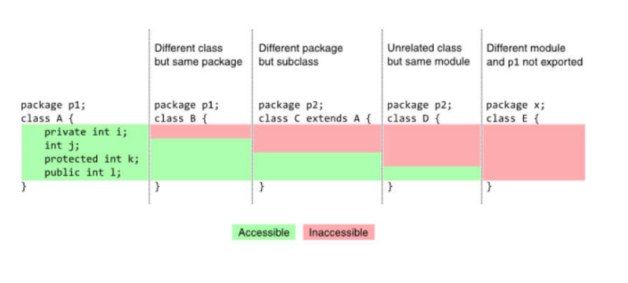


#### 4.9. Exercício de fixação

Em um banco, para se cadastrar uma conta bancária, é necessário informar o número da conta, o nome do titular da conta, e o valor de depósito inicial que o titular depositou ao abrir a conta. Este valor de depósito inicial, entretanto, é opcional, ou seja: se o titular não tiver dinheiro a depositar no momento de abrir sua conta, o depósito inicial não será feito e o saldo inicial da conta será, naturalmente, zero. 

Importante: uma vez que uma conta bancária foi aberta, o número da conta nunca poderá ser alterado. Já o nome do titular pode ser alterado (pois uma pessoa pode mudar de nome por ocasião de casamento, por exemplo).

Por fim, o saldo da conta não pode ser alterado livremente. É preciso haver um mecanismo para proteger isso. O saldo só aumenta por meio de depósitos, e só diminui por meio de saques. Para cada saque realizado, o banco cobra uma taxa de $ 5.00. Nota: a conta pode ficar com saldo negativo se o saldo não for suficiente para realizar o saque e/ou pagar a taxa.

Você deve fazer um programa que realize o cadastro de uma conta, dando opção para que seja ou não informado o valor de depósito inicial. Em seguida, realizar um depósito e depois um saque, sempre mostrando os dados da conta após cada operação.

**Ex 1**

```
Enter account number: 8532
Enter account holder: Alex Green
Is there na initial deposit (y/n)? y
Enter initial deposit value: 500.00
Account data:
Account 8532, Holder: Alex Green, Balance: $ 500.00
Enter a deposit value: 200.00
Updated account data:
Account 8532, Holder: Alex Green, Balance: $ 700.00
Enter a withdraw value: 300.00
Updated account data:
Account 8532, Holder: Alex Green, Balance: $ 395.00
```

**Ex 2**

```
Enter account number: 7801
Enter account holder: Maria Brown
Is there na initial deposit (y/n)? n
Account data:
Account 7801, Holder: Maria Brown, Balance: $ 0.00
Enter a deposit value: 200.00
Updated account data:
Account 7801, Holder: Maria Brown, Balance: $ 200.00
Enter a withdraw value: 198.00
Updated account data:
Account 7801, Holder: Maria Brown, Balance: $ -3.00
```

#### 4.10. Correção do exercício de fixação - Parte 1

#### 4.11. Correção do exercício de fixação - Parte 2

```java
package entities;

public class Account {
	private int number;
	private String holder;
	private double balance;
	
	public Account(int number, String holder) {
		this.number = number;
		this.holder = holder;
	}
	public Account(int number, String holder, double initialDeposit) {
		this.number = number;
		this.holder = holder;
		//this.balance = balance;
		deposit(initialDeposit);
	}
	public Integer getNumber() {
		return number;
	}
//	public void setNumber(Integer number) {
//		this.number = number;
//	}
	public String getHolder() {
		return holder;
	}
	public void setHolder(String holder) {
		this.holder = holder;
	}
	public Double getBalance() {
		return balance;
	}
	
	public void deposit(double amount) {
		balance += amount;
	}
	public void withraw(double amount) {
		balance -= amount + 5.0;
	}
	@Override
	public String toString() {
		return "Account "
				+ number
				+ ", Holder: "
				+ holder
				+ ", Balance: $ "
				+ String.format("%.2f", balance);

	}
	
	
	
}

``` 

```java
package app;

import java.util.Locale;
import java.util.Scanner;
import entities.Account;

public class Program {

	public static void main(String[] args) {

		Locale.setDefault(Locale.US);
		Scanner sc = new Scanner(System.in);
		Account account;

		System.out.print("Enter account number: ");
		Integer number = sc.nextInt();

		System.out.print("Enter account holder: ");
		sc.nextLine();
		String holder = sc.nextLine();

		System.out.print("Enter account holder: (y/n)");
		char confirm = sc.next().charAt(0);

		if (confirm == 'y') {
			System.out.println("Enter initial deposit value:");
			double initialDeposit = sc.nextDouble();
			account = new Account(number, holder, initialDeposit);
		} else {
			account = new Account(number, holder);
		}

		System.out.println();
		System.out.println("Account data:");
		System.out.println(account);

		System.out.println();
		System.out.print("Enter a deposit value: ");
		double deposit = sc.nextDouble();
		account.deposit(deposit);

		System.out.print("Updated account data:");
		System.out.print(account);
		
		System.out.println();
		System.out.print("Enter a withdraw value: ");
		double withdrawValue = sc.nextDouble();
		account.withraw(withdrawValue);
		System.out.println("Updated account data:");
		System.out.println(account);


		sc.close();
	}

}

``` 


[Voltar ao Índice](#indice)

---


## <a name="parte5">5 - Comportamento de memória, arrays, listas</a>

[MATERIAL DO MÓDULO](5-Comportamento-de-memoria-arrays-listas/pdf/2.2-05-memoria-arrays-e-listas.pdf)

#### 5.3. Tipos referência vs. tipos valor

**Classes são tipos referência**

Variáveis cujo tipo são classes não devem ser entendidas como caixas, mas sim “tentáculos” (ponteiros) para caixas

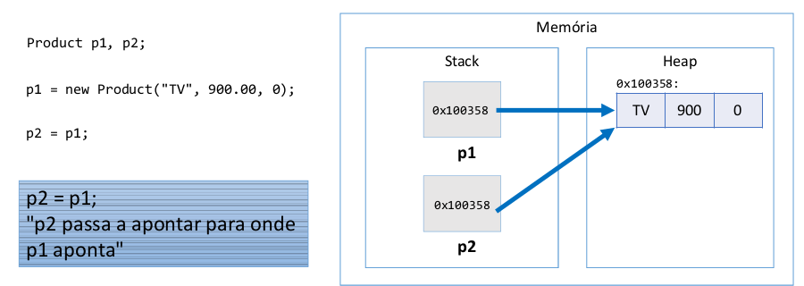

**Valor "null"**

Tipos referência aceitam o valor "null", que indica que a variável aponta pra ninguém.

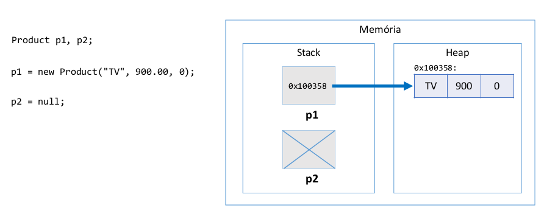

**Tipos primitivos são tipos valor**

Em Java, tipos primitivos são tipos valor. Tipos valor são CAIXAS e não ponteiros.

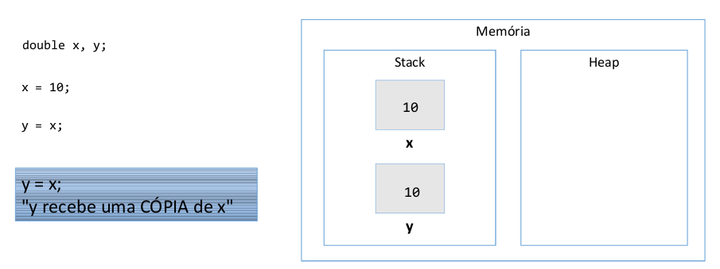

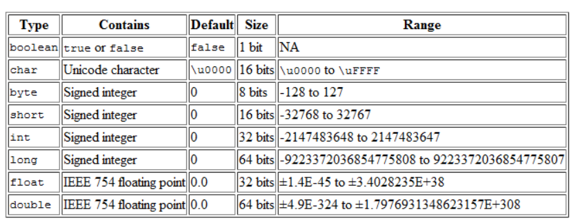

**Tipos primitivos e inicialização**

```java
int p;
System.out.println(p); // erro: variável não iniciada

p = 10;
System.out.println(p); // 10
```

**Valores padrão**

Quando alocamos (new) qualquer tipo estruturado (classe ou array), são atribuídos valores padrão aos seus elementos

- números: 0
- boolean: false
- char: caractere código 0
- objeto: null

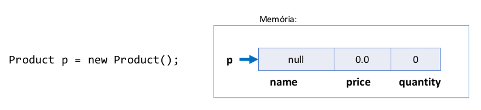

**Tipos referência vs. tipos valor**

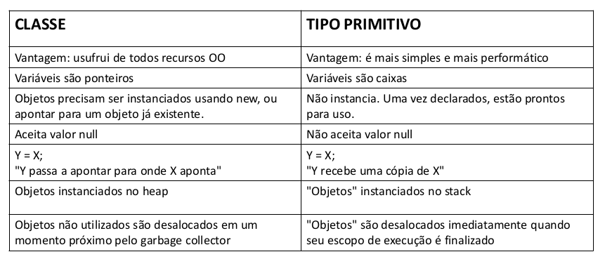


#### 5.4. Desalocação de memória - garbage collector e escopo local

**Garbage collector**

- É um processo que automatiza o gerenciamento de memória de um programa em execução
- O garbage collector monitora os objetos alocados dinamicamente pelo programa (no heap), desalocando aqueles que não estão mais sendo utilizados.

**Desalocação por garbage collector**

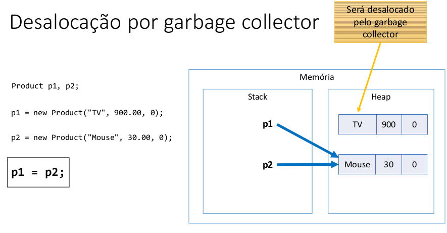

**Resumo**

- Objetos alocados dinamicamente, quando não possuem mais referência para eles, serão desalocados pelo garbage collector
- Variáveis locais são desalocadas imediatamente assim que seu escopo local sai de execução

#### 5.5. Vetores - Parte 1

-  Em programação, "vetor" é o nome dado a arranjos unidimensionais
-  Arranjo (array) é uma estrutura de dados:
   -  Homogênea (dados do mesmo tipo)
   -  Ordenada (elementos acessados por meio de posições)
   -  Alocada de uma vez só, em um bloco contíguo de memória
-  Vantagens:
   -  Acesso imediato aos elementos pela sua posição
-  Desvantagens:
   -  Tamanho fixo
   -  Dificuldade para se realizar inserções e deleções

**Problema exemplo 1**

Fazer um programa para ler um número inteiro N e a altura de N pessoas. Armazene as N alturas em um vetor. Em seguida, mostrar a altura média dessas pessoas.

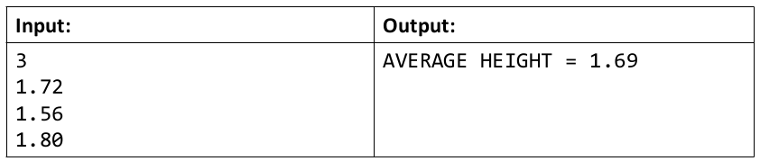

```java
package app;

import java.util.Locale;
import java.util.Scanner;

public class Program {

	public static void main(String[] args) {
		
		Locale.setDefault(Locale.US);
		Scanner sc = new Scanner(System.in);
		
		int n = sc.nextInt();
		
		double[] vet = new double[n];
		
		for(int i = 0 ; i < n ; i++) {
			vet[i] = sc.nextDouble();
		}
		
		double sum = 0.0;
		for(int i = 0 ; i < n ; i++) {
			sum += vet[i];
		}
		
		double avg = sum /n ;
		
		System.out.printf("Average height: %.2f%n", avg);
		
		sc.close();

	}

}

```


#### 5.6. Vetores - Parte 2

**Problema exemplo 2**

Fazer um programa para ler um número inteiro N e os dados (nome e preço) de N Produtos. Armazene os N produtos em um vetor. Em seguida, mostrar o preço médio dos produtos.

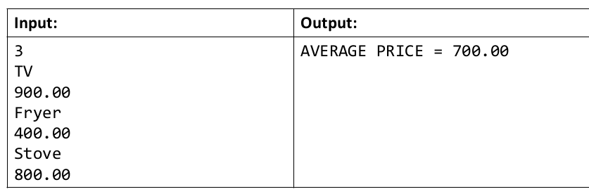

- 5-Comportamento-de-memoria-arrays-listas/5-6-Vetores-Parte-2/src/entities/Product.java

```java
package app;

import java.util.Locale;
import java.util.Scanner;

import entities.Product;

public class Program {

	public static void main(String[] args) {

		Locale.setDefault(Locale.US);
		Scanner sc = new Scanner(System.in);
		
		int n = sc.nextInt();
		Product[] vect = new Product[n];
		
		for(int i = 0 ; i < vect.length ; i++) {
			sc.nextLine(); // limpa
			String name = sc.nextLine();
			double price = sc.nextDouble();
			vect[i] = new Product(name, price);
		}
		
		double sum = 0.0;
		for(int i = 0 ; i < vect.length ; i++) {
			sum += vect[i].getPrice();
		}
		
		double avg = sum / vect.length;
		
		System.out.printf("AVERAGE PRICE = %.2f%n", avg);
			
		sc.close();
		
	}

}

```


#### 5.7. Exercício de fixação

A dona de um pensionato possui dez quartos para alugar para estudantes, sendo esses quartos identificados pelos números 0 a 9.

Fazer um programa que inicie com todos os dez quartos vazios, e depois leia uma quantidade N representando o número de estudantes que vão lugar quartos (N pode ser de 1 a 10). Em seguida, registre o aluguel dos N estudantes. Para cada registro de aluguel, informar o nome e email do estudante, bem como qual dos quartos ele escolheu (de 0 a 9). Suponha que seja escolhido um quarto vago. Ao final, seu programa deve imprimir um relatório de todas ocupações do pensionato, por ordem de quarto,conforme exemplo.

```
How many rooms will be rented? 3
Rent #1:
Name: Maria Green
Email: maria@gmail.com
Room: 5
Rent #2:
Name: Marco Antonio
Email: marco@gmail.com
Room: 1
Rent #3:
Name: Alex Brown
Email: alex@gmail.com
Room: 8
Busy rooms:
1: Marco Antonio, marco@gmail.com
5: Maria Green, maria@gmail.com
8: Alex Brown, alex@gmail.com

```

- 5-Comportamento-de-memoria-arrays-listas/5-7-Exercicio-de-fixacao

```java
package app;

import java.util.Scanner;

import entities.Rent;

public class Program {

	public static void main(String[] args) {

		Scanner sc = new Scanner(System.in);

		Rent[] vect = new Rent[10];

		System.out.println("How many roons will be rented?  ");
		int n = sc.nextInt();

		for (int i = 1; i <= n; i++) {
			System.out.println();
			System.out.println("Rent #" + i + " : ");
			System.out.print("Name: ");
			sc.nextLine();
			String name = sc.nextLine();

			System.out.print("Email: ");
			String email = sc.nextLine();

			System.out.print("Room: ");
			int room = sc.nextInt();

			vect[room] = new Rent(name, email);
		}

		System.out.println();
		System.out.println("Busy rooms: ");
		for (int i = 0; i < vect.length; i++) {
			if (vect[i] != null)
				System.out.println(i + ": " + vect[i]);
		}

		sc.close();
	}

}

```


#### 5.8. Boxing, unboxing e wrapper classes

**Boxing**

- É o processo de conversão de um objeto tipo valor para um objeto tipo referência compatível
  
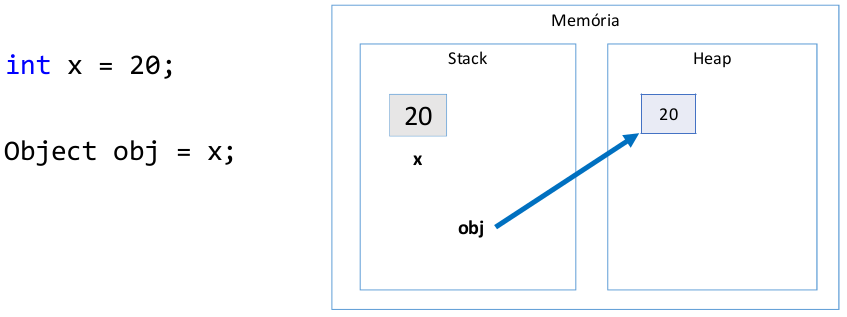

**Unboxing**

- É o processo de conversão de um objeto tipo referência para um objeto tipo valor compatível

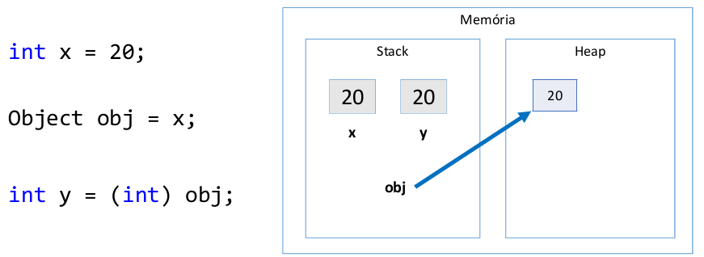

**Wrapper classes**

- São classes equivalentes aos tipos primitivos
- Boxing e unboxing é natural na linguagem
- Uso comum: campos de entidades em sistemas de informação (IMPORTANTE!)
	- Pois tipos referência (classes) aceitam valor null e usufruem dos recursos OO

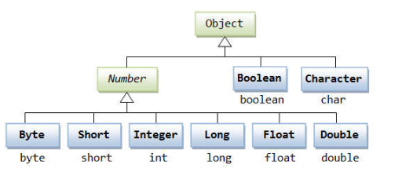

```java
Integer x = 10;
int y = x * 2;

public class Product {
	public String name;
	public Double price;
	public Integer quantity;
}
```

#### 5.9. Laço for each

Sintaxe opcional e simplificada para percorrer coleções

Sintaxe:

```
for (Tipo apelido : coleção) {
	<comando 1>
	<comando 2>
}
```
**Leitura: "para cada objeto 'obj' contido em vect, faça:"**

```java
package app;

import java.util.Iterator;

public class Program {

	public static void main(String[] args) {
		
		String[] vect = new String[] {"JOSE", "Luci", "Mariazinha"};
		
		for (int i = 0; i < vect.length; i++) {
			System.out.println(vect[i]);
		}
		System.out.println("-----------------------");
		
		for (String obj : vect) {
			System.out.println(obj);
		}

	}

}

```

#### 5.10. Listas - Parte 1

- Referência: https://docs.oracle.com/javase/10/docs/api/java/util/List.html

- Lista é uma estrutura de dados:
  - Homogênea (dados do mesmo tipo)
  - Ordenada (elementos acessados por meio de posições)
  - Inicia vazia, e seus elementos são alocados sob demanda
  - Cada elemento ocupa um "nó" (ou nodo) da lista
- Tipo (interface): List
- Classes que implementam: ArrayList, LinkedList, etc.
- Vantagens:
  - Tamanho variável
  - Facilidade para se realizar inserções e deleções
- Desvantagens:
  - Acesso sequencial aos elementos *(algumas classes melhoram o acesso)

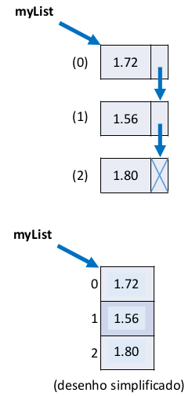


#### 5.11. Listas - Parte 2

- Tamanho da lista: size()
- Obter o elemento de uma posição: get(position)
- Inserir elemento na lista: add(obj), add(int, obj)
- Remover elementos da lista: remove(obj), remove(int), removeIf(Predicate)
- Encontrar posição de elemento: indexOf(obj), lastIndexOf(obj)
- Filtrar lista com base em predicado: List<Integer> result = list.stream().filter(x -> x > 4).collect(Collectors.toList());
- Encontrar primeira ocorrência com base em predicado: Integer result = list.stream().filter(x -> x > 4).findFirst().orElse(null);

```java
package app;

import java.util.ArrayList;
import java.util.List;
import java.util.stream.Collectors;

public class Program {

	public static void main(String[] args) {

		List<String> list = new ArrayList<>();

		list.add("Maria");
		list.add("Alex");
		list.add("Babel");
		list.add("Pharo");
		list.add("Alberto");
		list.add("Ziraldo");
		list.add("Zezinho");

		System.out.println(list.size());
		for (String elem : list) {
			System.out.println(elem);
		}
		System.out.println("---------------------------");

		list.removeIf(x -> x.charAt(0) == 'M');
		for (String x : list) {
			System.out.println(x);
		}
		System.out.println("---------------------");
		
		System.out.println("Index of Bob: " + list.indexOf("Bob"));
		System.out.println("Index of Marco: " + list.indexOf("Marco"));
		System.out.println("---------------------");
		
		List<String> result = list.stream().filter(x -> x.charAt(0) == 'A').collect(Collectors.toList());
		for (String x : result) {
			System.out.println(x);
		}
		System.out.println("---------------------");
		
		String name = list.stream().filter(x -> x.charAt(0) == 'J').findFirst().orElse(null);
		System.out.println(name);

	}

}

```

#### 5.12. Exercício proposto

Fazer um programa para ler um número inteiro N e depois os dados (id, nome e salario) de N funcionários. Não deve haver repetição de id.

Em seguida, efetuar o aumento de X por cento no salário de um determinado funcionário. Para isso, o programa deve ler um id e o valor X. Se o id informado não existir, mostrar uma mensagem e abortar a operação. Ao final, mostrar a listagem atualizada dos funcionários, conforme exemplos.

Lembre-se de aplicar a técnica de encapsulamento para não permitir que o salário possa ser mudado livremente. Um salário só pode ser aumentado com base em uma operação de
aumento por porcentagem dada.

```
How many employees will be registered? 3
Emplyoee #1:
Id: 333
Name: Maria Brown
Salary: 4000.00
Emplyoee #2:
Id: 536
Name: Alex Grey
Salary: 3000.00
Emplyoee #3:
Id: 772
Name: Bob Green
Salary: 5000.00
Enter the employee id that will have salary increase : 536
Enter the percentage: 10.0
List of employees:
333, Maria Brown, 4000.00
536, Alex Grey, 3300.00
772, Bob Green, 5000.00

```

```
How many employees will be registered? 2
Emplyoee #1:
Id: 333
Name: Maria Brown
Salary: 4000.00
Emplyoee #2:
Id: 536
Name: Alex Grey
Salary: 3000.00
Enter the employee id that will have salary increase: 776
This id does not exist!
List of employees:
333, Maria Brown, 4000.00
536, Alex Grey, 3000.00
```

```java
package entities;

public class Employee {
	private Integer id;
	private String name;
	private Double salary;

	public Employee(Integer id, String name, Double salary) {
		this.id = id;
		this.name = name;
		this.salary = salary;
	}

	public Integer getId() {
		return id;
	}

	public void setId(Integer id) {
		this.id = id;
	}

	public String getName() {
		return name;
	}

	public void setName(String name) {
		this.name = name;
	}

	public Double getSalary() {
		return salary;
	}

	public void setSalary(Double salary) {
		this.salary = salary;
	}

	public void increaseSalary(double percentage) {
		salary += salary * percentage / 100.0;
	}

	@Override
	public String toString() {
		return id + ", " + name + ", " + String.format("%.2f", salary);
	}

}

```

```java
package app;

import java.util.ArrayList;
import java.util.List;
import java.util.Locale;
import java.util.Scanner;

import entities.Employee;

public class Program {

	public static void main(String[] args) {

		Locale.setDefault(Locale.US);
		Scanner sc = new Scanner(System.in);

		List<Employee> listEmployee = new ArrayList<Employee>();

		System.out.println("How many employees will be registered?");
		int employees = sc.nextInt();

		for (int i = 1; i <= employees; i++) {
			System.out.println("Emplyoee #" + i + " : ");

			System.out.print("id: ");
			int id = sc.nextInt();

			System.out.print("Name: ");
			sc.nextLine();
			String name = sc.next();

			System.out.print("Salary: ");
			double salary = sc.nextDouble();

			listEmployee.add(new Employee(id, name, salary));
		}
		System.out.println();
		System.out.print("Enter the employee id that will have salary increase: ");
		int id = sc.nextInt();
		Employee emp = listEmployee.stream().filter(x -> x.getId() == id).findFirst().orElse(null);
		if (emp == null) {
			System.out.println("This id does not exist!");
		} else {
			System.out.print("Enter the percentage: ");
			double percentage = sc.nextDouble();
			emp.increaseSalary(percentage);
		}

		System.out.println();
		System.out.println("List of employees: ");
		for (Employee obj : listEmployee) {
			System.out.println(obj);
		}

	}

}

```

#### 5.13. Matrizes

- Em programação, "matriz" é o nome dado a arranjos bidimensionais
  - Atenção: "vetor de vetores"
- Arranjo (array) é uma estrutura de dados:
  - Homogênea (dados do mesmo tipo)
  - Ordenada (elementos acessados por meio de posições)
  - Alocada de uma vez só, em um bloco contíguo de memória
- Vantagens:
  - Acesso imediato aos elementos pela sua posição
- Desvantagens:
  - Tamanho fixo
  - Dificuldade para se realizar inserções e deleções

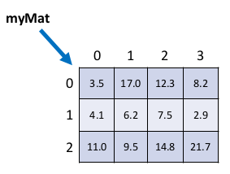


#### 5.14. Exercício resolvido


Fazer um programa para ler um número inteiro N e uma matriz de ordem N contendo números inteiros. Em seguida, mostrar a diagonal principal e a quantidade de valores negativos da matriz.

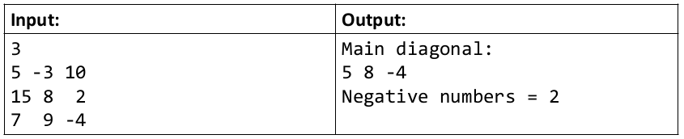

```java
package app;

import java.util.Scanner;

public class Program {

	public static void main(String[] args) {

		Scanner sc = new Scanner(System.in);
		
		int n = sc.nextInt();
		int[][] mat = new int[n][n];
		
		for (int i = 0; i < mat.length; i++) {
			for (int j = 0; j < mat[i].length; j++) {
				mat[i][j] = sc.nextInt();
			}
		}
		
		System.out.println("Diagonal: ");
		for (int i = 0; i < mat.length; i++) {
			System.out.print(mat[i][i] + " ");
		}
		
		System.out.println();
		
		int count = 0;
		
		for (int i = 0; i < mat.length; i++) {
			for (int j = 0; j < mat[i].length; j++) {
				if(mat[i][j] < 0) {
					count++;
				}
			}
		}
		System.out.println("Negative numbers = " + count);
		
		sc.close();

	}

}

```

#### 5.15. Exercício proposto

Fazer um programa para ler dois números inteiros M e N, e depois ler uma matriz de M linhas por N colunas contendo números inteiros, podendo haver repetições. Em seguida, ler um número inteiro X que
pertence à matriz. Para cada ocorrência de X, mostrar os valores à esquerda, acima, à direita e abaixo de X, quando houver, conforme exemplo.

```
3 4
10 8 15 12
21 11 23 8
14 5 13 19
8

Position 0,1:
Left: 10
Right: 15
Down: 11
Position 1,3:
Left: 23
Up: 12
Down: 19

```

```java
package app;

import java.util.Scanner;

public class Program {

	public static void main(String[] args) {

		Scanner sc = new Scanner(System.in);

		int m = sc.nextInt();
		int n = sc.nextInt();

		int[][] mat = new int[m][n];

		for (int i = 0; i < mat.length; i++) {
			for (int j = 0; j < mat[i].length; j++) {
				mat[i][j] = sc.nextInt();
			}
		}

		int x = sc.nextInt();

		for (int i=0; i<mat.length; i++) {
			for (int j=0; j<mat[i].length; j++) {
				if (mat[i][j] == x) {
					System.out.println("Position " + i + "," + j + ":");
					if (j > 0) {
						System.out.println("Left: " + mat[i][j-1]);
					}
					if (i > 0) {
						System.out.println("Up: " + mat[i-1][j]);
					}
					if (j < mat[i].length-1) {
						System.out.println("Right: " + mat[i][j+1]);
					}
					if (i < mat.length-1) {
						System.out.println("Down: " + mat[i+1][j]);
					}
				}
			}
		}
		sc.close();
	}

}

```


[Voltar ao Índice](#indice)

---


## <a name="parte6">6 - Tópicos especiais em Java</a>

#### 6.2. Trabalhando com datas - Date

Representa um INSTANTE

Pacote java.util - https://docs.oracle.com/javase/10/docs/api/java/util/Date.html

Um objeto Date internamente armazena:
- O número de milissegundos desde a meia noite do dia 1 de janeiro de 1970 GMT (UTC)
  - GMT: Greenwich Mean Time (time zone)
  - UTC: Coordinated Universal Time (time standard)

**SimpleDateFormat**
- https://docs.oracle.com/javase/10/docs/api/java/text/SimpleDateFormat.html
- Define formatos para conversão entre Date e String

- dd/MM/yyyy -> 23/07/2018
- dd/MM/yyyy HH:mm:ss -> 23/07/2018 15:42:07

**Padrão ISO 8601 e classe Instant**

- Formato: yyyy-MM-ddTHH:mm:ssZ
- Exemplo: "2018-06-25T15:42:07Z"
- Date y3 = Date.from(Instant.parse("2018-06-25T15:42:07Z"));

```java
package app;

import java.text.ParseException;
import java.text.SimpleDateFormat;
import java.time.Instant;
import java.util.Date;
import java.util.TimeZone;

public class Program {

	public static void main(String[] args) throws ParseException {

		SimpleDateFormat sdf1 = new SimpleDateFormat("dd/MM/yyyy");
		SimpleDateFormat sdf2 = new SimpleDateFormat("dd/MM/yyyy HH:mm:ss");
		SimpleDateFormat sdf3 = new SimpleDateFormat("dd/MM/yyyy HH:mm:ss");
		sdf3.setTimeZone(TimeZone.getTimeZone("GMT"));
		
		Date x1 = new Date();
		Date x2 = new Date(System.currentTimeMillis());
		Date x3 = new Date(0L);
		Date x4 = new Date(1000L * 60L * 60L * 5L);
		
		Date y1 = sdf1.parse("25/06/2018");
		Date y2 = sdf2.parse("25/06/2018 15:42:07");
		Date y3 = Date.from(Instant.parse("2018-06-25T15:42:07Z"));
		
		System.out.println("x1: " + x1);
		System.out.println("x2: " + x2);
		System.out.println("x3: " + x3);
		System.out.println("x4: " + x4);
		System.out.println("y1: " + y1);
		System.out.println("y2: " + y2);
		System.out.println("y3: " + y3);
		System.out.println("-------------");
		System.out.println("x1: " + sdf2.format(x1));
		System.out.println("x2: " + sdf2.format(x2));
		System.out.println("x3: " + sdf2.format(x3));
		System.out.println("x4: " + sdf2.format(x4));
		System.out.println("y1: " + sdf2.format(y1));
		System.out.println("y2: " + sdf2.format(y2));
		System.out.println("y3: " + sdf2.format(y3));
		System.out.println("-------------");
		System.out.println("x1: " + sdf3.format(x1));
		System.out.println("x2: " + sdf3.format(x2));
		System.out.println("x3: " + sdf3.format(x3));
		System.out.println("x4: " + sdf3.format(x4));
		System.out.println("y1: " + sdf3.format(y1));
		System.out.println("y2: " + sdf3.format(y2));
		System.out.println("y3: " + sdf3.format(y3));
	}

}

```

```
x1: Fri May 24 22:50:05 BRT 2019
x2: Fri May 24 22:50:05 BRT 2019
x3: Wed Dec 31 21:00:00 BRT 1969
x4: Thu Jan 01 02:00:00 BRT 1970
y1: Mon Jun 25 00:00:00 BRT 2018
y2: Mon Jun 25 15:42:07 BRT 2018
y3: Mon Jun 25 12:42:07 BRT 2018
-------------
x1: 24/05/2019 22:50:05
x2: 24/05/2019 22:50:05
x3: 31/12/1969 21:00:00
x4: 01/01/1970 02:00:00
y1: 25/06/2018 00:00:00
y2: 25/06/2018 15:42:07
y3: 25/06/2018 12:42:07
-------------
x1: 25/05/2019 01:50:05
x2: 25/05/2019 01:50:05
x3: 01/01/1970 00:00:00
x4: 01/01/1970 05:00:00
y1: 25/06/2018 03:00:00
y2: 25/06/2018 18:42:07
y3: 25/06/2018 15:42:07

```

#### 6.3. Manipulando um Date com Calendar


[Voltar ao Índice](#indice)

---


## <a name="parte7">7 - Bônus - nivelamento sobre Git e Github</a>


[Voltar ao Índice](#indice)

---


## <a name="parte8">8 - Enumerações, composição</a>


[Voltar ao Índice](#indice)

---


## <a name="parte9">9 - Herança e polimorfismo</a>


[Voltar ao Índice](#indice)

---


## <a name="parte10">10 - Tratamento de exceções</a>


[Voltar ao Índice](#indice)

---


## <a name="parte11">11 - Projeto: Sistema jogo de xadrez</a>


[Voltar ao Índice](#indice)

---


## <a name="parte12">12 - Trabalhando com arquivos</a>


[Voltar ao Índice](#indice)

---


## <a name="parte13">13 - Interfaces</a>


[Voltar ao Índice](#indice)

---


## <a name="parte14">14 - Generics, Set, Map</a>


[Voltar ao Índice](#indice)

---


## <a name="parte15">15 - Programação funcional e expressões lambda</a>


[Voltar ao Índice](#indice)

---


## <a name="parte16">16 - Acesso a banco de dados com JDBC</a>


[Voltar ao Índice](#indice)

---


## <a name="parte17">17 - Interface gráfica com JavaFX</a>


[Voltar ao Índice](#indice)

---


## <a name="parte18">18 - Projeto: Aplicação desktop com JavaFX e banco de dados MySQL com JDBC</a>


[Voltar ao Índice](#indice)

---


## <a name="parte19">19 - Projeto: API Restful web com Spring Boot e banco de dados MongoDB</a>


[Voltar ao Índice](#indice)

---


## <a name="parte20">20 - Seção bônus</a>


[Voltar ao Índice](#indice)

---

