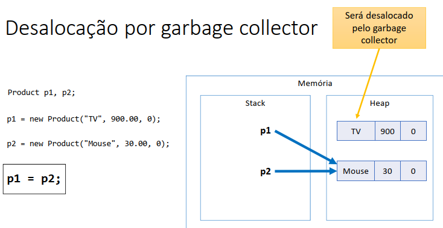

# Java COMPLETO Programação Orientada a Objetos + Projetos

*Update 2025*

https://www.udemy.com/java-curso-completo/

Curso mais didático e completo de Java e OO, UML, JDBC, JavaFX, Spring Boot, JPA, Hibernate, MySQL, MongoDB e muito mais

## <a name="indice">Índice</a>

- [Seção 1: Introdução](#parte1)
- [Seção 2: Conceitos de programação](#parte2)
- [Seção 3: Introdução à linguagem Java](#parte3)
- [Seção 4: Estrutura sequencial](#parte4)
- [Seção 5: Estrutura condicional](#parte5)
- [Seção 6: Estruturas repetitivas](#parte6)
- [Seção 7: Outros tópicos básicos sobre Java](#parte7)
- [Seção 8: Introdução à Programação Orientada a Objetos](#parte8)
- [Seção 9: Construtores, palavra this, sobrecarga, encapsulamento](#parte9)
- [Seção 10: Comportamento de memória, arrays, listas](#parte10)
- [Seção 11: Tópicos especiais em Java: data-hora](#parte11)
- [Seção 12: Bônus - nivelamento sobre Git e Github](#parte12)
- [Seção 13: Enumerações, composição](#parte13)
- [Seção 14: Herança e polimorfismo](#parte14)
- [Seção 15: Tratamento de exceções](#parte15)
- [Seção 16: Projeto: Sistema jogo de xadrez](#parte16)
- [Seção 17: Trabalhando com arquivos](#parte17)
- [Seção 18: Interfaces](#parte18)
- [Seção 19: Generics, Set, Map](#parte19)
- [Seção 20: Programação funcional e expressões lambda](#parte20)
- [Seção 21: Acesso a banco de dados com JDBC](#parte21)
- [Seção 22: Java EE - Mapeamento objeto-relacional com JPA / Hibernate](#parte22)
- [Seção 23: Projeto: Web services com Spring Boot e JPA / Hibernate](#parte23)
- [Seção 24: Projeto: API Restful com Spring Boot e banco MongoDB (web services + NoSQL)](#parte24)
- [Seção 25: Interface gráfica com JavaFX](#parte25)
- [Seção 26: Seção bônus](#parte26)
---


## <a name="parte1">1 - Seção 1: Introdução</a>

- 1 Introdução: visão geral do curso

[Voltar ao Índice](#indice)

---


## <a name="parte2">2 - Seção 2: Conceitos de programação</a>

- 2 Visão geral do capítulo
- 3 Material de apoio do capítulo
- 4 Algoritmo, Automação, Programa de Computador
- 5 O que é preciso para se fazer um programa de computador
- 6 Linguagem de programação, léxica, sintática
- 7 IDE - Ambiente Integrado de Desenvolvimento
- 8 Compilação, interpretação, código fonte, código objeto, máquina virtual

[Voltar ao Índice](#indice)

---


## <a name="parte3">3 - Seção 3: Introdução à linguagem Java</a>

- 9 Visão geral do capítulo
- 10 Material de apoio do capítulo

    - [MaterialApoio/02-conceitos-de-programacao.pdf](MaterialApoio/02-conceitos-de-programacao.pdf)

- 11 Entendendo as versões do Java
- 12 Histórico e edições de Java
- 13 JDK / JVM - Máquina Virtual do Java
- 14 Estrutura de uma aplicação Java
- 15 Instalando o Java JDK
- 16 Instalando o Eclipse
- 17 Primeiro programa em Java no Eclipse

[Voltar ao Índice](#indice)

---


## <a name="parte4">4 - Seção 4: Estrutura sequencial</a>

- 18 Visão geral do capítulo
- 19 Material de apoio do capítulo

    - [MaterialApoio/04-estrutura-sequencial.pdf](MaterialApoio/04-estrutura-sequencial.pdf)

- 20 Expressões aritméticas
- 21 Variáveis e tipos básicos em Java
- 22 As três operações básicas de programação
- 23 Saída de dados em Java

```
```
Exercício de fixação
Em um novo programa, inicie as seguintes variáveis:
String product1 = "Computer";
String product2 = "Office desk";
int age = 30;
int code = 5290;
char gender = 'F';
double price1 = 2100.0;
double price2 = 650.50;
double measure = 53.234567;

Em seguida, usando os valores das variáveis, produza a seguinte saída na tela do console:

Products:
Computer, which price is $ 2100,00
Office desk, which price is $ 650,50
Record: 30 years old, code 5290 and gender: F
Measue with eight decimal places: 53,23456700
Rouded (three decimal places): 53,235
US decimal point: 53.235
```

[Secao-04-Estruturasequencial/P_023_Saida_de_dados_em_Java](Secao-04-Estruturasequencial/P_023_Saida_de_dados_em_Java)


- 24 Processamento de dados em Java, Casting
- 25 Entrada de dados em Java - Parte 1
- 26 Entrada de dados em Java - Parte 2
- 27 Funções matemáticas em Java

```java
public class Main {
    public static void main(String[] args) {
        double x = 3.0;
        double y = 4.0;
        double z = -5.0;
        double A, B, C;
        A = Math.sqrt(x);
        B = Math.sqrt(y);
        C = Math.sqrt(25.0);
        System.out.println("Raiz quadrada de " + x + " = " + A);
        System.out.println("Raiz quadrada de " + y + " = " + B);
        System.out.println("Raiz quadrada de 25 = " + C);
        A = Math.pow(x, y);
        B = Math.pow(x, 2.0);
        C = Math.pow(5.0, 2.0);
        System.out.println(x + " elevado a " + y + " = " + A);
        System.out.println(x + " elevado ao quadrado = " + B);
        System.out.println("5 elevado ao quadrado = " + C);
        A = Math.abs(y);
        B = Math.abs(z);
        System.out.println("Valor absoluto de " + y + " = " + A);
        System.out.println("Valor absoluto de " + z + " = " + B);
    }
}
```

```
Raiz quadrada de 3.0 = 1.7320508075688772
Raiz quadrada de 4.0 = 2.0
Raiz quadrada de 25 = 5.0
3.0 elevado a 4.0 = 81.0
3.0 elevado ao quadrado = 9.0
5 elevado ao quadrado = 25.0
Valor absoluto de 4.0 = 4.0
Valor absoluto de -5.0 = 5.0
```

- 28 AVISO: exercícios para iniciantes PARTE 1
- 29 Exercícios para Iniciantes - PARTE 1

[/MaterialApoio/04-02-exercicios1-estrutura-sequencial.pdf](/MaterialApoio/04-02-exercicios1-estrutura-sequencial.pdf)

Resolvido - https://www.youtube.com/watch?v=Ah1Y6d6deq0

Exercício 01

```
Faça um programa para ler dois valores inteiros, e depois mostrar na tela a soma desses números com uma 
mensagem explicativa, conforme exemplos.

Entrada: 
10
30
Saída:
SOMA = 40

Entrada: 
-30
10
Saída:
SOMA = -20

Entrada: 
0
0
Saída:
SOMA = 0

```

[/Secao-04-Estruturasequencial/Exercicio_01/](/Secao-04-Estruturasequencial/Exercicio_01/)


Exercício 02
```
Faça um programa para ler o valor do raio de um círculo, e depois mostrar o valor da área deste círculo com quatro 
casas decimais conforme exemplos.
Fórmula da área: area = π . raio**2
Considere o valor de π = 3.14159

Entrada: 
2.00 
Saída:
A=12.5664

Entrada: 
100.64 
Saída:
A=31819.3103

Entrada: 
150.00 
Saída:
A=70685.7750
```

[/Secao-04-Estruturasequencial/ExercIcio_02/](/Secao-04-Estruturasequencial/ExercIcio_02/)


Exercício 03
```
Fazer um programa para ler quatro valores inteiros A, B, C e D. A seguir, calcule e mostre a diferença do produto 
de A e B pelo produto de C e D segundo a fórmula: DIFERENCA = (A * B - C * D)

Entrada: 
5
6
7
8
Saída:
DIFERENCA = -26

Entrada: 
5
6
-7
8
Saída:
DIFERENCA = 86

```

Exercício 04
```
Fazer um programa que leia o número de um funcionário, seu número de horas trabalhadas, o valor que recebe por 
hora e calcula o salário desse funcionário. A seguir, mostre o número e o salário do funcionário, com duas casas 
decimais.
Entrada: 
25
100
5.50
Saída:
NUMBER = 25
SALARY = U$ 550.00

Entrada: 
1
200
20.50
Saída:
NUMBER = 1
SALARY = U$ 4100.00

Entrada: 
6
145
15.55
Saída:
NUMBER = 6
SALARY = U$ 2254.75
```

[/Secao-04-Estruturasequencial/Exercicio_04/](/Secao-04-Estruturasequencial/Exercicio_04/)

Exercício 05

```
Fazer um programa para ler o código de uma peça 1, o número de peças 1, o valor unitário de cada peça 1, o 
código de uma peça 2, o número de peças 2 e o valor unitário de cada peça 2. Calcule e mostre o valor a ser pago.

Entrada: 
12 1 5.30
16 2 5.10
Saída:
VALOR A PAGAR: R$ 15.50

Entrada: 
13 2 15.30
161 4 5.20
Saída:
VALOR A PAGAR: R$ 51.40

Entrada: 
1 1 15.10
2 1 15.10
Saída:
VALOR A PAGAR: R$ 30.20

```

[/Secao-04-Estruturasequencial/Exercicio_05/](/Secao-04-Estruturasequencial/Exercicio_05/)

Exercício 06

```
Fazer um programa que leia três valores com ponto flutuante de dupla precisão: A, B e C. Em seguida, calcule e 
mostre: 
a) a área do triângulo retângulo que tem A por base e C por altura. 
b) a área do círculo de raio C. (pi = 3.14159) 
c) a área do trapézio que tem A e B por bases e C por altura. 
d) a área do quadrado que tem lado B. 
e) a área do retângulo que tem lados A e B.

Entrada: 
3.0 4.0 5.2 
Saída:
TRIANGULO: 7.800
CIRCULO: 84.949
TRAPEZIO: 18.200
QUADRADO: 16.000
RETANGULO: 12.000

Entrada: 
12.7 10.4 15.2 
Saída:
TRIANGULO: 96.520
CIRCULO: 725.833
TRAPEZIO: 175.560
QUADRADO: 108.160
RETANGULO: 132.080
```

[/Secao-04-Estruturasequencial/Exercicio_06/](/Secao-04-Estruturasequencial/Exercicio_06/)


[Voltar ao Índice](#indice)

---


## <a name="parte5">5 - Seção 5: Estrutura condicional</a>

- 30 Visão geral do capítulo
- 31 Material de apoio do capítulo

[/MaterialApoio/05-estrutura-condicional%20(1).pdf](/MaterialApoio/05-estrutura-condicional%20(1).pdf)

- 32 Expressões comparativas
- 33 Expressões lógicas
- 34 Estrutura condicional (if-else)
- 35 AVISO: exercícios para iniciantes PARTE 2
- 36 Exercícios para Iniciantes - PARTE 2

Exercício 01

```
Fazer um programa para ler um número inteiro, e depois dizer se este número é negativo ou não.
Exemplos:
Entrada: -10 
Saída: NEGATIVO
Entrada:  8 
Saída: NAO NEGATIVO
Entrada:  0 
Saída: NAO NEGATIVO
```

[/Secao-05-Estrutura_condicional/Exercicio_01/](/Secao-05-Estrutura_condicional/Exercicio_01/)

Exercício 02

```
Fazer um programa para ler um número inteiro e dizer se este número é par ou ímpar.
Exemplos:
Entrada: 12 
Saída: PAR
Entrada: -27 
Saída: IMPAR
Entrada: 0 
Saída: PAR
```

[/Secao-05-Estrutura_condicional/Exercicio_02/](/Secao-05-Estrutura_condicional/Exercicio_02/)

Exercício 03

```
Leia 2 valores inteiros (A e B). Após, o programa deve mostrar uma mensagem "Sao Multiplos" ou "Nao sao
Multiplos", indicando se os valores lidos são múltiplos entre si. Atenção: os números devem poder ser digitados em ordem crescente ou decrescente.

Exemplos:
Entrada: 6 24 
Saída: Sao Multiplos
Entrada: 6 25 
Saída: Nao sao Multiplos
Entrada: 24 6 
Saída:Sao Multiplos
```

Exercício 04

```
Leia a hora inicial e a hora final de um jogo. A seguir calcule a duração do jogo, sabendo que o mesmo pode começar em um dia e terminar em outro, tendo uma duração mínima de 1 hora e máxima de 24 horas.
Exemplos:
Entrada: 16 2 
Saída: O JOGO DUROU 10 HORA(S)
Entrada: 0 0 
Saída:O JOGO DUROU 24 HORA(S)
Entrada: 2 16 
Saída:O JOGO DUROU 14 HORA(S)
```

[/Secao-05-Estrutura_condicional/Exercicio_04/](/Secao-05-Estrutura_condicional/Exercicio_04/)

Exercício 05

```
Com base na tabela abaixo, escreva um programa que leia o código de um item e a quantidade deste item. A seguir, calcule e mostre o valor da conta a pagar.
```


```
Exemplos:
Entrada: 3 2 
Saída: Total: R$ 10.00
Entrada: 2 3 
Saída: Total: R$ 13.50
```

- 37 Sintaxe opcional - operadores de atribuição cumulativa
- 38 Sintaxe opcional - switch-case

```
switch ( expressão ) {
    case valor1:
        comando1
        comando2
        break;
    case valor2:
        comando3
        comando4
        break;
    default:
        comando5
        comando6
        break;
}
```

- 39 Expressão condicional ternária

```java
double preco = 34.5;
double desconto;
if (preco < 20.0) {
    desconto = preco * 0.1;
}
else {
    desconto = preco * 0.05;
}
```

```java
double preco = 34.5;
double desconto = (preco < 20.0) ? preco * 0.1 : preco * 0.05;
```

- 40 Escopo e inicialização

```
• Escopo de uma variável: é a região do programa onde a variável é válida, ou seja, onde ela pode ser referenciada.
• Uma variável não pode ser usada se não for iniciada.
• Falaremos de escopo de métodos no Capítulo 5
```

[Voltar ao Índice](#indice)

---


## <a name="parte6">6 - Seção 6: Estruturas repetitivas</a>

### 42 Visão geral do capítulo

### 43 Material de apoio do capítulo

[Secao-06-Estruturas_repetitivas\00-apoio\06-estruturas-repetitivas.pdf](Secao-06-Estruturas_repetitivas\00-apoio\06-estruturas-repetitivas.pdf)

### 44 Como utilizar o DEBUG no Eclipse (execução passo a passo)

- Para marcar uma linha de breakpoint:
    - Run -> Toggle Breakpoint
- Para iniciar o debug:
    - Botão direito na classe -> Debug as -> Java Application
- Para executar uma linha:
    - F6
- Para interromper o debug: "stop"

### 45 Estrutura repetitiva enquanto (while)

- É uma estrutura de controle que repete um bloco de comandos enquanto uma condição for verdadeira.
- Quando usar: quando não se sabe previamente a quantidade de repetições que será realizada.

```
Fazer um programa que lê números inteiros até que um zero seja lido. Ao final mostra a soma dos números lidos.
```


```java
public class Main {
    public static void main(String[] args) {

        Scanner sc = new Scanner(System.in);

        int x = sc.nextInt();

        int soma = 0;
        while (x != 0) {
            soma = soma + x;
            x = sc.nextInt();
        }
        System.out.println(soma);
    }
}
```

• Estrutura repetitiva "enquanto"
• Recomendada quando não se sabe previamente a quantidade de repetições
• Regra:
    • V: executa e volta
    • F: pula fora

### 46 Teste de mesa com estrutura repetitiva enquanto

### 47 Exercícios de teste de mesa com while

### 48 AVISO: exercícios para iniciantes PARTE 3

### 49 Exercícios para Iniciantes - PARTE 3

[Secao-06-Estruturas_repetitivas\00-apoio\02-exercicios3-estrutura-while.pdf](Secao-06-Estruturas_repetitivas\00-apoio\02-exercicios3-estrutura-while.pdf)

### 50 Estrutura repetitiva para (for)

É uma estrutura de controle que repete um bloco de comandos para um certo intervalo de valores.
Quando usar: quando se sabe previamente a quantidade de repetições, ou o intervalo de valores.

Por exemplo:

- Fazer um programa que lê um valor inteiro N e depois N números inteiros. Ao final, mostra a soma dos N números lidos


```java
public class Main {
    public static void main(String[] args) {
        Scanner sc = new Scanner(System.in);
        int n = sc.nextInt();

        int soma = 0;
        for (int i = 0; i < n; i++) {
            int x = sc.nextInt();
            soma = soma + x;
        }
        System.out.println(soma);
        sc.close();
    }
}
```

Perceba que a estrutura "para" é ótima para se fazer uma repetição baseada em uma CONTAGEM:

```java
for (int i=0; i<5; i++) {
    System.out.println("Valor de i: " + i);
}

for (int i=4; i>=0; i--) {
    System.out.println("Valor de i: " + i);
}
```

### 51 Teste de mesa com estrutura repetitiva para

### 52 Exercícios de testes de mesa com for

### 53 AVISO: exercícios para iniciantes PARTE 4

### 54 Exercícios para iniciantes PARTE 4

[Secao-06-Estruturas_repetitivas\00-apoio\02-exercicios4-estrutura-for.pdf](Secao-06-Estruturas_repetitivas\00-apoio\02-exercicios4-estrutura-for.pdf)

### 55 Estrutura repetitiva faça-enquanto (do-while)

- Menos utilizada, mas em alguns casos se encaixa melhor ao problema.
- O bloco de comandos executa pelo menos uma vez, pois a condição é verificada no final.


```
Problema exemplo:
Fazer um programa para ler uma temperatura em Celsius e mostrar o equivalente em
Fahrenheit. Perguntar se o usuário deseja repetir (s/n). Caso o usuário digite "s", repetir o
programa.
Fórmula: F = ( 9C/5 ) + 32
```

```java
public class Main {
    public static void main(String[] args) {
        Locale.setDefault(Locale.US);
        Scanner sc = new Scanner(System.in);

        char resp;
        do {
            System.out.println("Digite a temperatura em Celcius: ");
            double C = sc.nextDouble();
            double F = 9.0 * C / 5.0 + 32.0;

            System.out.printf("Equivalente em Fahrenheit: %.1f%n", F);
            System.out.print("Deseja repetir (s/n)?");

            resp = sc.next().charAt(0);

        } while (resp != 'n');

        sc.close();
    }
}
```

[Voltar ao Índice](#indice)

---


## <a name="parte7">7 - Seção 7: Outros tópicos básicos sobre Java</a>

### 56 Material de apoio do capítulo

[Secao-07-Outros_topicos_basicos_sobre_Java\00-apoio\07-outros-topicos-basicos.pdf](Secao-07-Outros_topicos_basicos_sobre_Java\00-apoio\07-outros-topicos-basicos.pdf)

### 57 Restrições e convenções para nomes

- Não pode começar com dígito: use uma letra ou _
- Não usar acentos ou til
- Não pode ter espaço em branco
- Sugestão: use nomes que tenham um significado

Convenções
- Camel Case: lastName
    - pacotes
    - atributos
    - métodos
    - variáveis e parâmetros
- Pascal Case: ProductService
    - classes

### 58 Operadores bitwise


```java
import java.util.Scanner;
public class Program {
    public static void main(String[] args) {
        Scanner sc = new Scanner(System.in);
        int mask = 0b100000;
        int n = sc.nextInt();
        if ((n & mask) != 0) {
            System.out.println("6th bit is true!");
        }
        else {
            System.out.println("6th bit is false");
        }
        sc.close();
    }
}
```

### 59 Funções interessantes para String

- Formatar: toLowerCase(), toUpperCase(), trim()
- Recortar: substring(inicio), substring(inicio, fim)
- Substituir: Replace(char, char), Replace(string, string)
- Buscar: IndexOf, LastIndexOf
- str.Split(" ")

```java
public class Main {
    public static void main(String[] args) {
        String original = "abcde FGHIJ ABC abc DEFG ";

        String s01 = original.toLowerCase();
        String s02 = original.toUpperCase();
        String s03 = original.trim();
        String s04 = original.substring(2);
        String s05 = original.substring(2, 9);
        String s06 = original.replace('a', 'x');
        String s07 = original.replace("abc", "xy");
        int i = original.indexOf("bc");
        int j = original.lastIndexOf("bc");

        System.out.println("Original: -" + original + "-");
        System.out.println("toLowerCase: -" + s01 + "-");
        System.out.println("toUpperCase: -" + s02 + "-");
        System.out.println("trim: -" + s03 + "-");
        System.out.println("substring(2): -" + s04 + "-");
        System.out.println("substring(2, 9): -" + s05 + "-");
        System.out.println("replace('a', 'x'): -" + s06 + "-");
        System.out.println("replace('abc', 'xy'): -" + s07 + "-");
        System.out.println("Index of 'bc': " + i);
        System.out.println("Last index of 'bc': " + j);
    }
}
```

```
Original: -abcde FGHIJ ABC abc DEFG -
toLowerCase: -abcde fghij abc abc defg -
toUpperCase: -ABCDE FGHIJ ABC ABC DEFG -
trim: -abcde FGHIJ ABC abc DEFG-
substring(2): -cde FGHIJ ABC abc DEFG -
substring(2, 9): -cde FGH-
replace('a', 'x'): -xbcde FGHIJ ABC xbc DEFG -
replace('abc', 'xy'): -xyde FGHIJ ABC xy DEFG -
Index of 'bc': 1
Last index of 'bc': 17
```


### 60 Comentários em Java (básico)

```java
package course;
import java.util.Locale;
import java.util.Scanner;
/*
Este programa calcula as raízes de uma equação do segundo grau
Os valores dos coeficientes devem ser digitados um por linha
*/
public class Program {
    public static void main(String[] args) {
        Locale.setDefault(Locale.US);
        Scanner sc = new Scanner(System.in);
        double a, b, c, delta;
        System.out.println("Digite os valores dos coeficientes:");
        a = sc.nextDouble();
        b = sc.nextDouble();
        c = sc.nextDouble();
        delta = b * b - 4 * a * c; // cálculo do valor de delta
```

### 61 Funções (sintaxe)

- Representam um processamento que possui um significado
    - Math.sqrt(double)
    - System.out.println(string)
- Principais vantagens: modularização, delegação e reaproveitamento
- Dados de entrada e saída
    - Funções podem receber dados de entrada (parâmetros ou argumentos)
    - Funções podem ou não retornar uma saída
- Em orientação a objetos, funções em classes recebem o nome de "métodos"

Problema exemplo

- Fazer um programa para ler três números inteiros e mostrar na tela o maior deles.

```java
import java.util.Scanner;

public class Main {
    public static void main(String[] args) {
        Scanner sc = new Scanner(System.in);
        System.out.println("Enter three numbers:");
        int a = sc.nextInt();
        int b = sc.nextInt();
        int c = sc.nextInt();

        int higher = max(a, b, c);
        showResult(higher);

        sc.close();
    }
    public static int max(int x, int y, int z) {
        int aux;
        if (x > y && x > z) {
            aux = x;
        } else if (y > z) {
            aux = y;
        } else {
            aux = z;
        }
        return aux;
    }
    public static void showResult(int value) {
        System.out.println("Higher = " + value);
    }
}
```

[Voltar ao Índice](#indice)

---


## <a name="parte8">8 - Seção 8: Introdução à Programação Orientada a Objetos</a>

### 62 Visão geral do capítulo

### 63 Material de apoio do capítulo

[Secao-08-Introducao_a_Programacao_Orientada_a_Objetos\00-apoio\03-classes-atributos-membros-staticos.pdf](Secao-08-Introducao_a_Programacao_Orientada_a_Objetos\00-apoio\03-classes-atributos-membros-staticos.pdf)

### 64 Resolvendo um problema sem orientação a objetos

```java
import java.util.Locale;
import java.util.Scanner;

public class Main {
    public static void main(String[] args) {

        Locale.setDefault(Locale.US);
        Scanner sc = new Scanner(System.in);

        double xA, xB, xC, yA, yB, yC;

        System.out.println("Enter the measures of triangle X: ");
        xA = sc.nextDouble();
        xB = sc.nextDouble();
        xC = sc.nextDouble();

        System.out.println("Enter the measures of triangle Y: ");
        yA = sc.nextDouble();
        yB = sc.nextDouble();
        yC = sc.nextDouble();
        double p = (xA + xB + xC) / 2.0;
        double areaX = Math.sqrt(p * (p - xA) * (p - xB) * (p - xC));
        p = (yA + yB + yC) / 2.0;
        double areaY = Math.sqrt(p * (p - yA) * (p - yB) * (p - yC));

        System.out.printf("Triangle X area: %.4f%n", areaX);
        System.out.printf("Triangle Y area: %.4f%n", areaY);

        if (areaX > areaY) {
            System.out.println("Larger area: X");
        }
        else {
            System.out.println("Larger area: Y");
        }
        sc.close();

    }
}
```

### 65 Criando uma classe com três atributos para representar melhor o triângulo

Classe

- É um tipo estruturado que pode conter (membros):
    - Atributos (dados / campos)
    - Métodos (funções / operações)

- A classe também pode prover muitos outros recursos, tais como:
    - Construtores
    - Sobrecarga
    - Encapsulamento
    - Herança
    - Polimorfismo

- Exemplos:
    - Entidades: Produto, Cliente, Triangulo
    - Serviços: ProdutoService, ClienteService, EmailService, StorageService
    - Controladores: ProdutoController, ClienteController
    - Utilitários: Calculadora, Compactador
    - Outros (views, repositórios, gerenciadores, etc.)


```java
package entities;

public class Triangle {
    public double a;
    public double b;
    public double c;

    public double area() {
        double p = (a + b + c) / 2.0;
        return Math.sqrt(p * (p - a) * (p - b) * (p - c));
    }
}

```

```java
import entities.Triangle;

import java.util.Locale;
import java.util.Scanner;

public class Main {
    public static void main(String[] args) {

        Locale.setDefault(Locale.US);
        Scanner sc = new Scanner(System.in);
        Triangle x, y;
        x = new Triangle();
        y = new Triangle();

        System.out.println("Enter the measures of triangle X: ");
        x.a = sc.nextDouble();
        x.b = sc.nextDouble();
        x.c = sc.nextDouble();
        System.out.println("Enter the measures of triangle Y: ");
        y.a = sc.nextDouble();
        y.b = sc.nextDouble();
        y.c = sc.nextDouble();

        double areaX = x.area();
        double areaY = y.area();

        System.out.printf("Triangle X area: %.4f%n", areaX);
        System.out.printf("Triangle Y area: %.4f%n", areaY);
        if (areaX > areaY) {
            System.out.println("Larger area: X");
        }
        else {
            System.out.println("Larger area: Y");
        }
        sc.close();
    }
}
```


### 66 Criando um método para obtermos os benefícios de reaproveitamento e delegação

Quais são os benefícios de se calcular a área de um triângulo por meio de um MÉTODO dentro da CLASSE Triangle?

1) Reaproveitamento de código: nós eliminamos o código repetido (cálculo das áreas dos triângulos x e y) no programa principal.

2) Delegação de responsabilidades: quem deve ser responsável por saber como calcular a área de um triângulo é o próprio triângulo. A lógica do cálculo da área não deve estar em outro lugar.


### 67 Começando a resolver um segundo problema exemplo


Fazer um programa para ler os dados de um produto em estoque (nome, preço e quantidade no estoque). Em seguida:

• Mostrar os dados do produto (nome, preço, quantidade no estoque, valor total no estoque)  
• Realizar uma entrada no estoque e mostrar novamente os dados do produto  
• Realizar uma saída no estoque e mostrar novamente os dados do produto

Para resolver este problema, você deve criar uma CLASSE conforme projeto ao lado:


```
Enter product data:
Name: TV
Price: 900.00
Quantity in stock: 10
Product data: TV, $ 900.00, 10 units, Total: $ 9000.00
Enter the number of products to be added in stock: 5
Updated data: TV, $ 900.00, 15 units, Total: $ 13500.00
Enter the number of products to be removed from stock: 3
Updated data: TV, $ 900.00, 12 units, Total: $ 10800.00
```

### 68 Object e toString
- 
- Toda classe em Java é uma subclasse da classe Object 
- Object possui os seguintes métodos:
  - getClass- retorna o tipo do objeto 
  - equals - compara se o objeto é igual a outro
  - hashCode - retorna um código hash do objeto
  - toString - converte o objeto para string


### 69 Finalizando o programa


```java
package entities;

public class Product {
    public String name;
    public double price;
    public int quantity;

    public double totalValueInStock() {
        return price * quantity;
    }

    public void addProducts(int quantity) {
        this.quantity += quantity;
    }

    public void removeProducts(int quantity) {
        this.quantity -= quantity;
    }

    public String toString() {
        return name
                + ", $ "
                + String.format("%.2f", price)
                + ", "
                + quantity
                + " units, Total: $ "
                + String.format("%.2f", totalValueInStock());
    }
}

```

```java
import entities.Product;

import java.util.Locale;
import java.util.Scanner;

public class Main {
    public static void main(String[] args) {
        Locale.setDefault(Locale.US);
        Scanner sc = new Scanner(System.in);

        Product product = new Product();

        System.out.println("Enter product data: ");
        System.out.print("Name: ");
        product.name = sc.nextLine();
        System.out.print("Price: ");
        product.price = sc.nextDouble();
        System.out.print("Quantity in stock: ");
        product.quantity = sc.nextInt();
        System.out.println();
        System.out.println("Product data: " + product);
        System.out.println();
        
        System.out.print("Enter the number of products to be added in stock: ");
        int quantity = sc.nextInt();
        product.addProducts(quantity);
        System.out.println();
        System.out.println("Updated data: " + product);
        System.out.println();
        
        System.out.print("Enter the number of products to be removed from stock: ");
        quantity = sc.nextInt();
        product.removeProducts(quantity);

        System.out.println();
        System.out.println("Updated data: " + product);
        sc.close();
    }
}
```

### 70 Exercícios de fixação

- Exercício 1

Fazer um programa para ler os valores da largura e altura
de um retângulo. Em seguida, mostrar na tela o valor de
sua área, perímetro e diagonal. Usar uma classe como
mostrado no projeto ao lado.


```
Enter rectangle width and height:
3.00
4.00
AREA = 12.00
PERIMETER = 14.00
DIAGONAL = 5.00
```

- Exercício 2

Fazer um programa para ler os dados de um funcionário (nome, salário bruto e imposto). Em
seguida, mostrar os dados do funcionário (nome e salário líquido). Em seguida, aumentar o
salário do funcionário com base em uma porcentagem dada (somente o salário bruto é
afetado pela porcentagem) e mostrar novamente os dados do funcionário. Use a classe
projetada abaixo.


```
Name: Joao Silva
Gross salary: 6000.00
Tax: 1000.00
Employee: Joao Silva, $ 5000.00
Which percentage to increase salary? 10.0
Updated data: Joao Silva, $ 5600.00
```

- Exercício 3

Fazer um programa para ler o nome de um aluno e as três notas que ele obteve nos três trimestres do ano (primeiro trimestre vale 30 e o segundo e terceiro valem 35 cada). Ao final, mostrar qual a nota final do aluno no ano. Dizer também se o aluno está aprovado (PASS) ou não (FAILED) e, em caso negativo, quantos pontos faltam para o aluno obter o mínimo para ser aprovado (que é 60% da nota). Você deve criar uma classe Student para resolver este problema.


### 71 Membros estáticos - Parte 1

membros = atributos e métodos

**Membros estáticos**
- Também chamados membros de classe
- Em oposição a membros e instância
- São membros que fazem sentido independentemente de objetos. Não precisam de objeto para serem chamados. São chamados a partir do próprio nome da classe.


- Uma classe que possui somente membros estáticos, pode ser uma classe estática também. Esta classe não poderá ser instanciada.

```
Problema exemplo
Fazer um programa para ler um valor numérico qualquer, e daí mostrar quanto seria o valor de uma 
circunferência e do volume de uma esfera para um raio daquele valor. Informar também o valor de PI 
com duas casas decimais.

Ex:
Enter radius: 3.0 
Circumference: 18.85 
Volume: 113.10
PI value: 3.14
```

Checklist
- Versão 1: métodos na própria classe do programa
  - Nota: dentro de um método estático você não pode chamar membros de instância da mesma classe.
- Versão 2: classe Calculator com membros de instância
- Versão 3: classe Calculator com método estático

### 72 Membros estáticos - Parte 2


```java
package versao3.util;

public class Calculator {
    public static final double PI = 3.14159;

    public static double volume(double radius) {
        return 4.0 * PI * radius * radius * radius / 3.0;
    }

    public static double circumference(double radius) {
        return 2.0 * PI * radius;
    }
}

```

```java
public static void main(String[] args) {
        Locale.setDefault(Locale.US);
        Scanner sc = new Scanner(System.in);

        System.out.print("Enter radius: ");
        double radius = sc.nextDouble();

        double c = Calculator.circumference(radius);
        double v = Calculator.volume(radius);

        System.out.printf("Circumference: %.2f%n", c);
        System.out.printf("Volume: %.2f%n", v);
        System.out.printf("PI value: %.2f%n", Calculator.PI);

        sc.close();
```

### 73 Exercício de fixação


[Voltar ao Índice](#indice)

---


## <a name="parte9">9 - Seção 9: Construtores, palavra this, sobrecarga, encapsulamento</a>

### 73 Visão geral do capítulo

### 74 Material de apoio do capítulo

[Secao-09-Construtores-palavra-this-sobrecarga-encapsulamento/00-apoio/04-construtores-this-sobrecarga-encapsulamento.pdf](Secao-09-Construtores-palavra-this-sobrecarga-encapsulamento/00-apoio/04-construtores-this-sobrecarga-encapsulamento.pdf)

### 75 Construtores

É uma operação especial da classe, que executa no momento da instanciação do objeto

- Usos comuns:
  - Iniciar valores dos atributos
  - Permitir ou obrigar que o objeto receba dados / dependências no momento de sua instanciação (injeção de dependência)
- Se um construtor customizado não for especificado, a classe disponibiliza o construtor padrão:
  - Product p = new Product();
- É possível especificar mais de um construtor na mesma classe (sobrecarga)

```
Problema exemplo:

Enter product data: Name: TV
Price: 900.00
Quantity in stock: 10

Product data: TV, $ 900.00, 10 units, Total: $ 9000.00

Enter the number of products to be added in stock: 5

Updated data: TV, $ 900.00, 15 units, Total: $ 13500.00

Enter the number of products to be removed from stock: 3

Updated data: TV, $ 900.00, 12 units, Total: $ 10800.00

```


Proposta de melhoria

Quando executamos o comando abaixo, instanciamos um produto "product" com seus atributos “vazios”:

Com o intuito de evitar a existência de produtos sem nome e sem preço, é possível fazer com que seja “obrigatória” a iniciação desses valores?

```java
package entities;

public class Product {
    public String name;
    public double price;
    public int quantity;

    public Product(String name, double price, int quantity) {
        this.name = name;
        this.price = price;
        this.quantity = quantity;
    }

    public double totalValueInStock(){
        return quantity * price;
    }

    public void addProduct(int quantity) {
        this.quantity += quantity;
    }

    public void removeProduct(int quantity) {
        this.quantity -= quantity;
    }

    public String toString() {
        return name
                + ", $ "
                + String.format("%.2f", price)
                + ", "
                + quantity
                + " units, Total: $ "
                + String.format("%.2f", totalValueInStock());
    }
}

```

```java
public static void main(String[] args) {
        Locale.setDefault(Locale.US);
        Scanner sc = new Scanner(System.in);

        // Product product = new Product();
//        System.out.println("Enter product data: "); System.out.print("Name: ");
//        product.name = sc.nextLine();
//        System.out.print("Price: ");
//        product.price = sc.nextDouble();
//        System.out.print("Quantity in stock: "); product.quantity = sc.nextInt();
        System.out.println("Enter product data: ");
        System.out.print("Name: ");
        String name = sc.nextLine();
        System.out.print("Price: ");
        double price = sc.nextDouble();
        System.out.print("Quantity in stock: ");
        int quantity = sc.nextInt();

        Product product = new Product(name, price, quantity);

        System.out.println();
        System.out.println("Product data: " + product);

        System.out.println();
        System.out.print("Enter the number of products to be added in stock: "); quantity = sc.nextInt();
        product.addProduct(quantity);

        System.out.println();
        System.out.println("Updated data: " + product);

        System.out.println();
        System.out.print("Enter the number of products to be removed from stock: "); quantity = sc.nextInt();
        product.removeProduct(quantity);

        System.out.println();
        System.out.println("Updated data: " + product);

        sc.close();
    }
```

### 76 Palavra this

- É uma referência para o próprio objeto
- Usos comuns:
  - Diferenciar atributos de variáveis locais 
  - Passar o próprio objeto como argumento na chamada de um método ou construtor

### 77 Sobrecarga

- É um recurso que uma classe possui de oferecer mais de uma operação com o mesmo nome, porém com diferentes listas de
parâmetros.

Proposta de melhoria

- Vamos criar um construtor opcional, o qual recebe apenas nome e preço do produto. A quantidade em estoque deste novo produto, por
  padrão, deverá então ser iniciada com o valor zero.

Nota: é possível também incluir um construtor padrão


```java
public class Product {
    public String name;
    public double price;
    public int quantity;

    public Product() {

    }

    public Product(String name, double price) {
        this.name = name;
        this.price = price;
    }

    public Product(String name, double price, int quantity) {
        this.name = name;
        this.price = price;
        this.quantity = quantity;
    }
```

### 78 Encapsulamento

- É um princípio que consiste em esconder detalhes de implementação de uma classe, expondo apenas operações seguras e que mantenham os objetos em um estado consistente.
- Regra de ouro: o objeto deve sempre estar em um estado consistente, e a própria classe deve garantir isso.

Regra geral básica

- Um objeto NÃO deve expor nenhum atributo (modificador de acesso private)
- Os atributos devem ser acessados por meio de métodos get e set 
  - Padrão JavaBeans: https://en.wikipedia.org/wiki/JavaBeans

```java
public class ProductEncap {
    private String name;
    private double price;
    private int quantity;

    public ProductEncap() {

    }

    public ProductEncap(String name, double price) {
        this.name = name;
        this.price = price;
    }

    public ProductEncap(String name, double price, int quantity) {
        this.name = name;
        this.price = price;
        this.quantity = quantity;
    }

    public void setName(String name) {
        this.name = name;
    }

    public String getName() {
        return name;
    }

    public double getPrice() {
        return price;
    }

    public void setPrice(double price) {
        this.price = price;
    }

    public int getQuantity() {
        return quantity;
    }
```


### 79 Gerando automaticamente construtores, getters e setters com Eclipse

### 80 Modificadores de acesso

[https://docs.oracle.com/javase/tutorial/java/javaOO/accesscontrol.html](https://docs.oracle.com/javase/tutorial/java/javaOO/accesscontrol.html)

- private: o membro só pode ser acessado na própria classe
- (nada): o membro só pode ser acessado nas classes do mesmo pacote
- protected: o membro só pode ser acessado no mesmo pacote, bem como em subclasses de pacotes diferentes
- public: o membro é acessado por todas classes (ao menos que ele resida em um módulo diferente  que não exporte o pacote onde ele está)


### 81 Exercício de fixação

```
Em um banco, para se cadastrar uma conta bancária, é necessário informar o número da conta, 
o nome do titular da conta, e o valor de depósito inicial que o titular depositou ao abrir a conta. 
Este valor de depósito inicial, entretanto, é opcional, ou seja: se o titular não tiver dinheiro a 
depositar no momento de abrir sua conta, o depósito inicial não será feito e o saldo inicial da conta 
será, naturalmente, zero.

Importante: uma vez que uma conta bancária foi aberta, o número da conta nunca poderá ser alterado. 
Já o nome do titular pode ser alterado (pois uma pessoa pode mudar de nome por ocasião de casamento, 
por exemplo).

Por fim, o saldo da conta não pode ser alterado livremente. É preciso haver um mecanismo para 
proteger isso. O saldo só aumenta por meio de depósitos, e só diminui por meio de saques. 
Para cada saque realizado, o banco cobra uma taxa de $ 5.00. 
Nota: a conta pode ficar com saldo negativo se o saldo não for suficiente para realizar o 
saque e/ou pagar a taxa.

Você deve fazer um programa que realize o cadastro de uma conta, dando opção para que seja ou não 
informado o valor de depósito inicial. Em seguida,
 realizar um depósito e depois um saque, sempre mostrando os dados da conta após cada operação.

EXAMPLE 1
Enter account number: 8532
Enter account holder: Alex Green
Is there na initial deposit (y/n)? y Enter initial deposit value: 500.00

Account data:
Account 8532, Holder: Alex Green, Balance: $ 500.00

Enter a deposit value: 200.00
Updated account data:
Account 8532, Holder: Alex Green, Balance: $ 700.00

Enter a withdraw value: 300.00
Updated account data:
Account 8532, Holder: Alex Green, Balance: $ 395.00

EXAMPLE 2
Enter account number: 7801
Enter account holder: Maria Brown
Is there na initial deposit (y/n)? n

Account data:
Account 7801, Holder: Maria Brown, Balance: $ 0.00

Enter a deposit value: 200.00
Updated account data:
Account 7801, Holder: Maria Brown, Balance: $ 200.00

Enter a withdraw value: 198.00
Updated account data:
Account 7801, Holder: Maria Brown, Balance: $ -3.00
```


### 82 Correção do exercício de fixação - Parte 1

### 83 Correção do exercício de fixação - Parte 2

[https://github.com/acenelio/encapsulation1-java](https://github.com/acenelio/encapsulation1-java)


[Voltar ao Índice](#indice)

---


## <a name="parte10">10 - Seção 10: Comportamento de memória, arrays, listas</a>

### 84 Visão geral do capítulo

### 85 Material de apoio do capítulo

### 86 Tipos referência vs. tipos valor

Classes são tipos referência

Variáveis cujo tipo são classes não devem ser entendidas como caixas, mas sim “tentáculos” (ponteiros) para caixas


Valor "null"

Tipos referência aceitam o valor "null", que indica que a variável aponta pra ninguém.


Tipos primitivos são tipos valor

Em Java, tipos primitivos são tipos valor. Tipos valor são CAIXAS e não ponteiros.


Tipos primitivos e inicialização

```java
int p;
System.out.println(p); // erro: variável não iniciada

p = 10;
System.out.println(p);
```
Valores padrão

- Quando alocamos (new) qualquer tipo estruturado (classe ou array), são atribuídos valores padrão aos seus elementos
  - números: 0
  - boolean: false
  - char: caractere código 0
  - objeto: null


Tipos referência vs. tipos valor


### 87 Desalocação de memória - garbage collector e escopo local

- É um processo que automatiza o gerenciamento de memória de um   programa em execução
- O garbage collector monitora os objetos alocados dinamicamente pelo programa (no heap), desalocando aqueles que não estão mais sendo utilizados.

Desalocação por garbage collector



- Objetos alocados dinamicamente, quando não possuem mais referência para eles, serão desalocados pelo garbage collector
- Variáveis locais são desalocadas imediatamente assim que seu escopo local sai de execução

### 88 Vetores - Parte 1

- Em programação, "vetor" é o nome dado a arranjos unidimensionais
- Arranjo (array) é uma estrutura de dados:
  - Homogênea (dados do mesmo tipo)
  - Ordenada (elementos acessados por meio de posições)
  - Alocada de uma vez só, em um bloco contíguo de memória

- Vantagens:
  - Acesso imediato aos elementos pela sua posição 
  - Desvantagens:
    - Tamanho fixo 
    - Dificuldade para se realizar inserções e deleções

```
Fazer um programa para ler um número inteiro N e a altura de N 
pessoas. Armazene as N alturas em um vetor. Em seguida, mostrar a 
altura média dessas pessoas.

Input: 
3
1.72 
1.56 
1.80

Output:
AVERAGE HEIGHT = 1.69
```

```java
package vetor01;

import java.util.Locale;
import java.util.Scanner;

public class Program {
    public static void main(String[] args) {
        Locale.setDefault(Locale.US);
        Scanner sc = new Scanner(System.in);

        int n = sc.nextInt();
        double[] vect = new double[n];

        for (int i = 0; i < n; i++) {
            vect[i] = sc.nextDouble();
        }

        double sum = 0.0;
        for (int i = 0; i < n; i++) {
            sum += vect[i];
        }

        double avg = sum / n;

        System.out.printf("AVERAGE HEIGHT: %.2f%n", avg);

        sc.close();
    }
}

```

### 89 Vetores - Parte 2

```
Problema exemplo 2

Fazer um programa para ler um número inteiro N e os dados (nome e preço) de N Produtos. 
Armazene os N produtos em um vetor. 
Em seguida, mostrar o preço médio dos produtos.

Input: 
3
TV 
900.00 
Fryer 
400.00 
Stove 
800.00

Output:
AVERAGE PRICE = 700.00
``` 

```java
public static void main(String[] args) {
        Locale.setDefault(Locale.US);
        Scanner sc = new Scanner(System.in);

        int n = sc.nextInt();
        Produduct[] vect = new Produduct[n];

        for (int i = 0; i < vect.length; i++) {
            sc.nextLine();
            String name = sc.nextLine();
            double price = sc.nextDouble();
            vect[i] = new Produduct(name, price);
        }
        double sum = 0.0;

        for (int i = 0; i < vect.length; i++) {
            sum += vect[i].getPrice();
        }
        System.out.printf("Total %.2f%n", sum);
        double med = sum / vect.length;
        System.out.printf("Preço Médio %.2f%n", med);

        sc.close();
    }
```

### 90 Exercícios de fixação sobre vetores

### 91 Correção do exercício negativos

### 92 Correção do exercício alturas

### 93 Desafio sobre vetores (pensionato)

### 94 Correção do desafio sobre vetores (pensionato)

### 95 Boxing, unboxing e wrapper classes

### 96 Laço for each

### 97 Listas - Parte 1

### 98 Listas - Parte 2

### 99 Exercício proposto

### 100 Correção em vídeo do exercício proposto

### 101 Matrizes

### 102 Exercício resolvido

### 103 Exercício proposto


[Voltar ao Índice](#indice)

---


## <a name="parte11">11 - Seção 11: Tópicos especiais em Java: data-hora</a>

- 104 Boas-vindas e avisos
- 105 Material de apoio do capítulo
- 106 Introdução a data-hora e duração
- 107 Entendendo timezone (fuso horário)
- 108 Padrão ISO 8601
- 109 Operações importantes com data-hora
- 110 Instanciando data-hora em Java
- 111 Convertendo data-hora para texto
- 112 Convertendo data-hora global para local
- 113 Cálculos com data-hora
- 114 Aviso: próximas duas aulas são sobre Date e Calendar
- 115 Trabalhando com datas - Date
- 116 Manipulando um Date com Calendar

[Voltar ao Índice](#indice)

---


## <a name="parte12">12 - Seção 12: Bônus - nivelamento sobre Git e Github</a>

- 117 Apresentação do bônus Git e Github
- 118 Material de apoio do capítulo
- 119 Introdução ao Git e Github
- 120 Repositório local e repositório remoto
- 121 Instalação do Git no Windows
- 122 Configurando sua identificação
- 123 Mostrar arquivos ocultos e extensões
- 124 Configurar chave SSH no Github
- 125 Salvando primeira versão de um projeto no Github
- 126 Salvando um novo commit
- 127 Demo - clonar e modificar um projeto
- 128 Git log para verificar histórico de versões
- 129 Entendendo git status e stage
- 130 Git diff e recurso source control do VS Code
- 131 Git checkout
- 132 Arquivo .gitignore
- 133 Visão geral da segunda parte
- 134 Removendo arquivos da área de stage
- 135 Desfazendo modificações não salvas
- 136 O que fazer quando abre o editor VIM
- 137 Deletando último commit sem deletar modificações nos arquivos
- 138 Deletando commits e também modificações nos arquivos
- 139 Como atualizar o repositório local em relação ao remoto
- 140 Como resolver push rejeitado por históricos diferentes
- 141 Resolvendo pull com conflito
- 142 Como sobrescrever um histórico no Github
- 143 Como apontar o projeto para outro repositório remoto

[Voltar ao Índice](#indice)

---


## <a name="parte13">13 - Seção 13: Enumerações, composição</a>

- 144 Visão geral do capítulo Enumerações e Composição
- 145 Material de apoio do capítulo
- 146 Enumerações
- 147 Vamos falar um pouco sobre design
- 148 Composição
- 149 Exercício resolvido 1 - Parte 1
- 150 Exercício resolvido 1 - Parte 2
- 151 Exercício resolvido 2 (demo StringBuilder)
- 152 Exercício de fixação
- 153 Correção em vídeo do exercício de fixação

[Voltar ao Índice](#indice)

---


## <a name="parte14">14 - Seção 14: Herança e polimorfismo</a>

- 154 Visão geral do capítulo Herança e Polimorfismo
- 155 Material de apoio do capítulo
- 156 Herança
- 157 Upcasting e downcasting
- 158 Sobreposição, palavra super, anotação @Override
- 159 Classes e métodos final
- 160 Introdução ao polimorfismo
- 161 Exercício resolvido
- 162 Exercício de fixação
- 163 Classes abstratas
- 164 Métodos abstratos
- 165 Exercício de fixação
- 166 Correção em vídeo do exercício de fixação

[Voltar ao Índice](#indice)

---


## <a name="parte15">15 - Seção 15: Tratamento de exceções</a>

- 167 Visão geral do capítulo Tratamento de Exceções
- 168 Material de apoio do capítulo
- 169 Discussão inicial sobre exceções
- 170 Estrutura try-catch
- 171 Pilha de chamadas de métodos (stack trace)
- 172 Bloco finally
- 173 Criando exceções personalizadas
- 174 Primeira solução - muito ruim
- 175 Segunda solução - ruim
- 176 Terceira solução - boa
- 177 Exercício de fixação
- 178 Correção do exercício de fixação

[Voltar ao Índice](#indice)

---


## <a name="parte16">16 - Seção 16: Projeto: Sistema jogo de xadrez</a>

- 179 Visão geral do capítulo Sistema Jogo de Xadrez
- 180 Material de apoio do capítulo
- 181 Criando projeto e repositório Git
- 182 Primeira classe - Position
- 183 Começando a implementar Board e Piece
- 184 Camada Chess e imprimindo o tabuleiro
- 185 Colocando peças no tabuleiro
- 186 BoardException e programação defensiva
- 187 ChessException e ChessPosition
- 188 Pequena melhoria na impressão do tabuleiro
- 189 Movendo peças
- 190 Tratando exceções e limpando a tela
- 191 Movimentos possíveis de uma peça
- 192 Implementando movimentos possíveis da Torre
- 193 Imprimindo os movimentos possíveis
- 194 Implementando os movimentos possíveis do Rei
- 195 Trocando de jogador a cada turno
- 196 Manipulando peças capturadas
- 197 Lógica de xeque - PARTE 1
- 198 Lógica de xeque - PARTE 2
- 199 Lógica de xequemate
- 200 Contagem de movimentos das peças
- 201 Peão
- 202 Bispo
- 203 Cavalo
- 204 Rainha
- 205 Jogada especial Roque - PARTE 1
- 206 Jogada especial Roque - PARTE 2
- 207 Jogada especial en passant - PARTE 1
- 208 Jogada especial en passant - PARTE 2
- 209 Jogada especial promoção
- 210 Atualização de compliance
- 211 Dando um tratamento melhor para promoção

[Voltar ao Índice](#indice)

---


## <a name="parte17">17 - Seção 17: Trabalhando com arquivos</a>

- 212 Visão geral do capítulo Trabalhando com Arquivos
- 213 Material de apoio do capítulo
- 214 Lendo arquivo texto com classes File e Scanner
- 215 FileReader e BufferedReader
- 216 Bloco try-with-resources
- 217 FileWriter e BufferedWriter
- 218 Manipulando pastas com File
- 219 Informações do caminho do arquivo
- 220 Exercício proposto
- 221 Correção em vídeo do exercício proposto

[Voltar ao Índice](#indice)

---


## <a name="parte18">18 - Seção 18: Interfaces</a>

- 222 Visão geral do capítulo Interfaces
- 223 Material de apoio do capítulo
- 224 Interfaces
- 225 Solução do problema - PARTE 1
- 226 Solução do problema - PARTE 2 (sem interface)
- 227 Solução do problema - PARTE 3
- 228 Inversão de controle e injeção de dependência
- 229 Exercício de fixação
- 230 Correção do exercício de fixação PARTE 1
- 231 Correção do exercício de fixação PARTE 2
- 232 Herdar vs. cumprir contrato
- 233 Herança múltipla e o problema do diamante
- 234 Interface Comparable
- 235 Default methods

[Voltar ao Índice](#indice)

---


## <a name="parte19">19 - Seção 19: Generics, Set, Map</a>

- 236 Visão geral do capítulo Generics, Set, Map
- 237 Material de apoio do capítulo
- 238 Introdução aos Generics
- 239 Genéricos delimitados
- 240 Tipos curinga
- 241 Curingas delimitados
- 242 HashCode e Equals
- 243 Set
- 244 Como Set testa igualdade
- 245 Como TreeSet compara os elementos
- 246 Exercício resolvido (Set)
- 247 Exercício de fixação (Set)
- 248 Map
- 249 Exercício de fixação (Map)

[Voltar ao Índice](#indice)

---


## <a name="parte20">20 - Seção 20: Programação funcional e expressões lambda</a>

- 250 Visão geral do capítulo Programação Funcional e Expressões Lambda
- 251 Material de apoio do capítulo
- 252 Uma experiência com Comparator
- 253 Programação funcional e cálculo lambda
- 254 Interface funcional
- 255 Predicate
- 256 Consumer
- 257 Function
- 258 Criando funções que recebem funções como parâmetro
- 259 Stream
- 260 Pipeline (demo)
- 261 Exercício resolvido (stream)
- 262 Exercício de fixação

[Voltar ao Índice](#indice)

---


## <a name="parte21">21 - Seção 21: Acesso a banco de dados com JDBC</a>

- 263 Visão geral do capítulo
- 264 Material de apoio do capítulo
- 265 Visão geral do JDBC
- 266 Nivelamento: Álgebra Relacional e SQL
- 267 Instalando o MySQL
- 268 Preparação do primeiro projeto no Eclipse - PARTE 1
- 269 Preparação do primeiro projeto no Eclipse - PARTE 2
- 270 Demo - recuperar dados
- 271 Demo - inserir dados
- 272 Demo - atualizar dados
- 273 Demo - deletar dados
- 274 Demo - transações
- 275 Padrão de projeto DAO (Data Access Object)
- 276 PROJETO - criando projeto e repositório Git
- 277 Classe Department
- 278 Classe Seller
- 279 Interfaces DepartmentDao e SellerDao
- 280 SellerDaoJDBC e DaoFactory
- 281 Implementando findById
- 282 Reutilizando a instanciação
- 283 Implementando findByDepartment
- 284 Implementando findAll
- 285 Implementando insert
- 286 Implementando update
- 287 Implementando delete
- 288 Implementação e teste do DepartmentDao

[Voltar ao Índice](#indice)

---


## <a name="parte22">22 - Seção 22: Java EE - Mapeamento objeto-relacional com JPA / Hibernate</a>

- 289 Visão geral do capítulo
- 290 Material de apoio do capítulo
- 291 Instalação do STS e Postman
- 292 Nivelamento JPA / Hibernate - PARTE 1
- 293 Nivelamento JPA / Hibernate - PARTE 2 (Trabalhando com Maven)
- 294 Nivelamento JPA / Hibernate - PARTE 3

[Voltar ao Índice](#indice)

---


## <a name="parte23">23 - Seção 23: Projeto: Web services com Spring Boot e JPA / Hibernate</a>

- 295 Visão geral do capítulo
- 296 AVISO: sobre projeto atualizado
- 297 Material de apoio do capítulo
- 298 Criação do projeto
- 299 Entidade User e seu resource
- 300 Banco de dados H2, test profile, JPA
- 301 JPA repository, injeção de dependência, database seeding
- 302 Camada de serviço, registro de componentes
- 303 Entidade Pedido. Datas com Instant e padrão ISO 8601 - PARTE 1
- 304 Entidade Pedido. Datas com Instant e padrão ISO 8601 - PARTE 2
- 305 Enum OrderStatus
- 306 Entidade Category
- 307 Entidade Product
- 308 Associação muitos-para-muitos com JoinTable
- 309 Entidade OrderItem. Associação muitos-para-muitos com dados extras - PARTE 1
- 310 Entidade OrderItem. Associação muitos-para-muitos com dados extras - PARTE 2
- 311 Associação muitos para muitos entre Product e OrderItem
- 312 Entidade Payment, associação um para um
- 313 Métodos subtotal e total
- 314 Inserção de User
- 315 Deleção de User
- 316 Atualização de User
- 317 Tratamento de exceção - findById
- 318 Tratamento de exceção - delete
- 319 Tratamento de exceção - update
- 320 AVISO: implantação no Heroku
- 321 Criando app Heroku e provisionando banco PostgreSQL
- 322 Instalação do PostgreSQL
- 323 Profile dev
- 324 Obtendo script SQL a partir do PostgreSQL local
- 325 Executando script SQL no servidor remoto
- 326 Instalando o Heroku CLI
- 327 Deploy do sistema no Heroku
- 328 Testando o sistema em produção

[Voltar ao Índice](#indice)

---


## <a name="parte24">24 - Seção 24: Projeto: API Restful com Spring Boot e banco MongoDB (web services + NoSQL)</a>

- 329 Visão geral do capítulo Projeto MongoDB com Spring Boot
- 330 Material de apoio do capítulo
- 331 Instalação do STS e Postman
- 332 Instalação do MongoDB
- 333 Instalação do Mongo Compass
- 334 Nivelamento sobre NoSQL e MongoDB - PARTE 1
- 335 Nivelamento sobre NoSQL e MongoDB - PARTE 2
- 336 Primeiro commit - Projeto criado
- 337 Entity User e REST funcionando
- 338 Conectando ao MongoDB com repository e service
- 339 Operação de instanciação da base de dados
- 340 Usando padrão DTO para retornar usuários
- 341 Obtendo um usuário por id
- 342 Inserção de usuário com POST
- 343 Deleção de usuário com DELETE
- 344 Atualização de usuário com PUT
- 345 Discutindo o design do modelo de domínio
- 346 Criando entity Post com User aninhado
- 347 Projeção dos dados do autor com DTO
- 348 Referenciando os posts do usuário
- 349 Endpoint para retornar os posts de um usuário
- 350 Obtendo um post por id
- 351 Acrescentando comentários aos posts
- 352 Consulta simples com query methods
- 353 Consulta simples com @Query
- 354 Consulta com vários critérios

[Voltar ao Índice](#indice)

---


## <a name="parte25">25 - Seção 25: Interface gráfica com JavaFX</a>

- 355 Visão geral do capítulo
- 356 Material de apoio do capítulo
- 357 Visão Geral do JavaFX
- 358 Instalação do Scene Builder
- 359 Preparação do Eclipse
- 360 Criando um novo projeto JavaFX no Eclipse
- 361 Testando o FXML
- 362 Tratando eventos com JavaFX
- 363 Mostrando Alert
- 364 Usando TextField e Label (app para calcular soma)
- 365 Limitações para TextField, interface Initializable
- 366 ComboBox
- 367 Visão geral dos principais containers de layout
- 368 PARTE 2: Projeto Aplicação Desktop JavaFX
- 369 Criação do projeto
- 370 Tela MainView
- 371 MainView design
- 372 MainView controller
- 373 About view
- 374 DepartmentList view design
- 375 DepartmentList controller
- 376 DepartmentService
- 377 Ação de inicialização como parâmetro (Consumer)
- 378 Adicionando acesso ao banco de dados
- 379 DepartmentForm (dialog) design
- 380 DepartmentForm controller
- 381 Passando um objeto Department para o formulário
- 382 Salvando um novo departamento
- 383 Padrão de projeto Observer para atualizar a TableView
- 384 Validação de dados e ValidationException
- 385 Atualizando departamento
- 386 Deletando departamento
- 387 Deletando pasta .settings
- 388 SellerList
- 389 SellerList Tableview
- 390 SellerForm
- 391 TextField & DatePicker
- 392 Department ComboBox
- 393 Salvando Seller
- 394 Build da aplicação e preparação para distribuição
- 395 Implantação da aplicação
- 396 Opcional - criação de arquivo de lote
- 397 Opcional - criação de atalho

[Voltar ao Índice](#indice)

---


## <a name="parte26">26 - Seção 26: Seção bônus</a>

- 398 Aula bônus: conheça nossos outros cursos


[Voltar ao Índice](#indice)

---

