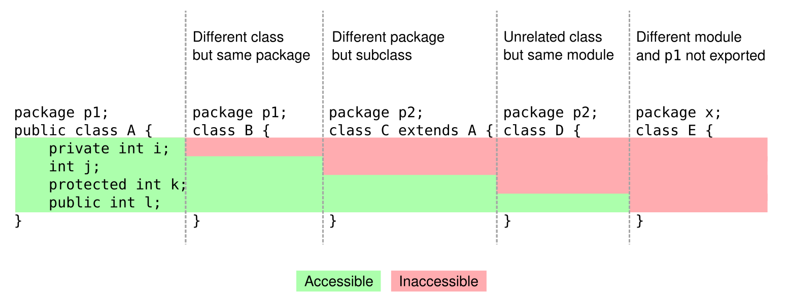
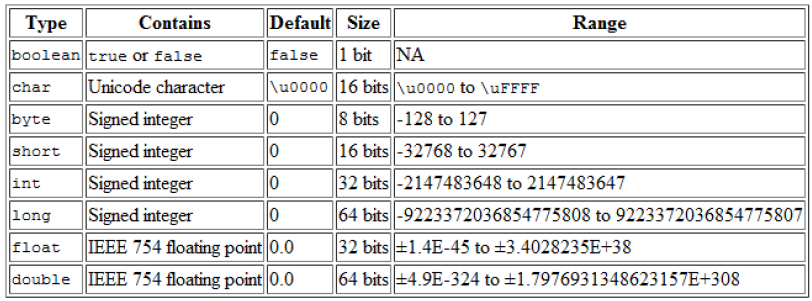
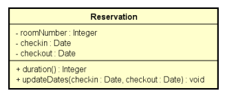

# Java COMPLETO Programação Orientada a Objetos + Projetos

*Update 2025*

https://www.udemy.com/java-curso-completo/

Curso mais didático e completo de Java e OO, UML, JDBC, JavaFX, Spring Boot, JPA, Hibernate, MySQL, MongoDB e muito mais

## <a name="indice">Índice</a>

- [Seção 1: Introdução](#parte1)
- [Seção 2: Conceitos de programação](#parte2)
- [Seção 3: Introdução à linguagem Java](#parte3)
- [Seção 4: Estrutura sequencial](#parte4)
- [Seção 5: Estrutura condicional](#parte5)
- [Seção 6: Estruturas repetitivas](#parte6)
- [Seção 7: Outros tópicos básicos sobre Java](#parte7)
- [Seção 8: Introdução à Programação Orientada a Objetos](#parte8)
- [Seção 9: Construtores, palavra this, sobrecarga, encapsulamento](#parte9)
- [Seção 10: Comportamento de memória, arrays, listas](#parte10)
- [Seção 11: Tópicos especiais em Java: data-hora](#parte11)
- [Seção 12: Enumerações, composição](#parte12)
- [Seção 13: Herança e polimorfismo](#parte13)
- [Seção 14: Tratamento de exceções](#parte14)
- [Seção 15: Trabalhando com arquivos](#parte15)
- [Seção 16: Interfaces](#parte16)
- [Seção 17: Generics, Set, Map](#parte17)
- [Seção 18: Programação funcional e expressões lambda](#parte18)
- [Seção 19: Bônus: Acesso a banco de dados com JDBC](#parte19)
- [Seção 20: Bônus: Nivelamento sobre Git e Github](#parte20)
- [Seção 21: Bônus: Java EE - Mapeamento objeto-relacional com JPA / Hibernate](#parte21)
- [Seção 22: Bônus: Projeto web services com Spring Boot e JPA / Hibernate](#parte22)
- [Seção 23: Bônus: Projeto Sistema jogo de xadrez](#parte23)
- [Seção 24: Bônus: Projeto Spring Boot e banco MongoDB (web services + NoSQL)](#parte24)
- [Seção 25: Bônus (LEGADO): Interface gráfica com JavaFX (projeto Java 11)](#parte25)
- [Seção 26: Seção bônus](#parte26)
---


## <a name="parte1">1 - Seção 1: Introdução</a>

- 1 Introdução: visão geral do curso

[Voltar ao Índice](#indice)

---


## <a name="parte2">2 - Seção 2: Conceitos de programação</a>

- 2 Visão geral do capítulo
- 3 Material de apoio do capítulo
- 4 Algoritmo, Automação, Programa de Computador
- 5 O que é preciso para se fazer um programa de computador
- 6 Linguagem de programação, léxica, sintática
- 7 IDE - Ambiente Integrado de Desenvolvimento
- 8 Compilação, interpretação, código fonte, código objeto, máquina virtual

[Voltar ao Índice](#indice)

---


## <a name="parte3">3 - Seção 3: Introdução à linguagem Java</a>

- 9 Visão geral do capítulo
- 10 Material de apoio do capítulo

    - [MaterialApoio/02-conceitos-de-programacao.pdf](MaterialApoio/02-conceitos-de-programacao.pdf)

- 11 Entendendo as versões do Java
- 12 Histórico e edições de Java
- 13 JDK / JVM - Máquina Virtual do Java
- 14 Estrutura de uma aplicação Java
- 15 Instalando o Java JDK
- 16 Instalando o Eclipse
- 17 Primeiro programa em Java no Eclipse

[Voltar ao Índice](#indice)

---


## <a name="parte4">4 - Seção 4: Estrutura sequencial</a>

- 18 Visão geral do capítulo
- 19 Material de apoio do capítulo

    - [MaterialApoio/04-estrutura-sequencial.pdf](MaterialApoio/04-estrutura-sequencial.pdf)

- 20 Expressões aritméticas
- 21 Variáveis e tipos básicos em Java
- 22 As três operações básicas de programação
- 23 Saída de dados em Java

```
```
Exercício de fixação
Em um novo programa, inicie as seguintes variáveis:
String product1 = "Computer";
String product2 = "Office desk";
int age = 30;
int code = 5290;
char gender = 'F';
double price1 = 2100.0;
double price2 = 650.50;
double measure = 53.234567;

Em seguida, usando os valores das variáveis, produza a seguinte saída na tela do console:

Products:
Computer, which price is $ 2100,00
Office desk, which price is $ 650,50
Record: 30 years old, code 5290 and gender: F
Measue with eight decimal places: 53,23456700
Rouded (three decimal places): 53,235
US decimal point: 53.235
```

[Secao-04-Estruturasequencial/P_023_Saida_de_dados_em_Java](Secao-04-Estruturasequencial/P_023_Saida_de_dados_em_Java)


- 24 Processamento de dados em Java, Casting
- 25 Entrada de dados em Java - Parte 1
- 26 Entrada de dados em Java - Parte 2
- 27 Funções matemáticas em Java

```java
public class Main {
    public static void main(String[] args) {
        double x = 3.0;
        double y = 4.0;
        double z = -5.0;
        double A, B, C;
        A = Math.sqrt(x);
        B = Math.sqrt(y);
        C = Math.sqrt(25.0);
        System.out.println("Raiz quadrada de " + x + " = " + A);
        System.out.println("Raiz quadrada de " + y + " = " + B);
        System.out.println("Raiz quadrada de 25 = " + C);
        A = Math.pow(x, y);
        B = Math.pow(x, 2.0);
        C = Math.pow(5.0, 2.0);
        System.out.println(x + " elevado a " + y + " = " + A);
        System.out.println(x + " elevado ao quadrado = " + B);
        System.out.println("5 elevado ao quadrado = " + C);
        A = Math.abs(y);
        B = Math.abs(z);
        System.out.println("Valor absoluto de " + y + " = " + A);
        System.out.println("Valor absoluto de " + z + " = " + B);
    }
}
```

```
Raiz quadrada de 3.0 = 1.7320508075688772
Raiz quadrada de 4.0 = 2.0
Raiz quadrada de 25 = 5.0
3.0 elevado a 4.0 = 81.0
3.0 elevado ao quadrado = 9.0
5 elevado ao quadrado = 25.0
Valor absoluto de 4.0 = 4.0
Valor absoluto de -5.0 = 5.0
```

- 28 AVISO: exercícios para iniciantes PARTE 1
- 29 Exercícios para Iniciantes - PARTE 1

[/MaterialApoio/04-02-exercicios1-estrutura-sequencial.pdf](/MaterialApoio/04-02-exercicios1-estrutura-sequencial.pdf)

Resolvido - https://www.youtube.com/watch?v=Ah1Y6d6deq0

Exercício 01

```
Faça um programa para ler dois valores inteiros, e depois mostrar na tela a soma desses números com uma 
mensagem explicativa, conforme exemplos.

Entrada: 
10
30
Saída:
SOMA = 40

Entrada: 
-30
10
Saída:
SOMA = -20

Entrada: 
0
0
Saída:
SOMA = 0

```

[/Secao-04-Estruturasequencial/Exercicio_01/](/Secao-04-Estruturasequencial/Exercicio_01/)


Exercício 02
```
Faça um programa para ler o valor do raio de um círculo, e depois mostrar o valor da área deste círculo com quatro 
casas decimais conforme exemplos.
Fórmula da área: area = π . raio**2
Considere o valor de π = 3.14159

Entrada: 
2.00 
Saída:
A=12.5664

Entrada: 
100.64 
Saída:
A=31819.3103

Entrada: 
150.00 
Saída:
A=70685.7750
```

[/Secao-04-Estruturasequencial/ExercIcio_02/](/Secao-04-Estruturasequencial/ExercIcio_02/)


Exercício 03
```
Fazer um programa para ler quatro valores inteiros A, B, C e D. A seguir, calcule e mostre a diferença do produto 
de A e B pelo produto de C e D segundo a fórmula: DIFERENCA = (A * B - C * D)

Entrada: 
5
6
7
8
Saída:
DIFERENCA = -26

Entrada: 
5
6
-7
8
Saída:
DIFERENCA = 86

```

Exercício 04
```
Fazer um programa que leia o número de um funcionário, seu número de horas trabalhadas, o valor que recebe por 
hora e calcula o salário desse funcionário. A seguir, mostre o número e o salário do funcionário, com duas casas 
decimais.
Entrada: 
25
100
5.50
Saída:
NUMBER = 25
SALARY = U$ 550.00

Entrada: 
1
200
20.50
Saída:
NUMBER = 1
SALARY = U$ 4100.00

Entrada: 
6
145
15.55
Saída:
NUMBER = 6
SALARY = U$ 2254.75
```

[/Secao-04-Estruturasequencial/Exercicio_04/](/Secao-04-Estruturasequencial/Exercicio_04/)

Exercício 05

```
Fazer um programa para ler o código de uma peça 1, o número de peças 1, o valor unitário de cada peça 1, o 
código de uma peça 2, o número de peças 2 e o valor unitário de cada peça 2. Calcule e mostre o valor a ser pago.

Entrada: 
12 1 5.30
16 2 5.10
Saída:
VALOR A PAGAR: R$ 15.50

Entrada: 
13 2 15.30
161 4 5.20
Saída:
VALOR A PAGAR: R$ 51.40

Entrada: 
1 1 15.10
2 1 15.10
Saída:
VALOR A PAGAR: R$ 30.20

```

[/Secao-04-Estruturasequencial/Exercicio_05/](/Secao-04-Estruturasequencial/Exercicio_05/)

Exercício 06

```
Fazer um programa que leia três valores com ponto flutuante de dupla precisão: A, B e C. Em seguida, calcule e 
mostre: 
a) a área do triângulo retângulo que tem A por base e C por altura. 
b) a área do círculo de raio C. (pi = 3.14159) 
c) a área do trapézio que tem A e B por bases e C por altura. 
d) a área do quadrado que tem lado B. 
e) a área do retângulo que tem lados A e B.

Entrada: 
3.0 4.0 5.2 
Saída:
TRIANGULO: 7.800
CIRCULO: 84.949
TRAPEZIO: 18.200
QUADRADO: 16.000
RETANGULO: 12.000

Entrada: 
12.7 10.4 15.2 
Saída:
TRIANGULO: 96.520
CIRCULO: 725.833
TRAPEZIO: 175.560
QUADRADO: 108.160
RETANGULO: 132.080
```

[/Secao-04-Estruturasequencial/Exercicio_06/](/Secao-04-Estruturasequencial/Exercicio_06/)


[Voltar ao Índice](#indice)

---


## <a name="parte5">5 - Seção 5: Estrutura condicional</a>

- 30 Visão geral do capítulo
- 31 Material de apoio do capítulo

[/MaterialApoio/05-estrutura-condicional%20(1).pdf](/MaterialApoio/05-estrutura-condicional%20(1).pdf)

- 32 Expressões comparativas
- 33 Expressões lógicas
- 34 Estrutura condicional (if-else)
- 35 AVISO: exercícios para iniciantes PARTE 2
- 36 Exercícios para Iniciantes - PARTE 2

Exercício 01

```
Fazer um programa para ler um número inteiro, e depois dizer se este número é negativo ou não.
Exemplos:
Entrada: -10 
Saída: NEGATIVO
Entrada:  8 
Saída: NAO NEGATIVO
Entrada:  0 
Saída: NAO NEGATIVO
```

[/Secao-05-Estrutura_condicional/Exercicio_01/](/Secao-05-Estrutura_condicional/Exercicio_01/)

Exercício 02

```
Fazer um programa para ler um número inteiro e dizer se este número é par ou ímpar.
Exemplos:
Entrada: 12 
Saída: PAR
Entrada: -27 
Saída: IMPAR
Entrada: 0 
Saída: PAR
```

[/Secao-05-Estrutura_condicional/Exercicio_02/](/Secao-05-Estrutura_condicional/Exercicio_02/)

Exercício 03

```
Leia 2 valores inteiros (A e B). Após, o programa deve mostrar uma mensagem "Sao Multiplos" ou "Nao sao
Multiplos", indicando se os valores lidos são múltiplos entre si. Atenção: os números devem poder ser digitados em ordem crescente ou decrescente.

Exemplos:
Entrada: 6 24 
Saída: Sao Multiplos
Entrada: 6 25 
Saída: Nao sao Multiplos
Entrada: 24 6 
Saída:Sao Multiplos
```

Exercício 04

```
Leia a hora inicial e a hora final de um jogo. A seguir calcule a duração do jogo, sabendo que o mesmo pode começar em um dia e terminar em outro, tendo uma duração mínima de 1 hora e máxima de 24 horas.
Exemplos:
Entrada: 16 2 
Saída: O JOGO DUROU 10 HORA(S)
Entrada: 0 0 
Saída:O JOGO DUROU 24 HORA(S)
Entrada: 2 16 
Saída:O JOGO DUROU 14 HORA(S)
```

[/Secao-05-Estrutura_condicional/Exercicio_04/](/Secao-05-Estrutura_condicional/Exercicio_04/)

Exercício 05

```
Com base na tabela abaixo, escreva um programa que leia o código de um item e a quantidade deste item. A seguir, calcule e mostre o valor da conta a pagar.
```


```
Exemplos:
Entrada: 3 2 
Saída: Total: R$ 10.00
Entrada: 2 3 
Saída: Total: R$ 13.50
```

- 37 Sintaxe opcional - operadores de atribuição cumulativa
- 38 Sintaxe opcional - switch-case

```
switch ( expressão ) {
    case valor1:
        comando1
        comando2
        break;
    case valor2:
        comando3
        comando4
        break;
    default:
        comando5
        comando6
        break;
}
```

- 39 Expressão condicional ternária

```java
double preco = 34.5;
double desconto;
if (preco < 20.0) {
    desconto = preco * 0.1;
}
else {
    desconto = preco * 0.05;
}
```

```java
double preco = 34.5;
double desconto = (preco < 20.0) ? preco * 0.1 : preco * 0.05;
```

- 40 Escopo e inicialização

```
• Escopo de uma variável: é a região do programa onde a variável é válida, ou seja, onde ela pode ser referenciada.
• Uma variável não pode ser usada se não for iniciada.
• Falaremos de escopo de métodos no Capítulo 5
```

[Voltar ao Índice](#indice)

---


## <a name="parte6">6 - Seção 6: Estruturas repetitivas</a>

### 42 Visão geral do capítulo

### 43 Material de apoio do capítulo

[Secao-06-Estruturas_repetitivas\00-apoio\06-estruturas-repetitivas.pdf](Secao-06-Estruturas_repetitivas\00-apoio\06-estruturas-repetitivas.pdf)

### 44 Como utilizar o DEBUG no Eclipse (execução passo a passo)

- Para marcar uma linha de breakpoint:
    - Run -> Toggle Breakpoint
- Para iniciar o debug:
    - Botão direito na classe -> Debug as -> Java Application
- Para executar uma linha:
    - F6
- Para interromper o debug: "stop"

### 45 Estrutura repetitiva enquanto (while)

- É uma estrutura de controle que repete um bloco de comandos enquanto uma condição for verdadeira.
- Quando usar: quando não se sabe previamente a quantidade de repetições que será realizada.

```
Fazer um programa que lê números inteiros até que um zero seja lido. Ao final mostra a soma dos números lidos.
```


```java
public class Main {
    public static void main(String[] args) {

        Scanner sc = new Scanner(System.in);

        int x = sc.nextInt();

        int soma = 0;
        while (x != 0) {
            soma = soma + x;
            x = sc.nextInt();
        }
        System.out.println(soma);
    }
}
```

• Estrutura repetitiva "enquanto"
• Recomendada quando não se sabe previamente a quantidade de repetições
• Regra:
    • V: executa e volta
    • F: pula fora

### 46 Teste de mesa com estrutura repetitiva enquanto

### 47 Exercícios de teste de mesa com while

### 48 AVISO: exercícios para iniciantes PARTE 3

### 49 Exercícios para Iniciantes - PARTE 3

[Secao-06-Estruturas_repetitivas\00-apoio\02-exercicios3-estrutura-while.pdf](Secao-06-Estruturas_repetitivas\00-apoio\02-exercicios3-estrutura-while.pdf)

### 50 Estrutura repetitiva para (for)

É uma estrutura de controle que repete um bloco de comandos para um certo intervalo de valores.
Quando usar: quando se sabe previamente a quantidade de repetições, ou o intervalo de valores.

Por exemplo:

- Fazer um programa que lê um valor inteiro N e depois N números inteiros. Ao final, mostra a soma dos N números lidos


```java
public class Main {
    public static void main(String[] args) {
        Scanner sc = new Scanner(System.in);
        int n = sc.nextInt();

        int soma = 0;
        for (int i = 0; i < n; i++) {
            int x = sc.nextInt();
            soma = soma + x;
        }
        System.out.println(soma);
        sc.close();
    }
}
```

Perceba que a estrutura "para" é ótima para se fazer uma repetição baseada em uma CONTAGEM:

```java
for (int i=0; i<5; i++) {
    System.out.println("Valor de i: " + i);
}

for (int i=4; i>=0; i--) {
    System.out.println("Valor de i: " + i);
}
```

### 51 Teste de mesa com estrutura repetitiva para

### 52 Exercícios de testes de mesa com for

### 53 AVISO: exercícios para iniciantes PARTE 4

### 54 Exercícios para iniciantes PARTE 4

[Secao-06-Estruturas_repetitivas\00-apoio\02-exercicios4-estrutura-for.pdf](Secao-06-Estruturas_repetitivas\00-apoio\02-exercicios4-estrutura-for.pdf)

### 55 Estrutura repetitiva faça-enquanto (do-while)

- Menos utilizada, mas em alguns casos se encaixa melhor ao problema.
- O bloco de comandos executa pelo menos uma vez, pois a condição é verificada no final.


```
Problema exemplo:
Fazer um programa para ler uma temperatura em Celsius e mostrar o equivalente em
Fahrenheit. Perguntar se o usuário deseja repetir (s/n). Caso o usuário digite "s", repetir o
programa.
Fórmula: F = ( 9C/5 ) + 32
```

```java
public class Main {
    public static void main(String[] args) {
        Locale.setDefault(Locale.US);
        Scanner sc = new Scanner(System.in);

        char resp;
        do {
            System.out.println("Digite a temperatura em Celcius: ");
            double C = sc.nextDouble();
            double F = 9.0 * C / 5.0 + 32.0;

            System.out.printf("Equivalente em Fahrenheit: %.1f%n", F);
            System.out.print("Deseja repetir (s/n)?");

            resp = sc.next().charAt(0);

        } while (resp != 'n');

        sc.close();
    }
}
```

[Voltar ao Índice](#indice)

---


## <a name="parte7">7 - Seção 7: Outros tópicos básicos sobre Java</a>

### 56 Material de apoio do capítulo

[Secao-07-Outros_topicos_basicos_sobre_Java\00-apoio\07-outros-topicos-basicos.pdf](Secao-07-Outros_topicos_basicos_sobre_Java\00-apoio\07-outros-topicos-basicos.pdf)

### 57 Restrições e convenções para nomes

- Não pode começar com dígito: use uma letra ou _
- Não usar acentos ou til
- Não pode ter espaço em branco
- Sugestão: use nomes que tenham um significado

Convenções
- Camel Case: lastName
    - pacotes
    - atributos
    - métodos
    - variáveis e parâmetros
- Pascal Case: ProductService
    - classes

### 58 Operadores bitwise


```java
import java.util.Scanner;
public class Program {
    public static void main(String[] args) {
        Scanner sc = new Scanner(System.in);
        int mask = 0b100000;
        int n = sc.nextInt();
        if ((n & mask) != 0) {
            System.out.println("6th bit is true!");
        }
        else {
            System.out.println("6th bit is false");
        }
        sc.close();
    }
}
```

### 59 Funções interessantes para String

- Formatar: toLowerCase(), toUpperCase(), trim()
- Recortar: substring(inicio), substring(inicio, fim)
- Substituir: Replace(char, char), Replace(string, string)
- Buscar: IndexOf, LastIndexOf
- str.Split(" ")

```java
public class Main {
    public static void main(String[] args) {
        String original = "abcde FGHIJ ABC abc DEFG ";

        String s01 = original.toLowerCase();
        String s02 = original.toUpperCase();
        String s03 = original.trim();
        String s04 = original.substring(2);
        String s05 = original.substring(2, 9);
        String s06 = original.replace('a', 'x');
        String s07 = original.replace("abc", "xy");
        int i = original.indexOf("bc");
        int j = original.lastIndexOf("bc");

        System.out.println("Original: -" + original + "-");
        System.out.println("toLowerCase: -" + s01 + "-");
        System.out.println("toUpperCase: -" + s02 + "-");
        System.out.println("trim: -" + s03 + "-");
        System.out.println("substring(2): -" + s04 + "-");
        System.out.println("substring(2, 9): -" + s05 + "-");
        System.out.println("replace('a', 'x'): -" + s06 + "-");
        System.out.println("replace('abc', 'xy'): -" + s07 + "-");
        System.out.println("Index of 'bc': " + i);
        System.out.println("Last index of 'bc': " + j);
    }
}
```

```
Original: -abcde FGHIJ ABC abc DEFG -
toLowerCase: -abcde fghij abc abc defg -
toUpperCase: -ABCDE FGHIJ ABC ABC DEFG -
trim: -abcde FGHIJ ABC abc DEFG-
substring(2): -cde FGHIJ ABC abc DEFG -
substring(2, 9): -cde FGH-
replace('a', 'x'): -xbcde FGHIJ ABC xbc DEFG -
replace('abc', 'xy'): -xyde FGHIJ ABC xy DEFG -
Index of 'bc': 1
Last index of 'bc': 17
```


### 60 Comentários em Java (básico)

```java
package course;
import java.util.Locale;
import java.util.Scanner;
/*
Este programa calcula as raízes de uma equação do segundo grau
Os valores dos coeficientes devem ser digitados um por linha
*/
public class Program {
    public static void main(String[] args) {
        Locale.setDefault(Locale.US);
        Scanner sc = new Scanner(System.in);
        double a, b, c, delta;
        System.out.println("Digite os valores dos coeficientes:");
        a = sc.nextDouble();
        b = sc.nextDouble();
        c = sc.nextDouble();
        delta = b * b - 4 * a * c; // cálculo do valor de delta
```

### 61 Funções (sintaxe)

- Representam um processamento que possui um significado
    - Math.sqrt(double)
    - System.out.println(string)
- Principais vantagens: modularização, delegação e reaproveitamento
- Dados de entrada e saída
    - Funções podem receber dados de entrada (parâmetros ou argumentos)
    - Funções podem ou não retornar uma saída
- Em orientação a objetos, funções em classes recebem o nome de "métodos"

Problema exemplo

- Fazer um programa para ler três números inteiros e mostrar na tela o maior deles.

```java
import java.util.Scanner;

public class Main {
    public static void main(String[] args) {
        Scanner sc = new Scanner(System.in);
        System.out.println("Enter three numbers:");
        int a = sc.nextInt();
        int b = sc.nextInt();
        int c = sc.nextInt();

        int higher = max(a, b, c);
        showResult(higher);

        sc.close();
    }
    public static int max(int x, int y, int z) {
        int aux;
        if (x > y && x > z) {
            aux = x;
        } else if (y > z) {
            aux = y;
        } else {
            aux = z;
        }
        return aux;
    }
    public static void showResult(int value) {
        System.out.println("Higher = " + value);
    }
}
```

[Voltar ao Índice](#indice)

---


## <a name="parte8">8 - Seção 8: Introdução à Programação Orientada a Objetos</a>

### 62 Visão geral do capítulo

### 63 Material de apoio do capítulo

[Secao-08-Introducao_a_Programacao_Orientada_a_Objetos\00-apoio\03-classes-atributos-membros-staticos.pdf](Secao-08-Introducao_a_Programacao_Orientada_a_Objetos\00-apoio\03-classes-atributos-membros-staticos.pdf)

### 64 Resolvendo um problema sem orientação a objetos

```java
import java.util.Locale;
import java.util.Scanner;

public class Main {
    public static void main(String[] args) {

        Locale.setDefault(Locale.US);
        Scanner sc = new Scanner(System.in);

        double xA, xB, xC, yA, yB, yC;

        System.out.println("Enter the measures of triangle X: ");
        xA = sc.nextDouble();
        xB = sc.nextDouble();
        xC = sc.nextDouble();

        System.out.println("Enter the measures of triangle Y: ");
        yA = sc.nextDouble();
        yB = sc.nextDouble();
        yC = sc.nextDouble();
        double p = (xA + xB + xC) / 2.0;
        double areaX = Math.sqrt(p * (p - xA) * (p - xB) * (p - xC));
        p = (yA + yB + yC) / 2.0;
        double areaY = Math.sqrt(p * (p - yA) * (p - yB) * (p - yC));

        System.out.printf("Triangle X area: %.4f%n", areaX);
        System.out.printf("Triangle Y area: %.4f%n", areaY);

        if (areaX > areaY) {
            System.out.println("Larger area: X");
        }
        else {
            System.out.println("Larger area: Y");
        }
        sc.close();

    }
}
```

### 65 Criando uma classe com três atributos para representar melhor o triângulo

Classe

- É um tipo estruturado que pode conter (membros):
    - Atributos (dados / campos)
    - Métodos (funções / operações)

- A classe também pode prover muitos outros recursos, tais como:
    - Construtores
    - Sobrecarga
    - Encapsulamento
    - Herança
    - Polimorfismo

- Exemplos:
    - Entidades: Produto, Cliente, Triangulo
    - Serviços: ProdutoService, ClienteService, EmailService, StorageService
    - Controladores: ProdutoController, ClienteController
    - Utilitários: Calculadora, Compactador
    - Outros (views, repositórios, gerenciadores, etc.)


```java
package entities;

public class Triangle {
    public double a;
    public double b;
    public double c;

    public double area() {
        double p = (a + b + c) / 2.0;
        return Math.sqrt(p * (p - a) * (p - b) * (p - c));
    }
}

```

```java
import entities.Triangle;

import java.util.Locale;
import java.util.Scanner;

public class Main {
    public static void main(String[] args) {

        Locale.setDefault(Locale.US);
        Scanner sc = new Scanner(System.in);
        Triangle x, y;
        x = new Triangle();
        y = new Triangle();

        System.out.println("Enter the measures of triangle X: ");
        x.a = sc.nextDouble();
        x.b = sc.nextDouble();
        x.c = sc.nextDouble();
        System.out.println("Enter the measures of triangle Y: ");
        y.a = sc.nextDouble();
        y.b = sc.nextDouble();
        y.c = sc.nextDouble();

        double areaX = x.area();
        double areaY = y.area();

        System.out.printf("Triangle X area: %.4f%n", areaX);
        System.out.printf("Triangle Y area: %.4f%n", areaY);
        if (areaX > areaY) {
            System.out.println("Larger area: X");
        }
        else {
            System.out.println("Larger area: Y");
        }
        sc.close();
    }
}
```


### 66 Criando um método para obtermos os benefícios de reaproveitamento e delegação

Quais são os benefícios de se calcular a área de um triângulo por meio de um MÉTODO dentro da CLASSE Triangle?

1) Reaproveitamento de código: nós eliminamos o código repetido (cálculo das áreas dos triângulos x e y) no programa principal.

2) Delegação de responsabilidades: quem deve ser responsável por saber como calcular a área de um triângulo é o próprio triângulo. A lógica do cálculo da área não deve estar em outro lugar.


### 67 Começando a resolver um segundo problema exemplo


Fazer um programa para ler os dados de um produto em estoque (nome, preço e quantidade no estoque). Em seguida:

• Mostrar os dados do produto (nome, preço, quantidade no estoque, valor total no estoque)  
• Realizar uma entrada no estoque e mostrar novamente os dados do produto  
• Realizar uma saída no estoque e mostrar novamente os dados do produto

Para resolver este problema, você deve criar uma CLASSE conforme projeto ao lado:


```
Enter product data:
Name: TV
Price: 900.00
Quantity in stock: 10
Product data: TV, $ 900.00, 10 units, Total: $ 9000.00
Enter the number of products to be added in stock: 5
Updated data: TV, $ 900.00, 15 units, Total: $ 13500.00
Enter the number of products to be removed from stock: 3
Updated data: TV, $ 900.00, 12 units, Total: $ 10800.00
```

### 68 Object e toString
- 
- Toda classe em Java é uma subclasse da classe Object 
- Object possui os seguintes métodos:
  - getClass- retorna o tipo do objeto 
  - equals - compara se o objeto é igual a outro
  - hashCode - retorna um código hash do objeto
  - toString - converte o objeto para string


### 69 Finalizando o programa


```java
package entities;

public class Product {
    public String name;
    public double price;
    public int quantity;

    public double totalValueInStock() {
        return price * quantity;
    }

    public void addProducts(int quantity) {
        this.quantity += quantity;
    }

    public void removeProducts(int quantity) {
        this.quantity -= quantity;
    }

    public String toString() {
        return name
                + ", $ "
                + String.format("%.2f", price)
                + ", "
                + quantity
                + " units, Total: $ "
                + String.format("%.2f", totalValueInStock());
    }
}

```

```java
import entities.Product;

import java.util.Locale;
import java.util.Scanner;

public class Main {
    public static void main(String[] args) {
        Locale.setDefault(Locale.US);
        Scanner sc = new Scanner(System.in);

        Product product = new Product();

        System.out.println("Enter product data: ");
        System.out.print("Name: ");
        product.name = sc.nextLine();
        System.out.print("Price: ");
        product.price = sc.nextDouble();
        System.out.print("Quantity in stock: ");
        product.quantity = sc.nextInt();
        System.out.println();
        System.out.println("Product data: " + product);
        System.out.println();
        
        System.out.print("Enter the number of products to be added in stock: ");
        int quantity = sc.nextInt();
        product.addProducts(quantity);
        System.out.println();
        System.out.println("Updated data: " + product);
        System.out.println();
        
        System.out.print("Enter the number of products to be removed from stock: ");
        quantity = sc.nextInt();
        product.removeProducts(quantity);

        System.out.println();
        System.out.println("Updated data: " + product);
        sc.close();
    }
}
```

### 70 Exercícios de fixação

- Exercício 1

Fazer um programa para ler os valores da largura e altura
de um retângulo. Em seguida, mostrar na tela o valor de
sua área, perímetro e diagonal. Usar uma classe como
mostrado no projeto ao lado.


```
Enter rectangle width and height:
3.00
4.00
AREA = 12.00
PERIMETER = 14.00
DIAGONAL = 5.00
```

- Exercício 2

Fazer um programa para ler os dados de um funcionário (nome, salário bruto e imposto). Em
seguida, mostrar os dados do funcionário (nome e salário líquido). Em seguida, aumentar o
salário do funcionário com base em uma porcentagem dada (somente o salário bruto é
afetado pela porcentagem) e mostrar novamente os dados do funcionário. Use a classe
projetada abaixo.


```
Name: Joao Silva
Gross salary: 6000.00
Tax: 1000.00
Employee: Joao Silva, $ 5000.00
Which percentage to increase salary? 10.0
Updated data: Joao Silva, $ 5600.00
```

- Exercício 3

Fazer um programa para ler o nome de um aluno e as três notas que ele obteve nos três trimestres do ano (primeiro trimestre vale 30 e o segundo e terceiro valem 35 cada). Ao final, mostrar qual a nota final do aluno no ano. Dizer também se o aluno está aprovado (PASS) ou não (FAILED) e, em caso negativo, quantos pontos faltam para o aluno obter o mínimo para ser aprovado (que é 60% da nota). Você deve criar uma classe Student para resolver este problema.


### 71 Membros estáticos - Parte 1

membros = atributos e métodos

**Membros estáticos**
- Também chamados membros de classe
- Em oposição a membros e instância
- São membros que fazem sentido independentemente de objetos. Não precisam de objeto para serem chamados. São chamados a partir do próprio nome da classe.


- Uma classe que possui somente membros estáticos, pode ser uma classe estática também. Esta classe não poderá ser instanciada.

```
Problema exemplo
Fazer um programa para ler um valor numérico qualquer, e daí mostrar quanto seria o valor de uma 
circunferência e do volume de uma esfera para um raio daquele valor. Informar também o valor de PI 
com duas casas decimais.

Ex:
Enter radius: 3.0 
Circumference: 18.85 
Volume: 113.10
PI value: 3.14
```

Checklist
- Versão 1: métodos na própria classe do programa
  - Nota: dentro de um método estático você não pode chamar membros de instância da mesma classe.
- Versão 2: classe Calculator com membros de instância
- Versão 3: classe Calculator com método estático

### 72 Membros estáticos - Parte 2


```java
package versao3.util;

public class Calculator {
    public static final double PI = 3.14159;

    public static double volume(double radius) {
        return 4.0 * PI * radius * radius * radius / 3.0;
    }

    public static double circumference(double radius) {
        return 2.0 * PI * radius;
    }
}

```

```java
public static void main(String[] args) {
        Locale.setDefault(Locale.US);
        Scanner sc = new Scanner(System.in);

        System.out.print("Enter radius: ");
        double radius = sc.nextDouble();

        double c = Calculator.circumference(radius);
        double v = Calculator.volume(radius);

        System.out.printf("Circumference: %.2f%n", c);
        System.out.printf("Volume: %.2f%n", v);
        System.out.printf("PI value: %.2f%n", Calculator.PI);

        sc.close();
```

### 73 Exercício de fixação


[Voltar ao Índice](#indice)

---


## <a name="parte9">9 - Seção 9: Construtores, palavra this, sobrecarga, encapsulamento</a>

### 73 Visão geral do capítulo

### 74 Material de apoio do capítulo

[Secao-09-Construtores-palavra-this-sobrecarga-encapsulamento/00-apoio/04-construtores-this-sobrecarga-encapsulamento.pdf](Secao-09-Construtores-palavra-this-sobrecarga-encapsulamento/00-apoio/04-construtores-this-sobrecarga-encapsulamento.pdf)

### 75 Construtores

É uma operação especial da classe, que executa no momento da instanciação do objeto

- Usos comuns:
  - Iniciar valores dos atributos
  - Permitir ou obrigar que o objeto receba dados / dependências no momento de sua instanciação (injeção de dependência)
- Se um construtor customizado não for especificado, a classe disponibiliza o construtor padrão:
  - Product p = new Product();
- É possível especificar mais de um construtor na mesma classe (sobrecarga)

```
Problema exemplo:

Enter product data: Name: TV
Price: 900.00
Quantity in stock: 10

Product data: TV, $ 900.00, 10 units, Total: $ 9000.00

Enter the number of products to be added in stock: 5

Updated data: TV, $ 900.00, 15 units, Total: $ 13500.00

Enter the number of products to be removed from stock: 3

Updated data: TV, $ 900.00, 12 units, Total: $ 10800.00

```


Proposta de melhoria

Quando executamos o comando abaixo, instanciamos um produto "product" com seus atributos “vazios”:

Com o intuito de evitar a existência de produtos sem nome e sem preço, é possível fazer com que seja “obrigatória” a iniciação desses valores?

```java
package entities;

public class Product {
    public String name;
    public double price;
    public int quantity;

    public Product(String name, double price, int quantity) {
        this.name = name;
        this.price = price;
        this.quantity = quantity;
    }

    public double totalValueInStock(){
        return quantity * price;
    }

    public void addProduct(int quantity) {
        this.quantity += quantity;
    }

    public void removeProduct(int quantity) {
        this.quantity -= quantity;
    }

    public String toString() {
        return name
                + ", $ "
                + String.format("%.2f", price)
                + ", "
                + quantity
                + " units, Total: $ "
                + String.format("%.2f", totalValueInStock());
    }
}

```

```java
public static void main(String[] args) {
        Locale.setDefault(Locale.US);
        Scanner sc = new Scanner(System.in);

        // Product product = new Product();
//        System.out.println("Enter product data: "); System.out.print("Name: ");
//        product.name = sc.nextLine();
//        System.out.print("Price: ");
//        product.price = sc.nextDouble();
//        System.out.print("Quantity in stock: "); product.quantity = sc.nextInt();
        System.out.println("Enter product data: ");
        System.out.print("Name: ");
        String name = sc.nextLine();
        System.out.print("Price: ");
        double price = sc.nextDouble();
        System.out.print("Quantity in stock: ");
        int quantity = sc.nextInt();

        Product product = new Product(name, price, quantity);

        System.out.println();
        System.out.println("Product data: " + product);

        System.out.println();
        System.out.print("Enter the number of products to be added in stock: "); quantity = sc.nextInt();
        product.addProduct(quantity);

        System.out.println();
        System.out.println("Updated data: " + product);

        System.out.println();
        System.out.print("Enter the number of products to be removed from stock: "); quantity = sc.nextInt();
        product.removeProduct(quantity);

        System.out.println();
        System.out.println("Updated data: " + product);

        sc.close();
    }
```

### 76 Palavra this

- É uma referência para o próprio objeto
- Usos comuns:
  - Diferenciar atributos de variáveis locais 
  - Passar o próprio objeto como argumento na chamada de um método ou construtor

### 77 Sobrecarga

- É um recurso que uma classe possui de oferecer mais de uma operação com o mesmo nome, porém com diferentes listas de
parâmetros.

Proposta de melhoria

- Vamos criar um construtor opcional, o qual recebe apenas nome e preço do produto. A quantidade em estoque deste novo produto, por
  padrão, deverá então ser iniciada com o valor zero.

Nota: é possível também incluir um construtor padrão


```java
public class Product {
    public String name;
    public double price;
    public int quantity;

    public Product() {

    }

    public Product(String name, double price) {
        this.name = name;
        this.price = price;
    }

    public Product(String name, double price, int quantity) {
        this.name = name;
        this.price = price;
        this.quantity = quantity;
    }
```

### 78 Encapsulamento

- É um princípio que consiste em esconder detalhes de implementação de uma classe, expondo apenas operações seguras e que mantenham os objetos em um estado consistente.
- Regra de ouro: o objeto deve sempre estar em um estado consistente, e a própria classe deve garantir isso.

Regra geral básica

- Um objeto NÃO deve expor nenhum atributo (modificador de acesso private)
- Os atributos devem ser acessados por meio de métodos get e set 
  - Padrão JavaBeans: https://en.wikipedia.org/wiki/JavaBeans

```java
public class ProductEncap {
    private String name;
    private double price;
    private int quantity;

    public ProductEncap() {

    }

    public ProductEncap(String name, double price) {
        this.name = name;
        this.price = price;
    }

    public ProductEncap(String name, double price, int quantity) {
        this.name = name;
        this.price = price;
        this.quantity = quantity;
    }

    public void setName(String name) {
        this.name = name;
    }

    public String getName() {
        return name;
    }

    public double getPrice() {
        return price;
    }

    public void setPrice(double price) {
        this.price = price;
    }

    public int getQuantity() {
        return quantity;
    }
```


### 79 Gerando automaticamente construtores, getters e setters com Eclipse

### 80 Modificadores de acesso

[https://docs.oracle.com/javase/tutorial/java/javaOO/accesscontrol.html](https://docs.oracle.com/javase/tutorial/java/javaOO/accesscontrol.html)

- private: o membro só pode ser acessado na própria classe
- (nada): o membro só pode ser acessado nas classes do mesmo pacote
- protected: o membro só pode ser acessado no mesmo pacote, bem como em subclasses de pacotes diferentes
- public: o membro é acessado por todas classes (ao menos que ele resida em um módulo diferente  que não exporte o pacote onde ele está)




### 81 Exercício de fixação

```
Em um banco, para se cadastrar uma conta bancária, é necessário informar o número da conta, 
o nome do titular da conta, e o valor de depósito inicial que o titular depositou ao abrir a conta. 
Este valor de depósito inicial, entretanto, é opcional, ou seja: se o titular não tiver dinheiro a 
depositar no momento de abrir sua conta, o depósito inicial não será feito e o saldo inicial da conta 
será, naturalmente, zero.

Importante: uma vez que uma conta bancária foi aberta, o número da conta nunca poderá ser alterado. 
Já o nome do titular pode ser alterado (pois uma pessoa pode mudar de nome por ocasião de casamento, 
por exemplo).

Por fim, o saldo da conta não pode ser alterado livremente. É preciso haver um mecanismo para 
proteger isso. O saldo só aumenta por meio de depósitos, e só diminui por meio de saques. 
Para cada saque realizado, o banco cobra uma taxa de $ 5.00. 
Nota: a conta pode ficar com saldo negativo se o saldo não for suficiente para realizar o 
saque e/ou pagar a taxa.

Você deve fazer um programa que realize o cadastro de uma conta, dando opção para que seja ou não 
informado o valor de depósito inicial. Em seguida,
 realizar um depósito e depois um saque, sempre mostrando os dados da conta após cada operação.

EXAMPLE 1
Enter account number: 8532
Enter account holder: Alex Green
Is there na initial deposit (y/n)? y Enter initial deposit value: 500.00

Account data:
Account 8532, Holder: Alex Green, Balance: $ 500.00

Enter a deposit value: 200.00
Updated account data:
Account 8532, Holder: Alex Green, Balance: $ 700.00

Enter a withdraw value: 300.00
Updated account data:
Account 8532, Holder: Alex Green, Balance: $ 395.00

EXAMPLE 2
Enter account number: 7801
Enter account holder: Maria Brown
Is there na initial deposit (y/n)? n

Account data:
Account 7801, Holder: Maria Brown, Balance: $ 0.00

Enter a deposit value: 200.00
Updated account data:
Account 7801, Holder: Maria Brown, Balance: $ 200.00

Enter a withdraw value: 198.00
Updated account data:
Account 7801, Holder: Maria Brown, Balance: $ -3.00
```


### 82 Correção do exercício de fixação - Parte 1

### 83 Correção do exercício de fixação - Parte 2

[https://github.com/acenelio/encapsulation1-java](https://github.com/acenelio/encapsulation1-java)


[Voltar ao Índice](#indice)

---


## <a name="parte10">10 - Seção 10: Comportamento de memória, arrays, listas</a>

### 84 Visão geral do capítulo

### 85 Material de apoio do capítulo

### 86 Tipos referência vs. tipos valor

Classes são tipos referência

Variáveis cujo tipo são classes não devem ser entendidas como caixas, mas sim “tentáculos” (ponteiros) para caixas


Valor "null"

Tipos referência aceitam o valor "null", que indica que a variável aponta pra ninguém.


Tipos primitivos são tipos valor

Em Java, tipos primitivos são tipos valor. Tipos valor são CAIXAS e não ponteiros.




Tipos primitivos e inicialização

```java
int p;
System.out.println(p); // erro: variável não iniciada

p = 10;
System.out.println(p);
```
Valores padrão

- Quando alocamos (new) qualquer tipo estruturado (classe ou array), são atribuídos valores padrão aos seus elementos
  - números: 0
  - boolean: false
  - char: caractere código 0
  - objeto: null


Tipos referência vs. tipos valor


### 87 Desalocação de memória - garbage collector e escopo local

- É um processo que automatiza o gerenciamento de memória de um   programa em execução
- O garbage collector monitora os objetos alocados dinamicamente pelo programa (no heap), desalocando aqueles que não estão mais sendo utilizados.

Desalocação por garbage collector


- Objetos alocados dinamicamente, quando não possuem mais referência para eles, serão desalocados pelo garbage collector
- Variáveis locais são desalocadas imediatamente assim que seu escopo local sai de execução

### 88 Vetores - Parte 1

- Em programação, "vetor" é o nome dado a arranjos unidimensionais
- Arranjo (array) é uma estrutura de dados:
  - Homogênea (dados do mesmo tipo)
  - Ordenada (elementos acessados por meio de posições)
  - Alocada de uma vez só, em um bloco contíguo de memória

- Vantagens:
  - Acesso imediato aos elementos pela sua posição 
  - Desvantagens:
    - Tamanho fixo 
    - Dificuldade para se realizar inserções e deleções

```
Fazer um programa para ler um número inteiro N e a altura de N 
pessoas. Armazene as N alturas em um vetor. Em seguida, mostrar a 
altura média dessas pessoas.

Input: 
3
1.72 
1.56 
1.80

Output:
AVERAGE HEIGHT = 1.69
```

```java
package vetor01;

import java.util.Locale;
import java.util.Scanner;

public class Program {
    public static void main(String[] args) {
        Locale.setDefault(Locale.US);
        Scanner sc = new Scanner(System.in);

        int n = sc.nextInt();
        double[] vect = new double[n];

        for (int i = 0; i < n; i++) {
            vect[i] = sc.nextDouble();
        }

        double sum = 0.0;
        for (int i = 0; i < n; i++) {
            sum += vect[i];
        }

        double avg = sum / n;

        System.out.printf("AVERAGE HEIGHT: %.2f%n", avg);

        sc.close();
    }
}

```

### 89 Vetores - Parte 2

```
Problema exemplo 2

Fazer um programa para ler um número inteiro N e os dados (nome e preço) de N Produtos. 
Armazene os N produtos em um vetor. 
Em seguida, mostrar o preço médio dos produtos.

Input: 
3
TV 
900.00 
Fryer 
400.00 
Stove 
800.00

Output:
AVERAGE PRICE = 700.00
``` 

```java
public static void main(String[] args) {
        Locale.setDefault(Locale.US);
        Scanner sc = new Scanner(System.in);

        int n = sc.nextInt();
        Produduct[] vect = new Produduct[n];

        for (int i = 0; i < vect.length; i++) {
            sc.nextLine();
            String name = sc.nextLine();
            double price = sc.nextDouble();
            vect[i] = new Produduct(name, price);
        }
        double sum = 0.0;

        for (int i = 0; i < vect.length; i++) {
            sum += vect[i].getPrice();
        }
        System.out.printf("Total %.2f%n", sum);
        double med = sum / vect.length;
        System.out.printf("Preço Médio %.2f%n", med);

        sc.close();
    }
```

### 90 Exercícios de fixação sobre vetores

### 91 Correção do exercício negativos

### 92 Correção do exercício alturas

### 93 Desafio sobre vetores (pensionato)

### 94 Correção do desafio sobre vetores (pensionato)

### 95 Boxing, unboxing e wrapper classes

**Boxing**
- É o processo de conversão de um objeto tipo valor para um objeto tipo referência compatível

**Unboxing**
- É o processo de conversão de um objeto tipo referência para um objeto tipo valor compatível


**Wrapper classes**

- São classes equivalentes aos tipos primitivos
- Boxing e unboxing é natural na linguagem
- Uso comum: campos de entidades em sistemas de informação (IMPORTANTE!)
  - Pois tipos referência (classes) aceitam valor null e usufruem dos recursos OO


### 96 Laço for each

Sintaxe opcional e simplificada para percorrer coleções

```java
// Leitura: "para cada objeto 'obj' contido em vect, faça:"

String[] vect = new String[] {"Maria", "Bob", "Alex"};

for (int i=0; i< vect.length; i++) {
    System.out.println(vect[i]);
}

for (String obj : vect) { 
    System.out.println(obj);
}
```

### 97 Listas - Parte 1

Referência: https://docs.oracle.com/javase/10/docs/api/java/util/List.html

- Lista é uma estrutura de dados:
  - Homogênea (dados do mesmo tipo)
  - Ordenada (elementos acessados por meio de posições)
  - Inicia vazia, e seus elementos são alocados sob demanda
  - Cada elemento ocupa um "nó" (ou nodo) da lista

- Tipo (interface): List
- Classes que implementam: ArrayList, LinkedList, etc.

- Vantagens:
  - Tamanho variável
  - Facilidade para se realizar inserções e deleções
- Desvantagens:
  - Acesso sequencial aos elementos *

### 98 Listas - Parte 2

- Tamanho da lista: size()
- Obter o elemento de uma posição: get(position)
- Inserir elemento na lista: add(obj), add(int, obj)
- Remover elementos da lista: remove(obj), remove(int), removeIf(Predicate)
- Encontrar posição de elemento: indexOf(obj), lastIndexOf(obj)
- Filtrar lista com base em predicado:
  - List<Integer> result = list.stream().filter(x -> x > 4).collect(Collectors.toList());
- Encontrar primeira ocorrência com base em predicado:
  - Integer result = list.stream().filter(x -> x > 4).findFirst().orElse(null);

- Assuntos pendentes:
  - interfaces
  - generics
  - predicados (lambda)

```java
import java.util.ArrayList;
import java.util.Collection;
import java.util.List;
import java.util.stream.Collectors;

public class ProgramLists {
    public static void main(String[] args) {
        List<String> list = new ArrayList<>();

        list.add("Maria");
        list.add("Luciana");
        list.add("João");
        list.add("José");
        list.add("Marta");
        list.add("Adriana");
        list.add("Alberto");
        list.add("Farias");

        System.out.println("Tamanho da Lista: " + list.size());
        for (String x : list) {
            System.out.println("- " + x);
        }
        System.out.println("---------------");
        list.removeIf(s -> s.charAt(0) == 'M');
        System.out.println("Tamanho da Lista: " + list.size());
        for (String x : list) {
            System.out.println("- " + x);
        }
        System.out.println("---------------");
        System.out.println("Index of Bob: " + list.indexOf("Bob"));
        System.out.println("Index of Marco: " + list.indexOf("Marco"));

        System.out.println("---------------");
        List<String> result = list.stream().filter(s -> s.charAt(0) == 'A').collect(Collectors.toList());
        for (String x : result) {
            System.out.println("- " + x);
        }

        System.out.println("---------------");
        String name = list.stream().filter(s -> s.charAt(0) == 'J').findFirst().orElse(null);
        System.out.println("- " + name);
    }
}

```

### 99 Exercício proposto

### 100 Correção em vídeo do exercício proposto

https://github.com/acenelio/list1-java

https://www.youtube.com/watch?v=Xj-osdBe3TE

### 101 Matrizes

- Em programação, "matriz" é o nome dado a arranjos bidimensionais
  - Atenção: "vetor de vetores"


- Arranjo (array) é uma estrutura de dados:
  - Homogênea (dados do mesmo tipo)
  - Ordenada (elementos acessados por meio de posições)
  - Alocada de uma vez só, em um bloco contíguo de memória
- Vantagens: 
  - Acesso imediato aos elementos pela sua posição
  - Desvantagens: 
  - Tamanho fixo
  - Dificuldade para se realizar inserções e deleções

### 102 Exercício resolvido

```
Fazer um programa para ler um número inteiro N e uma matriz de 
ordem N contendo números inteiros. Em seguida, mostrar a diagonal 
principal e a quantidade de valores negativos da matriz.

Input: 
3
5 -3 10 
15 8  2
7  9 -4

Output:
Main diagonal:
5 8 -4
Negative numbers = 2
```

```java
public static void main(String[] args) {
        Scanner sc = new Scanner(System.in);

        int n = sc.nextInt();
        int[][] mat = new int[n][n];

        for (int i=0; i<mat.length; i++) {
            for (int j=0; j<mat[i].length; j++) {
                mat[i][j] = sc.nextInt();
            }
        }

        System.out.println("Main diagonal:");
        for (int i=0; i<mat.length; i++) {
            System.out.print(mat[i][i] + " ");
        }
        System.out.println();

        int count = 0;
        for (int i=0; i<mat.length; i++) {
            for (int j=0; j<mat[i].length; j++) {
                if (mat[i][j] < 0) {
                    count++;
                }
            }
        }
        System.out.println("Negative numbers = " + count);
        sc.close();
    }

```

### 103 Exercício proposto // 104. Exercício proposto

```
Fazer um programa para ler dois números inteiros M e N, e depois ler 
uma matriz de M linhas por N colunas contendo números inteiros, 
podendo haver repetições. Em seguida, ler um número inteiro X que 
pertence à matriz. Para cada ocorrência de X, mostrar os valores à 
esquerda, acima, à direita e abaixo de X, quando houver, conforme 
exemplo.

3 4
10 8 15 12 
21 11 23 8 
14 5 13 19
8

Position 0,1: 
Left: 10 
Right: 15 
Down: 11 
Position 1,3: 
Left: 23
Up: 12
Down: 19

```

https://github.com/acenelio/matrix2-java/blob/master/src/application/Program.java

[Voltar ao Índice](#indice)

---


## <a name="parte11">11 - Seção 11: Tópicos especiais em Java: data-hora</a>

### 105. Boas-vindas e avisos


### 106. Material de apoio do capítulo


### 107. Introdução a data-hora e duração


### 108. Entendendo timezone (fuso horário)

Conceitos importantes
- Data-[hora] local:
  - ano-mês-dia-[hora] sem fuso horário
  - [hora] opcional
- Data-hora global:
  - ano-mês-dia-hora com fuso horário
- Duração:
  - tempo decorrido entre duas data-horas


Quando usar?
- Data-[hora] local:
  - Quando o momento exato não interessa a pessoas de outro fuso horário.
  - Uso comum: sistemas de região única, Excel.
    - Data de nascimento: "15/06/2001"
    - Data-hora da venda: "13/08/2022 às 15:32" (presumindo não interessar fuso horário)
- 
- Data-hora global:
  - Quando o momento exato interessa a pessoas de outro fuso horário.
  - Uso comum: sistemas multi-região, web. 
    - Quando será o sorteio? "21/08/2022 às 20h (horário de São Paulo)"
    - Quando o comentário foi postado? "há 17 minutos"
    - Quando foi realizada a venda? "13/08/2022 às 15:32 (horário de São Paulo)"
    - Início e fim do evento? "21/08/2022 às 14h até 16h (horário de São Paulo)"

### 109. Padrão ISO 8601

Timezone (fuso horário)
- GMT - Greenwich Mean Time
  - Horário de Londres
  - Horário do padrão UTC - Coordinated Universal Time
  - Também chamado de "Z" time, ou Zulu time
- Outros fuso horários são relativos ao GMT/UTC:
  - São Paulo: GMT-3
  - Manaus: GMT-4
  - Portugal: GMT+1
- Muitas linguagens/tecnologias usam nomes para as timezones:
  - "US/Pacific"
  - "America/Sao_Paulo"
  - etc.

Padrão ISO 8601
- Data-[hora] local:
  - 2022-07-21
  - 2022-07-21T14:52
  - 2022-07-22T14:52:09 2022-07-22T14:52:09.4073

- Data-hora global:
  - 2022-07-23T14:52:09Z
  - 2022-07-23T14:52:09.254935Z 2022-07-23T14:52:09-03:00


### 110. Operações importantes com data-hora

- Instanciação
  - (agora) ➞Data-hora
  - Texto ISO 8601 ➞Data-hora
  - Texto formato customizado ➞Data-hora
  - dia, mês, ano, [horário] ➞Data-hora local
- Formatação
  - Data-hora ➞Texto ISO 8601
  - Data-hora ➞Texto formato customizado

- Converter data-hora global para local
  - Data-hora global, timezone (sistema local) ➞Data-hora local
- Obter dados de uma data-hora local
  - Data-hora local ➞dia, mês, ano, horário
- Cálculos com data-hora
  - Data-hora +/- tempo ➞Data-hora
  - Data-hora 1, Data-hora 2 ➞Duração

### 111. Instanciando data-hora em Java


```java


import java.time.Instant;
import java.time.LocalDate;
import java.time.LocalDateTime;
import java.time.format.DateTimeFormatter;

public class Program1 {

  public static void main(String[] args) {

    // https://docs.oracle.com/en/java/javase/17/docs/api/java.base/java/time/format/DateTimeFormatter.html
    DateTimeFormatter fmt1 = DateTimeFormatter.ofPattern("dd/MM/yyyy");
    DateTimeFormatter fmt2 = DateTimeFormatter.ofPattern("dd/MM/yyyy HH:mm");

    LocalDate d01 = LocalDate.now();
    LocalDateTime d02 = LocalDateTime.now();
    Instant d03 = Instant.now();

    LocalDate d04 = LocalDate.parse("2022-07-20");
    LocalDateTime d05 = LocalDateTime.parse("2022-07-20T01:30:26");
    Instant d06 = Instant.parse("2022-07-20T01:30:26Z");
    Instant d07 = Instant.parse("2022-07-20T01:30:26-03:00");

    // https://docs.oracle.com/en/java/javase/17/docs/api/java.base/java/time/format/DateTimeFormatter.html
    LocalDate d08 = LocalDate.parse("20/07/2022", fmt1);
    LocalDateTime d09 = LocalDateTime.parse("20/07/2022 01:30", fmt2);

    LocalDate d10 = LocalDate.of(2022, 07, 20);
    LocalDateTime d11 = LocalDateTime.of(2022, 07, 20, 1, 30);

    System.out.println("d01 = " + d01.toString()); // d01 = 2025-05-05
    System.out.println("d02 = " + d02.toString()); // d02 = 2025-05-05T10:11:18.340711400
    System.out.println("d03 = " + d03.toString()); // d03 = 2025-05-05T13:11:18.340711400Z
    System.out.println("d04 = " + d04.toString()); // d04 = 2022-07-20
    System.out.println("d05 = " + d05.toString()); // d05 = 2022-07-20T01:30:26
    System.out.println("d06 = " + d06.toString()); // d06 = 2022-07-20T01:30:26Z
    System.out.println("d07 = " + d07.toString()); // d07 = 2022-07-20T04:30:26Z
    System.out.println("d08 = " + d08.toString()); // d08 = 2022-07-20
    System.out.println("d09 = " + d09.toString()); // d09 = 2022-07-20T01:30
    System.out.println("d10 = " + d10.toString()); // d10 = 2022-07-20
    System.out.println("d11 = " + d11.toString()); // d11 = 2022-07-20T01:30
  }
}

```


### 112. Convertendo data-hora para texto

```java

import java.time.Instant;
import java.time.LocalDate;
import java.time.LocalDateTime;
import java.time.ZoneId;
import java.time.format.DateTimeFormatter;

public class Program2 {

    public static void main(String[] args) {

        LocalDate d04 = LocalDate.parse("2022-07-20");
        LocalDateTime d05 = LocalDateTime.parse("2022-07-20T01:30:26");
        Instant d06 = Instant.parse("2022-07-20T01:30:26Z");

        // https://docs.oracle.com/en/java/javase/17/docs/api/java.base/java/time/format/DateTimeFormatter.html
        DateTimeFormatter fmt1 = DateTimeFormatter.ofPattern("dd/MM/yyyy");
        DateTimeFormatter fmt2 = DateTimeFormatter.ofPattern("dd/MM/yyyy HH:mm");
        DateTimeFormatter fmt3 = DateTimeFormatter.ofPattern("dd/MM/yyyy HH:mm").withZone(ZoneId.systemDefault());
        DateTimeFormatter fmt4 = DateTimeFormatter.ISO_DATE_TIME;
        DateTimeFormatter fmt5 = DateTimeFormatter.ISO_INSTANT;

        System.out.println("d04 = " + d04.format(fmt1));// d04 = 20/07/2022
        System.out.println("d04 = " + fmt1.format(d04));// d04 = 20/07/2022
        System.out.println("d04 = " + d04.format(DateTimeFormatter.ofPattern("dd/MM/yyyy"))); // d04 = 20/07/2022

        System.out.println("d05 = " + d05.format(fmt1)); // d05 = 20/07/2022
        System.out.println("d05 = " + d05.format(fmt2)); // d05 = 20/07/2022 01:30
        System.out.println("d05 = " + d05.format(fmt4)); // d05 = 2022-07-20T01:30:26

        System.out.println("d06 = " + fmt3.format(d06)); // d06 = 19/07/2022 22:30
        System.out.println("d06 = " + fmt5.format(d06)); // d06 = 2022-07-20T01:30:26Z
        System.out.println("d06 = " + d06.toString());   // d06 = 2022-07-20T01:30:26Z
    }
}
```


### 113 Convertendo data-hora global para local

```java

import java.time.Instant;
import java.time.LocalDate;
import java.time.LocalDateTime;
import java.time.ZoneId;

public class Program3 {

    public static void main(String[] args) {

        // for (String s : ZoneId.getAvailableZoneIds())
        // System.out.println(s);

        LocalDate d04 = LocalDate.parse("2022-07-20");
        LocalDateTime d05 = LocalDateTime.parse("2022-07-20T01:30:26");
        Instant d06 = Instant.parse("2022-07-20T01:30:26Z");

        LocalDate r1 = LocalDate.ofInstant(d06, ZoneId.systemDefault());
        LocalDate r2 = LocalDate.ofInstant(d06, ZoneId.of("Portugal"));
        LocalDateTime r3 = LocalDateTime.ofInstant(d06, ZoneId.systemDefault());
        LocalDateTime r4 = LocalDateTime.ofInstant(d06, ZoneId.of("Portugal"));

        System.out.println("r1 = " + r1);// r1 = 2022-07-19
        System.out.println("r2 = " + r2);// r2 = 2022-07-20
        System.out.println("r3 = " + r3);// r3 = 2022-07-19T22:30:26
        System.out.println("r4 = " + r4);// r4 = 2022-07-20T02:30:26

        System.out.println("d04 dia = " + d04.getDayOfMonth());// d04 dia = 20
        System.out.println("d04 mês = " + d04.getMonthValue());// d04 mês = 7
        System.out.println("d04 ano = " + d04.getYear());// d04 ano = 2022

        System.out.println("d05 hora = " + d05.getHour());// d05 hora = 1
        System.out.println("d05 minutos = " + d05.getMinute());// d05 minutos = 30

    }
}
```

### 114 Cálculos com data-hora

```java
import java.time.Duration;
import java.time.Instant;
import java.time.LocalDate;
import java.time.LocalDateTime;
import java.time.temporal.ChronoUnit;

public class Program4 {

    public static void main(String[] args) {

        LocalDate d04 = LocalDate.parse("2022-07-20");
        LocalDateTime d05 = LocalDateTime.parse("2022-07-20T01:30:26");
        Instant d06 = Instant.parse("2022-07-20T01:30:26Z");

        LocalDate pastWeekDate = d04.minusDays(7);
        LocalDate nextWeekDate = d04.plusDays(7);

        LocalDateTime pastWeekLocalDate = d05.minusDays(7);
        LocalDateTime nextWeekLocalDate = d05.plusDays(7);

        Instant pastWeekInstant = d06.minus(7, ChronoUnit.DAYS);
        Instant nextWeekInstant = d06.plus(7, ChronoUnit.DAYS);

        System.out.println("pastWeekDate = " + pastWeekDate);// pastWeekDate = 2022-07-13
        System.out.println("nextWeekDate = " + nextWeekDate);// nextWeekDate = 2022-07-27

        System.out.println("pastWeekLocalDate = " + pastWeekLocalDate);// pastWeekLocalDate = 2022-07-13T01:30:26
        System.out.println("nextWeekLocalDate = " + nextWeekLocalDate);// nextWeekLocalDate = 2022-07-27T01:30:26

        System.out.println("pastWeekInstant = " + pastWeekInstant);// pastWeekInstant = 2022-07-13T01:30:26Z
        System.out.println("nextWeekInstant = " + nextWeekInstant);// nextWeekInstant = 2022-07-27T01:30:26Z

        Duration t1 = Duration.between(pastWeekDate.atStartOfDay(), d04.atStartOfDay());
        Duration t2 = Duration.between(pastWeekLocalDate, d05);
        Duration t3 = Duration.between(pastWeekInstant, d06);
        Duration t4 = Duration.between(d06, pastWeekInstant);

        System.out.println("t1 dias = " + t1.toDays());// t1 dias = 7
        System.out.println("t2 dias = " + t2.toDays());// t2 dias = 7
        System.out.println("t3 dias = " + t3.toDays());// t3 dias = 7
        System.out.println("t4 dias = " + t4.toDays());// t4 dias = -7
    }
}
```

### 115 Aviso: próximas duas aulas são sobre Date e Calendar


### 116 Trabalhando com datas - Date

Representa um INSTANTE

Pacote java.util

https://docs.oracle.com/javase/10/docs/api/java/util/Date.html

Um objeto Date internamente armazena:
  - O número de milissegundos desde a meia noite do dia 1 de janeiro de
    - 1970 GMT (UTC)
      - GMT: Greenwich Mean Time (time zone)
      - UTC: Coordinated Universal Time (time standard)

SimpleDateFormat

• https://docs.oracle.com/javase/10/docs/api/java/text/SimpleDateFormat.html

• Define formatos para conversão entre Date e String

```
• dd/MM/yyyy -> 23/07/2018
• dd/MM/yyyy HH:mm:ss -> 23/07/2018 15:42:07
```

Padrão ISO 8601 e classe Instant

- Formato: yyyy-MM-ddTHH:mm:ssZ
- • Date y3 = Date.from(Instant.parse("2018-06-25T15:42:07Z"));

```java
import java.text.ParseException;
import java.text.SimpleDateFormat;
import java.time.Instant;
import java.util.Date;
import java.util.TimeZone;

public class Program5Date {
    public static void main(String[] args) throws ParseException {
        SimpleDateFormat sdf1 = new SimpleDateFormat("dd/MM/yyyy");
        SimpleDateFormat sdf2 = new SimpleDateFormat("dd/MM/yyyy HH:mm:ss");
        SimpleDateFormat sdf3 = new SimpleDateFormat("dd/MM/yyyy HH:mm:ss");
        sdf3.setTimeZone(TimeZone.getTimeZone("GMT"));

        Date x1 = new Date();
        Date x2 = new Date(System.currentTimeMillis());
        Date x3 = new Date(0L);
        Date x4 = new Date(1000L * 60L * 60L * 5L);

        Date y1 = sdf1.parse("25/06/2018");
        Date y2 = sdf2.parse("25/06/2018 15:42:07");
        Date y3 = Date.from(Instant.parse("2018-06-25T15:42:07Z"));

        System.out.println("x1: " + x1);// x1: Mon May 05 17:08:33 GMT-03:00 2025
        System.out.println("x2: " + x2);// x2: Mon May 05 17:08:33 GMT-03:00 2025
        System.out.println("x3: " + x3);// x3: Wed Dec 31 21:00:00 GMT-03:00 1969
        System.out.println("x4: " + x4);// x4: Thu Jan 01 02:00:00 GMT-03:00 1970
        System.out.println("y1: " + y1);// y1: Mon Jun 25 00:00:00 GMT-03:00 2018
        System.out.println("y2: " + y2);// y2: Mon Jun 25 15:42:07 GMT-03:00 2018
        System.out.println("y3: " + y3);// y3: Mon Jun 25 12:42:07 GMT-03:00 2018
        System.out.println("-------------");
        
        System.out.println("x1: " + sdf2.format(x1));// x1: 05/05/2025 17:08:33
        System.out.println("x2: " + sdf2.format(x2));// x2: 05/05/2025 17:08:33
        System.out.println("x3: " + sdf2.format(x3));// x3: 31/12/1969 21:00:00
        System.out.println("x4: " + sdf2.format(x4));// x4: 01/01/1970 02:00:00
        System.out.println("y1: " + sdf2.format(y1));// y1: 25/06/2018 00:00:00
        System.out.println("y2: " + sdf2.format(y2));// y2: 25/06/2018 15:42:07
        System.out.println("y3: " + sdf2.format(y3));// y3: 25/06/2018 12:42:07
        System.out.println("-------------");
        System.out.println("x1: " + sdf3.format(x1));// x1: 05/05/2025 20:08:33
        System.out.println("x2: " + sdf3.format(x2));// x2: 05/05/2025 20:08:33
        System.out.println("x3: " + sdf3.format(x3));// x3: 01/01/1970 00:00:00
        System.out.println("x4: " + sdf3.format(x4));// x4: 01/01/1970 05:00:00
        System.out.println("y1: " + sdf3.format(y1));// y1: 25/06/2018 03:00:00
        System.out.println("y2: " + sdf3.format(y2));// y2: 25/06/2018 18:42:07
        System.out.println("y3: " + sdf3.format(y3));// y3: 25/06/2018 15:42:07
    }
}

```

### 117 Manipulando um Date com Calendar

#### Somando uma unidade de tempo

```java
import java.text.SimpleDateFormat;
import java.time.Instant;
import java.util.Calendar;
import java.util.Date;

public class Program6ManipDate {
  public static void main(String[] args) {
    SimpleDateFormat sdf = new SimpleDateFormat("dd/MM/yyyy HH:mm:ss");

    Date d = Date.from(Instant.parse("2018-06-25T15:42:07Z"));

    System.out.println(sdf.format(d));// 25/06/2018 12:42:07

    Calendar cal = Calendar.getInstance();
    cal.setTime(d);
    cal.add(Calendar.HOUR_OF_DAY, 4);
    d = cal.getTime();

    System.out.println(sdf.format(d));// 25/06/2018 16:42:07
  }
}

```


#### Obtendo uma unidade de tempo

```java
import java.text.SimpleDateFormat;
import java.time.Instant;
import java.util.Calendar;
import java.util.Date;

public class Program6ManipDate {
  public static void main(String[] args) {
    SimpleDateFormat sdf = new SimpleDateFormat("dd/MM/yyyy HH:mm:ss");

    Date d = Date.from(Instant.parse("2018-06-25T15:42:07Z"));

    System.out.println(sdf.format(d));// 25/06/2018 12:42:07

    Calendar cal = Calendar.getInstance();
    cal.setTime(d);
    int minutes = cal.get(Calendar.MINUTE);
    int month = 1 + cal.get(Calendar.MONTH);

    System.out.println("Minutes: " + minutes);// Minutes: 42
    System.out.println("Month: " + month);// Month: 6
  }
}

```


[Voltar ao Índice](#indice)

---


## <a name="parte12">12 - Seção 12: Enumerações, composição</a>

### 118 Visão geral do capítulo Enumerações e Composição


### 119 Material de apoio do capítulo

- [Secao-12-Enumeracoes-composicao/00-apoio/07-enumeracoes-composicao.pdf](Secao-12-Enumeracoes-composicao/00-apoio/07-enumeracoes-composicao.pdf)


### 120 Enumerações

- É um tipo especial que serve para especificar de forma literal um conjunto de constantes relacionadas
- Palavra chave em Java: enum
- Vantagem: melhor semântica, código mais legível e auxiliado pelo compilador
- Referência: https://docs.oracle.com/javase/tutorial/java/javaOO/enum.html


```java
package entities.enums;

public enum OrderStatus {
    PENDING_PAYMENT,
    PROCESSING,
    SHIPPED,
    DELIVERED;
}

```

```java
package app;

import entities.Order;
import entities.enums.OrderStatus;

import java.util.Date;

public class Program {
    public static void main(String[] args) {
        Order order = new Order(1010, new Date(), OrderStatus.PROCESSING);
        System.out.println(order);
        // Order{id='1010', moment=Tue May 06 22:13:12 GMT-03:00 2025, status=PROCESSING}

        OrderStatus os1 = OrderStatus.DELIVERED;
        OrderStatus os2 = OrderStatus.valueOf("DELIVERED");
        System.out.println(os1);
        System.out.println(os2);
        /*
         DELIVERED
         DELIVERED 
         * */

    }
}

```


### 121 Vamos falar um pouco sobre design

Categorias de classes
- Em um sistema orientado a objetos, de modo geral "tudo" é objeto.

- Por questões de design tais como organização, flexibilidade, reuso, delegação, etc., há várias categorias de classes:


### 122 Composição

- É um tipo de associação que permite que um objeto contenha outro

- Relação "tem-um" ou "tem-vários"

- Vantagens
  - Organização: divisão de responsabilidades
  - Coesão
  - Flexibilidade
  - Reuso
  
- Nota: embora o símbolo UML para composição (todo-parte) seja o diamante preto, neste contexto estamos chamando de composição qualquer associação tipo "tem-um" e "tem-vários".


### 123 Exercício resolvido 1 - Parte 1

Ler os dados de um trabalhador com N contratos (N fornecido pelo usuário). Depois, solicitar
do usuário um mês e mostrar qual foi o salário do funcionário nesse mês, conforme exemplo
(próxima página).


```
Enter department's name: Design
Enter worker data:
Name: Alex
Level: MID_LEVEL
Base salary: 1200.00
How many contracts to this worker? 3 
Enter contract #1 data:
Date (DD/MM/YYYY): 20/08/2018
Value per hour: 50.00
Duration (hours): 20
Enter contract #2 data:
Date (DD/MM/YYYY): 13/06/2018
Value per hour: 30.00
Duration (hours): 18
Enter contract #3 data:
Date (DD/MM/YYYY): 25/08/2018
Value per hour: 80.00
Duration (hours): 10

Enter month and year to calculate income (MM/YYYY): 08/2018 
Name: Alex
Department: Design
Income for 08/2018: 3000.00
```

### 124 Exercício resolvido 1 - Parte 2

Objects in memory:


### 125 Exercício resolvido 2 (demo StringBuilder)

```
Instancie manualmente (hard code) os objetos mostrados abaixo e mostre-os 
na tela do terminal, conforme exemplo.
```


```
Traveling to New Zealand
12 Likes - 21/06/2018 13:05:44
I'm going to visit this wonderful country! 
Comments:
Have a nice trip
Wow that's awesome!

Good night guys
5 Likes - 28/07/2018 23:14:19 
See you tomorrow
Comments:
Good night
May the Force be with you
```


### 126 Exercício de fixação

```
Ler os dados de um pedido com N itens (N fornecido pelo usuário). Depois, mostrar um 
sumário do pedido conforme exemplo (próxima página). Nota: o instante do pedido deve ser 
o instante do sistema: new Date()
```


```

Enter cliente data:
Name: Alex Green
Email: alex@gmail.com
Birth date (DD/MM/YYYY): 15/03/1985 
Enter order data:
Status: PROCESSING
How many items to this order? 2 
Enter #1 item data:
Product name: TV
Product price: 1000.00
Quantity: 1
Enter #2 item data:
Product name: Mouse
Product price: 40.00
Quantity: 2

ORDER SUMMARY:
Order moment: 20/04/2018 11:25:09
Order status: PROCESSING
Client: Alex Green (15/03/1985) - alex@gmail.com 
Order items:
TV, $1000.00, Quantity: 1, Subtotal: $1000.00 
Mouse, $40.00, Quantity: 2, Subtotal: $80.00 
Total price: $1080.00
```

Você deverá instanciar os objetos em memória da seguinte forma:


### 127 Correção em vídeo do exercício de fixação

[https://www.youtube.com/watch?v=gj80JEqk5ms](https://www.youtube.com/watch?v=gj80JEqk5ms)


#### Composição

- É um tipo de associação que permite que um objeto "contenha outro"

- Relação "tem-um" ou "tem-vários"

- Vantagens
  - Organização: divisão de responsabilidades
  - Coesão
  - Flexibilidade
  - Reuso

- Nota: embora o símbolo UML para composição (todo-parte) seja o diamante preto, neste contexto estamos chamando de composição qualquer associação tipo "tem-um" e "tem-vários".


[Voltar ao Índice](#indice)

---


## <a name="parte13">13 - Seção 13: Herança e polimorfismo</a>

### 128 Visão geral do capítulo Herança e Polimorfismo


### 129 Material de apoio do capítulo

- [08-heranca-e-polimorfismo.pdf](/Secao-13-Heranca-e-polimorfismo/00-APOIO/08-heranca-e-polimorfismo.pdf)

### 130 Herança

Herança permite o reuso de atributos e métodos (dados e comportamento)


```java
public class Account {
  private Integer number;
  private String holder;
  protected Double balance;
```

```java
public class BussinessAccount extends Account {

    private Double loanLimit;

    public BussinessAccount() {
        super();
    }

    public BussinessAccount(Integer number, String holder, Double balance, Double loanLimit) {
        super(number, holder, balance);
        this.loanLimit = loanLimit;
    }

```

- Relação "é-um"
- Generalização/especialização
- Superclasse (classe base) / subclasse (classe derivada)
- Herança / extensão
- Herança é uma associação entre classes (e não entre objetos)


### 131 Upcasting e downcasting

- Upcasting
  - Casting da subclasse para superclasse
  - Uso comum: polimorfismo

- Downcasting
  - Casting da superclasse para subclasse
  - Palavra instanceof
  - Uso comum: métodos que recebem parâmetros genéricos (ex: Equals)


```java
package app;

import entities.Account;
import entities.BussinessAccount;
import entities.SavingsAccount;

public class Program {
    public static void main(String[] args) {
        Account acc  = new Account(1001, "alex", 0.0);
        BussinessAccount bacc = new BussinessAccount(1002, "maria", 0.0, 500.0);

        //UPCASTING
        Account acc1 = bacc;

        Account acc2 = new BussinessAccount(1003, "bob", 0.0, 200.0);
        Account acc3 = new SavingsAccount(1004, "jose", 0.0, 400.0);

        //DOWNCASTING

        //BussinessAccount acc4 = acc2;
        BussinessAccount acc4 = (BussinessAccount) acc2;
        acc4.loan(100.0);

        // BussinessAccount acc5 = (BussinessAccount) acc3;
        /*
        Exception in thread "main" java.lang.ClassCastException: class entities.SavingsAccount cannot be cast to class entities.BussinessAccount (entities.SavingsAccount and entities.BussinessAccount are in unnamed module of loader 'app')
	at app.Program.main(Program.java:24)
        */

        if (acc3 instanceof BussinessAccount) {
            BussinessAccount acc5 = (BussinessAccount) acc3;
            acc5.loan(200.0);
            System.out.println("LOAN");
        }
        if (acc3 instanceof SavingsAccount) {
            SavingsAccount acc5 = (SavingsAccount) acc3;
            acc5.upadteBalance();
            System.out.println("Update");
        }
    }
}

```


### 132 Sobreposição, palavra super, anotação @Override

- É a implementação de um método de uma superclasse na subclasse

- É fortemente recomendável usar a anotação @Override em um método sobrescrito
  - Facilita a leitura e compreensão do código
  - Avisamos ao compilador (boa prática)


Suponha que a operação de saque possui uma taxa no valor de 5.0. Entretanto, se a conta
for do tipo poupança, esta taxa não deve ser cobrada.

Como resolver isso?

Resposta: sobrescrevendo o método withdraw na subclasse SavingsAccount

```java
package app;

import entities.Account;
import entities.BussinessAccount;
import entities.SavingsAccount;

public class program132 {
  public static void main(String[] args) {
    Account acc1 = new Account(1001, "Alex", 1000.0);
    acc1.withdraw(200);
    System.out.println(acc1.getBalance()); //  795.0

    Account acc2 = new SavingsAccount(1002, "Maria", 1000.00, 0.01);
    acc2.withdraw(200);
    System.out.println(acc2.getBalance());// 800.0

    Account acc3 = new BussinessAccount(1004, "bob", 1000.0, 500.0);
    acc3.withdraw(200.0);
    System.out.println(acc3.getBalance());//  793.0
  }
}
```

Palavra super

É possível chamar a implementação da superclasse usando a palavra super.

Exemplo: suponha que, na classe BusinessAccount, a regra para saque seja realizar o 
saque normalmente da superclasse, e descontar mais 2.0.

```java
package entities;

public class BussinessAccount extends Account {

 // (...)
    @Override
    public void withdraw(double amount) {
        super.withdraw(amount);
        balance -= 2.0;
    }
```


### 133 Classes e métodos final

- Palavra chave: final
- Classe: evita que a classe seja herdada
- Método: evita que o método sob seja sobreposto

```java
package entities;

public final class SavingsAccount extends Account{


  @Override
  public final void withdraw(double amount) {
    balance -= amount;
  }
```

Pra quê?
- Segurança: dependendo das regras do negócio, às vezes é desejável
garantir que uma classe não seja herdada, ou que um método não
seja sobreposto.
- Geralmente convém acrescentar final em métodos sobrepostos, pois
sobreposições múltiplas podem ser uma porta de entrada para
inconsistências

- Performance: atributos de tipo de uma classe final são analisados de
forma mais rápida em tempo de execução.
- Exemplo clássico: String

### 134 Introdução ao polimorfismo

#### Pilares da OOP

- Encapsulamento
- Herança
- Polimorfismo

#### Polimorfismo

Em Programação Orientada a Objetos, polimorfismo é recurso que
permite que variáveis de um mesmo tipo mais genérico possam
apontar para objetos de tipos específicos diferentes, tendo assim
comportamentos diferentes conforme cada tipo específico.


Importante entender
- A associação do tipo específico com o tipo genérico é feita em tempo de
execução (upcasting).

- O compilador não sabe para qual tipo específico a chamada do método
Withdraw está sendo feita (ele só sabe que são duas variáveis tipo Account):

### 135 Exercício resolvido

Uma empresa possui funcionários próprios e terceirizados.
Para cada funcionário, deseja-se registrar nome, horas
trabalhadas e valor por hora. Funcionários terceirizado
possuem ainda uma despesa adicional.

O pagamento dos funcionários corresponde ao valor da hora
multiplicado pelas horas trabalhadas, sendo que os
funcionários terceirizados ainda recebem um bônus
correspondente a 110% de sua despesa adicional.

Fazer um programa para ler os dados de N funcionários (N
fornecido pelo usuário) e armazená-los em uma lista. Depois
de ler todos os dados, mostrar nome e pagamento de cada
funcionário na mesma ordem em que foram digitados.

Construa o programa conforme projeto ao lado. Veja
exemplo na próxima página.


```
Enter the number of employees: 3 
Employee #1 data:
Outsourced (y/n)? n
Name: Alex
Hours: 50
Value per hour: 20.00
Employee #2 data:
Outsourced (y/n)? y
Name: Bob
Hours: 100
Value per hour: 15.00
Additional charge: 200.00 
Employee #3 data:
Outsourced (y/n)? n
Name: Maria
Hours: 60
Value per hour: 20.00

PAYMENTS:
Alex - $ 1000.00 
Bob - $ 1720.00 
Maria - $ 1200.00
```

### 136 Exercício de fixação

[Herança e Polimorfismo (exemplo Java) - Aulão #007](https://github.com/devsuperior/aulao007)


Fazer um programa para ler os dados de N contribuintes (N fornecido pelo usuário), os quais podem ser pessoa física ou pessoa jurídica, e depois mostrar o valor do imposto pago por cada um, bem como o total de imposto arrecadado.

Os dados de pessoa física são: nome, renda anual e gastos com saúde. Os dados de pessoa jurídica são nome, renda anual e número de funcionários. As regras para cálculo de imposto são as seguintes:

Pessoa física: pessoas cuja renda foi abaixo de 20000.00 pagam 15% de imposto. Pessoas com renda de 20000.00 em diante pagam 25% de imposto. Se a pessoa teve gastos com saúde, 50% destes gastos são abatidos no imposto.
Exemplo: uma pessoa cuja renda foi 50000.00 e teve 2000.00 em gastos com saúde, o imposto fica: (50000 * 25%) - (2000 * 50%) = 11500.00

Pessoa jurídica: pessoas jurídicas pagam 16% de imposto. Porém, se a empresa possuir mais de 10 funcionários, ela paga 14% de imposto.
Exemplo: uma empresa cuja renda foi 400000.00 e possui 25 funcionários, o imposto fica: 400000 * 14% = 56000.00

### Exemplo

```
Enter the number of tax payers: 3
Tax payer #1 data:
Individual or company (i/c)? i
Name: Alex
Anual income: 50000.00
Health expenditures: 2000.00
Tax payer #2 data:
Individual or company (i/c)? c
Name: SoftTech
Anual income: 400000.00
Number of employees: 25
Tax payer #3 data:
Individual or company (i/c)? i
Name: Bob
Anual income: 120000.00
Health expenditures: 1000.00

TAXES PAID:
Alex: $ 11500.00
SoftTech: $ 56000.00
Bob: $ 29500.00

TOTAL TAXES: $ 97000.00
```

### Diagrama


### 137 Classes abstratas

- São classes que não podem ser instanciadas
- É uma forma de garantir herança total: somente subclasses não abstratas podem ser instanciadas, mas nunca a superclasse abstrata


- Se a classe Account não pode ser instanciada, por
que simplesmente não criar somente SavingsAccount
e BusinessAccount?

- Resposta:
- Reuso
- Polimorfismo: a superclasse classe genérica nos permite tratar de forma fácil e uniforme todos os tipos de conta, inclusive
com polimorfismo se for o caso (como fizemos nos últimos exercícios). Por exemplo, você pode colocar todos tipos de
contas em uma mesma coleção.
- Demo: suponha que você queira:
- Totalizar o saldo de todas as contas.
- Depositar 10.00 em todas as contas.

### 138 Métodos abstratos

- São métodos que não possuem implementação.
- Métodos precisam ser abstratos quando a classe é genérica demais para conter sua implementação.
- Se uma classe possuir pelo menos um método abstrato, então esta classe também é abstrata.

- Notação UML: itálico


### 139 Exercício de fixação


### 140 Correção em vídeo do exercício de fixação


[Voltar ao Índice](#indice)

---


## <a name="parte14">14 - Seção 14: Tratamento de exceções</a>

### 141 Visão geral do capítulo Tratamento de Exceções


### 142 Material de apoio do capítulo


- [09-tratamento-de-excecoes.pdf](/Secao-14-Tratamento-de-excecoes/00-apoio/09-tratamento-de-excecoes.pdf)


### 143 Discussão inicial sobre exceções

- Uma exceção é qualquer condição de erro ou comportamento inesperado encontrado por um programa em execução

- Em Java, uma exceção é um objeto herdado da classe:
  - java.lang.Exception - o compilador obriga a tratar ou propagar
  - java.lang.RuntimeException - o compilador não obriga a tratar ou propagar

- Quando lançada, uma exceção é propagada na pilha de chamadas de métodos em execução, até que seja capturada (tratada) ou o programa seja encerrado

Hierarquia de exceções do Java

https://docs.oracle.com/javase/10/docs/api/java/lang/package-tree.html


Por que exceções?
- O modelo de tratamento de exceções permite que erros sejam tratados de forma consistente e flexível, usando boas práticas

- Vantagens:
  - Delega a lógica do erro para a classe responsável por conhecer as regras que podem ocasionar o erro
    - Trata de forma organizada (inclusive hierárquica) exceções de tipos diferentes 
    - A exceção pode carregar dados quaisquer

### 144 Estrutura try-catch

- Bloco try
  - Contém o código que representa a execução normal do trecho de código que pode acarretar em uma exceção

- Bloco catch
  - Contém o código a ser executado caso uma exceção ocorra
    - Deve ser especificado o tipo da exceção a ser tratada (upcasting é permitido)

```java
public static void main(String[] args) {
        Scanner sc = new Scanner(System.in);

        try {
            String[] vect = sc.nextLine().split(" ");
            int position = sc.nextInt();

            System.out.println(vect[position]);

        } catch (ArrayIndexOutOfBoundsException e) {
            System.out.println("Invalid position");
        } catch (InputMismatchException e) {
            System.out.println("Input Error!");
        }
        System.out.println("End od program");

        sc.close();
    }
```

### 145 Pilha de chamadas de métodos (stack trace)


```java
public class Program {
    public static void main(String[] args) {

        method1();

        System.out.println("End of program");
    }

    public static void method1() {
        System.out.println("***METHOD1 START***");
        method2();
        System.out.println("***METHOD1 END***");
    }

    public static void method2() {
        System.out.println("***METHOD2 START***");
        Scanner sc = new Scanner(System.in);

        try {

            String[] vect = sc.nextLine().split(" ");
            int position = sc.nextInt();
            System.out.println(vect[position]);

        } catch (ArrayIndexOutOfBoundsException e) {
            System.out.println("Invalid position!");
            e.printStackTrace();
            sc.next();
        } catch (InputMismatchException e) {
            System.out.println("Input error");
        }
        sc.close();
        System.out.println("***METHOD2 END***");

    }
}
```

```
***METHOD1 START***
***METHOD2 START***
jose luciana lurdes
5
Invalid position!
java.lang.ArrayIndexOutOfBoundsException: Index 5 out of bounds for length 3
	at app.Program.method2(Program.java:28)
	at app.Program.method1(Program.java:16)
	at app.Program.main(Program.java:9)

```


### 146 Bloco finally

- É um bloco que contém código a ser executado independentemente de ter ocorrido ou não uma exceção.
- Exemplo clássico: fechar um arquivo, conexão de banco de dados, ou outro recurso específico ao final do processamento.

```java
public static void main(String[] args) {
        File file = new File("c:\\temp\\in.txt");

        Scanner sc = null;

        try {
            sc = new Scanner(file);
            while (sc.hasNextLine()) {
                System.out.println(sc.nextLine());
            }
        } catch (FileNotFoundException e) {
            System.out.println("Error opening file: "  + e.getMessage());
        }finally {
            if (sc != null) {
                sc.close();
            }
            System.out.println("Finally block executed");
            
        }
    }
```

### 147 Criando exceções personalizadas

Sugestão de pacotes "model"


Problema exemplo:

Fazer um programa para ler os dados de uma reserva de hotel (número do quarto, data
de entrada e data de saída) e mostrar os dados da reserva, inclusive sua duração em
dias. Em seguida, ler novas datas de entrada e saída, atualizar a reserva, e mostrar
novamente a reserva com os dados atualizados. O programa não deve aceitar dados
inválidos para a reserva, conforme as seguintes regras:

- Alterações de reserva só podem ocorrer para datas futuras
- A data de saída deve ser maior que a data de entrada



Resumo da aula
- Cláusula throws: propaga a exceção ao invés de trata-la

- Cláusula throw: lança a exceção / "corta" o método

- Exception: compilador obriga a tratar ou propagar
- RuntimeException: compilador não obriga

- O modelo de tratamento de exceções permite que erros sejam tratados de forma consistente e flexível, usando boas práticas
- Vantagens:
  - Lógica delegada
  - Construtores podem ter tratamento de exceções
  - Possibilidade de auxílio do compilador (Exception)
  - Código mais simples. Não há aninhamento de condicionais: a qualquer momento que uma exceção for disparada, a execução é interrompida e cai no bloco catch correspondente.
  - É possível capturar inclusive outras exceções de sistema


### 148 Primeira solução - muito ruim


### 149 Segunda solução - ruim


### 150 Terceira solução - boa


### 151 Exercício de fixação

Fazer um programa para ler os dados de uma conta bancária e depois realizar um
saque nesta conta bancária, mostrando o novo saldo. Um saque não pode ocorrer
ou se não houver saldo na conta, ou se o valor do saque for superior ao limite de
saque da conta. Implemente a conta bancária conforme projeto abaixo:


### 152 Correção do exercício de fixação

- [Tratamento de exceções : aprenda na prática : exemplo Java](https://www.youtube.com/watch?v=AiIuJqJ0r8A)


[Voltar ao Índice](#indice)

---


## <a name="parte15">15 - Seção 15: Trabalhando com arquivos</a>

### 153 Visão geral do capítulo Trabalhando com Arquivos


### 154 Material de apoio do capítulo

- [Secao-15-Trabalhando-com-arquivos/00-apoio/11-arquivos.pdf](/Secao-15-Trabalhando-com-arquivos/00-apoio/11-arquivos.pdf)

### 155 Lendo arquivo texto com classes File e Scanner

- File - Representação abstrata de um arquivo e seu caminho
  - https://docs.oracle.com/javase/10/docs/api/java/io/File.html
- Scanner - Leitor de texto
  - https://docs.oracle.com/javase/10/docs/api/java/util/Scanner.html
- IOException (Exception)
  - https://docs.oracle.com/javase/10/docs/api/java/io/IOException.html
  
```java
public static void main(String[] args) {
        File file = new File("c:\\temp\\teste_texto1.txt");
        Scanner sc = null;
        try {
            sc = new Scanner(file);
            while (sc.hasNextLine()) {
                System.out.println(sc.nextLine());
            }
        } catch (IOException e) {
            System.out.println("ERROR: "+ e.getMessage());
        }finally {
            if (sc != null) {
                sc.close();
            }
        }
    }
```


### 156 FileReader e BufferedReader


### 157 Bloco try-with-resources


### 158 FileWriter e BufferedWriter


### 159 Manipulando pastas com File


### 160 Informações do caminho do arquivo


### 161 Exercício proposto


### 162 Correção em vídeo do exercício proposto


[Voltar ao Índice](#indice)

---


## <a name="parte16">16 - Seção 16: Interfaces</a>


[Voltar ao Índice](#indice)

---


## <a name="parte17">17 - Seção 17: Generics, Set, Map</a>


[Voltar ao Índice](#indice)

---


## <a name="parte18">18 - Seção 18: Programação funcional e expressões lambda</a>


[Voltar ao Índice](#indice)

---


## <a name="parte19">19 - Seção 19: Bônus: Acesso a banco de dados com JDBC</a>


[Voltar ao Índice](#indice)

---


## <a name="parte20">20 - </a>


[Voltar ao Índice](#indice)

---


## <a name="parte21">21 - </a>


[Voltar ao Índice](#indice)

---


## <a name="parte22">22 - </a>


[Voltar ao Índice](#indice)

---


## <a name="parte23">23 - </a>


[Voltar ao Índice](#indice)

---


## <a name="parte24">24 - </a>


[Voltar ao Índice](#indice)

---


## <a name="parte25">25 - </a>

[Voltar ao Índice](#indice)

---


## <a name="parte26">26 - </a>


[Voltar ao Índice](#indice)

---

